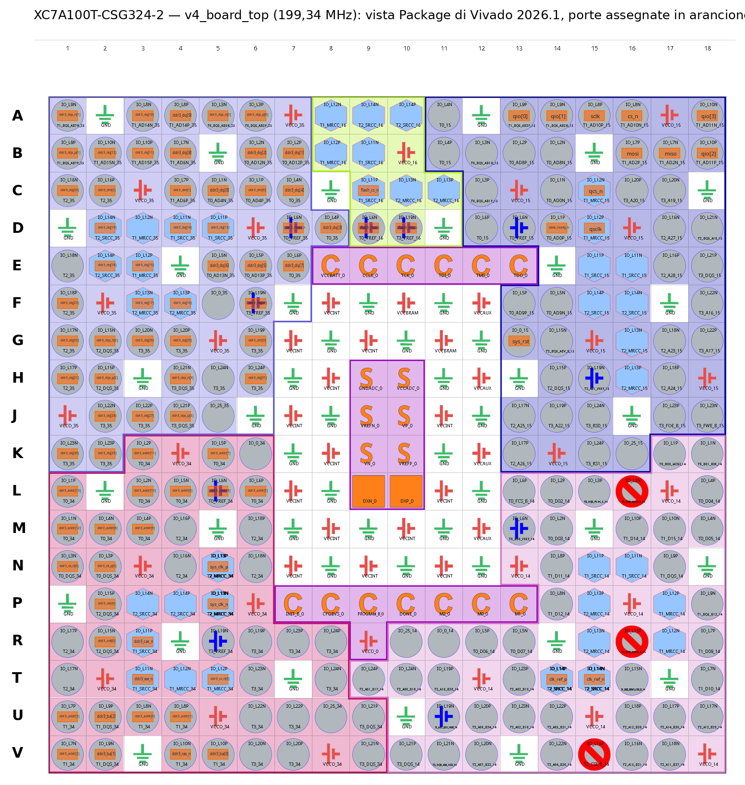

# Pinout v4 (G-esteso) — scheda reale XC7A100T-CSG324-2 + ESP32-S3

Fonte di verità: `hardware/v4/constr/v4_board_top.xdc` (pin FPGA) e la
configurazione MIG del progetto v3 (`mig_a.prj`, importata così com'è nel
progetto v4). Se un pin cambia, si aggiorna questo file nello stesso commit.

Rispetto a v3 cambiano due cose: si aggiunge la porta dati Quad-SPI
(6 pin in bank 15) e (dal 2026-10-05) la flash di configurazione torna sui
pin Master SPI dedicati L13/K17/K18, con il bank 14 a 3,3 V, così l'FPGA
si avvia da sola dalla flash. Dal 2026-10-07 (branch `v4-generic-area`)
la SPI di gestione non c'è più: tutti i comandi passano dalla Quad-SPI e
A15/B16/B17/A16 restano liberi. DDR3, clock, configurazione e JTAG restano
identici a v3 (`docs/PHYSICAL_REALIZATION.md` §2).

*Vista Package di Vivado sul design routed a 199,34 MHz: in arancione i pin usati dal design.*

## 1. Collegamenti ESP32-S3 ↔ FPGA

Un solo bus, FPGA slave (dal 2026-10-07):

- **Quad-SPI** (`qspi_data_port.v`): trasferimenti in blocco da/verso la
  DDR3 (modello, immagine, risultato) e anche registri, stato e accesso
  alla flash di configurazione (comandi 0x3A/0x4A/0x5A/0x6A). 80 MHz, 4 linee,
  misurati 38,9 MB/s (immagine 112×112×3 da 37.632 B in 0,94 ms). Lato ESP32:
  **SPI2 sui pin IO_MUX**, obbligatori per arrivare a 80 MHz.

Tutti i segnali qui sotto sono **LVCMOS33, bank 15 (VCCO 3,3 V)**.

### 1.1 Porta dati Quad-SPI (nuova in v4)

| Segnale | Pin FPGA | Dir. (lato FPGA) | ESP32-S3 (SPI2 IO_MUX) | Note |
|---|---|---|---|---|
| qsclk  | **D15** | ingresso | GPIO12 (FSPICLK) | pin clock-capable (MRCC), clocka direttamente il front-end |
| qcs_n  | **C15** | ingresso | GPIO10 (FSPICS0) | alto = reset asincrono del front-end |
| qio[0] | **A13** | bidir. | GPIO11 (FSPID / MOSI) | |
| qio[1] | **A14** | bidir. | GPIO13 (FSPIQ / MISO) | |
| qio[2] | **B18** | bidir. | GPIO14 (FSPIWP) | |
| qio[3] | **A18** | bidir. | GPIO9 (FSPIHD) | |

Note di layout:
- Tracce corte e di lunghezza simile tra le 6 linee (80 MHz: il vincolo
  XDC assume 0–2 ns di ritardo ESP32+scheda su ingressi e uscite). Una resistenza serie da 22–33 Ω
  vicino al driver su qsclk è consigliata.
- Pull-up (10 kΩ) su qcs_n, così il front-end resta in reset mentre
  l'ESP32 si avvia.
- GPIO9..14 sono liberi sui moduli ESP32-S3 con PSRAM octal (che usa
  GPIO33..37); verificare sul modulo scelto che non siano usati dalla
  flash/PSRAM.

Protocollo (SPI mode 0, cmd/addr/dati tutti su 4 linee, nibble alto prima):

| Campo | Bit | Contenuto |
|---|---|---|
| cmd  | 8  | `0x1A` scrittura DDR3, `0x2A` lettura, `0x3A` REG_WRITE, `0x4A` STATUS, `0x5A` FLASH_XFER, `0x6A` FLASH_READ |
| addr | 48 | `[47:16]` indirizzo parola DDR3 da 128 bit, `[15:0]` numero di parole |
| dummy | 64 clock | solo nelle letture (0x2A, 0x4A, 0x6A) |
| dati | 16 × len byte | byte k della parola = bit `[8k+7:8k]` |

### 1.2 Reset e interrupt (la SPI di gestione A15/B16/B17/A16 è stata tolta il 2026-10-07)

| Segnale | Pin FPGA | Dir. (lato FPGA) | ESP32-S3 |
|---|---|---|---|
| data_ready_n | D14 | uscita (IRQ attivo basso) | GPIO a scelta (ingresso, interrupt) |
| sys_rst | G13 | ingresso, **attivo basso** (reset MIG) | GPIO a scelta, con pull-up 10 kΩ |

Registri (comando Quad-SPI 0x3A REG_WRITE): `0x04` NETWORK_BASE
(indirizzo dell'header del modello), `0x01` CONTROL bit1 = start. Stato
(comando 0x4A STATUS, una parola da 16 byte): [31:0] ID 0x4E505604,
[63:32] NETWORK_BASE, [64] DDR3 calibrata, [65] errore, [66] occupato,
[67] finito (sticky), [68] flash occupata. Leggere STATUS rilascia
data_ready_n.

## 2. Flash di configurazione (pin Master SPI dedicati, FPGA master)

| Segnale | Pin FPGA | Funzione | W25Q32JV (SOIC-8) |
|---|---|---|---|
| flash_cs_n | **L13** | FCS_B, bank 14, LVCMOS33 | /CS (pin 1) |
| flash_mosi | **K17** | D00_MOSI, bank 14 | DI / IO0 (pin 5) |
| flash_miso | **K18** | D01_DIN, bank 14 | DO / IO1 (pin 2) |
| CCLK       | **E9**  | CCLK_0, bank 0 | CLK (pin 6) |

All'accensione (M[2:0] = `001`, Master SPI x1) l'FPGA legge il bitstream
dalla flash da sola. Dopo la configurazione (`PERSIST NO`) L13/K17/K18
diventano I/O utente usati da `flash_spi_master.v` per riscrivere la flash
via `FLASH_XFER`; CCLK è pilotato da `STARTUPE2` e non è una porta.
/CS (pin 1, pull-up 10 kΩ: la flash resta deselezionata finché l'FPGA non la usa, UG470/W25Q32JV tVSL 20 µs), /WP (pin 3) e /HOLD (pin 7) della flash con pull-up a 3,3 V; PUDC_B (L15,
bank 14) legato a GND o a VCCO_14 (3,3 V).

Fino al 2026-10-05 la flash era su D9/D10/C9 (bank 16), pin che la logica
di configurazione non usa: con quel cablaggio il boot autonomo da flash
non poteva funzionare.

## 3. DDR3 e clock

Due MT41J128M16JT-125:K in parallelo (bus da 32 bit), bank 34/35 a 1,5 V,
pin completi in `docs/PHYSICAL_REALIZATION.md` §2.1.

| Clock | Pin | Standard | Frequenza |
|---|---|---|---|
| sys_clk_p / sys_clk_n | N5 / P5 (coppia CC, bank 34) | LVDS_25, `DIFF_TERM FALSE` | **200 MHz**, unico oscillatore LVDS |

Clock interni: il 200 MHz (dopo IBUFDS e BUFG) è il riferimento
dell'IDELAYCTRL e l'ingresso di un MMCM ×31/5/4 che dà 310,0 MHz al MIG
(`NO_BUFFER`); ui_clk 155,0 MHz; core 199,29 MHz (MMCM da ui_clk, M=9
D=1 O=7); qsclk arriva dall'ESP32. Dalla rev. 1.3 (2026-10-06): prima
c'erano due oscillatori, 310,078 MHz su N5/P5 e 200 MHz su T14/T15.

**Resistenza esterna da 100 Ω tra N5 e P5**, vicina ai pin: il bank 34
è a 1,5 V e un ingresso LVDS_25 vi è ammesso (UG471) solo senza la
terminazione interna (`DIFF_TERM FALSE` nello XDC), con i livelli entro
VIN e VIDIFF di DS181. **T14/T15 sono liberi.**

## 4. Configurazione e JTAG (invariati da v3)

PROGRAM_B P9, INIT_B P7, DONE P10, M[2:0] = P11/P13/P12 legati a `001`
(Master SPI), CFGBVS P8. JTAG: TCK E10, TDI E11, TMS E12, TDO E13.
Riservati e da lasciare liberi: L16, R16, V15 (bank 14).

## 5. Tensioni dei bank

| Bank | VCCO | Cosa contiene |
|---|---|---|
| 14 | **3,3 V** | flash di configurazione (L13/K17/K18); T14/T15 liberi |
| 15 | 3,3 V | SPI gestione, Quad-SPI dati, data_ready_n, sys_rst |
| 16 | 3,3 V (nessun pin usato) | — |
| 34, 35 | 1,5 V | DDR3 + oscillatore 200 MHz su N5/P5 (LVDS_25 solo ingresso, 100 Ω esterni) |
| 0 | 3,3 V (CFGBVS a VCCO_0, impostato nello XDC) | configurazione, JTAG |

## 6. Connettore verso la base: BTB 0,8 mm 2×20

Connettore scheda-scheda (BTB) da **40 pin, passo 0,8 mm**: il modulo
sta orizzontale, parallelo alla base, a **4,0 mm** di altezza. Coppia
consigliata (verificata sui disegni hanxia): maschio **HX-BTB
M0810-2x20P** (LCSC C47018699, 1,0 mm) sul bottom del modulo, femmina
**HX-BTB F0830-2x20P** (LCSC C47018694, 3,0 mm) sulla base; 0,5 A per
contatto. Scelta, alternative scartate, footprint e motivazioni:
`hardware/v4/docs/CONNETTORE_BTB_V4.md`. Numerazione dispari su una
fila e pari sull'altra, confermata sul simbolo LCSC di C47018699. Il
maschio va sul bottom del modulo: footprint sul lato bottom (specchiato)
senza rinumerare i pin, e prima della produzione si verifica sovrapponendo
le due schede che il pin 1 del modulo cada sul pin 1 della base.

**Da aggiornare (connettore, thread dello schema):** con la SPI di
gestione tolta, i pin 21, 23, 24 e 25 (sclk/mosi/miso/cs_n) non servono più.

| Pin | Segnale | Pin FPGA | ESP32-S3 | | Pin | Segnale | Pin FPGA | ESP32-S3 |
|---|---|---|---|---|---|---|---|---|
| 1 | **+5V** | | | | 2 | **+5V** | | |
| 3 | **+5V** | | | | 4 | **+5V** | | |
| 5 | **+5V** | | | | 6 | **+5V** | | |
| 7 | GND | | | | 8 | GND | | |
| 9 | **qsclk** | D15 | GPIO12 (fisso) | | 10 | GND | | |
| 11 | GND | | | | 12 | qio0 | A13 | GPIO11 (fisso) |
| 13 | qio1 | A14 | GPIO13 (fisso) | | 14 | GND | | |
| 15 | GND | | | | 16 | qio2 | B18 | GPIO14 (fisso) |
| 17 | qio3 | A18 | GPIO9 (fisso) | | 18 | GND | | |
| 19 | GND | | | | 20 | qcs_n | C15 | GPIO10 (fisso) |
| 21 | sclk | A15 | GPIO4 | | 22 | GND | | |
| 23 | mosi | B16 | GPIO5 | | 24 | miso | B17 | GPIO6 |
| 25 | cs_n | A16 | GPIO7 | | 26 | GND | | |
| 27 | data_ready_n | D14 | GPIO16 | | 28 | sys_rst (att. basso) | G13 | GPIO15 |
| 29 | GND | | | | 30 | PROGRAM_B | P9 | GPIO21 |
| 31 | INIT_B | P7 | GPIO47 | | 32 | DONE | P10 | GPIO48 |
| 33 | GND | | | | 34 | TCK | E10 | GPIO1 |
| 35 | TMS | E12 | GPIO2 | | 36 | TDI | E11 | GPIO17 |
| 37 | TDO | E13 | GPIO18 | | 38 | GND | | |
| 39 | GND | | | | 40 | GND | | |

19 segnali LVCMOS 3,3 V, 6 × +5 V (3 A, contro 1,5 A di picco previsti,
§7), 15 × GND. Ogni segnale Quad-SPI ha una massa accanto e di fronte;
qsclk (9) è circondato da masse. JTAG, PROGRAM_B, INIT_B e DONE vanno a
GPIO dell'ESP32 (configurazione dall'ESP32, §11.8); il modulo non ha un
header JTAG. Pull-up sul modulo: qcs_n e sys_rst 10 kΩ, PROGRAM_B e
INIT_B 4,7 kΩ, DONE 330 Ω.

**Alimentazione e sequenza.** La base fornisce solo +5 V; tutti i rail
sono generati sul modulo (§7). L'ESP32 tiene in alta impedenza le linee
verso il modulo finché DONE (pull-up al 3,3 V del modulo) non è alto:
un ingresso pilotato con VCCO spento è fuori specifica (DS181).

**Meccanica.** Sotto il modulo restano 4,0 mm: sul bottom solo
componenti bassi. FPGA e DDR3 sul top, con il dissipatore (§7.2).
Distanziali da 4,0 mm sul lato opposto al connettore. PCB del modulo
1,6 mm.
