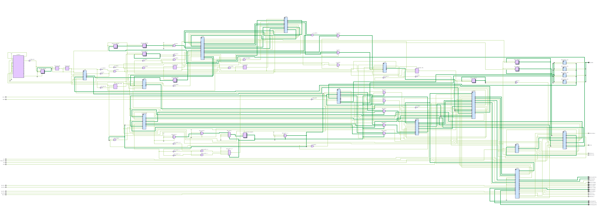

# FPGA-Neural V4 — Buildbook

**La storia e il riferimento tecnico di un acceleratore generico di reti neurali INT8 su Xilinx Artix-7 XC7A100T con DDR3, pilotato da ESP32-S3**

Rev. 3.0 — 2026-10-08 — riferimento RTL: branch `v4-generic-area`

> **Cos'è questo documento.** Fino alla rev. 2.0 si chiamava
> "datasheet". Dalla rev. 3.0 è il **Buildbook** del progetto: la
> Parte I racconta come è stato costruito, la Parte II conserva il
> riferimento tecnico. Il datasheet vero, con una struttura diversa,
> verrà scritto quando la versione generica sarà chiusa e funzionante.

---

<!-- BEGIN INDICE -->
## Indice

**S1. Il punto di partenza: un neurone su un FPGA**

**S2. La v2: tanti processori, e la scoperta che il limite è la memoria**

**S3. La v3: Artix-7 e DDR3**

**S4. La v4 "G-esteso": un motore che non torna in memoria**

**S5. Dal chip alla scheda: software, firmware e PCB**

**S6. La svolta: un acceleratore generico**

**S7. Il conto dell'area**

**S8. Il guaio del depthwise**

**S9. Dove siamo (8 ottobre 2026)**

**S10. Cosa abbiamo imparato**

**Caratteristiche principali** — Applicazioni tipiche

**1. Descrizione generale** — 1.1 Prestazioni in sintesi · 1.2 Convenzioni

**2. Configurazioni disponibili (bitstream)**

**3. Architettura del processore** — 3.1 Schema a blocchi · 3.2 Domini di clock · 3.3 Le unità di calcolo · 3.4 Sequencer a descrittori · 3.5 Memorie on-chip · 3.6 Alimentatori dati (feeder) · 3.7 Blocchi di calcolo · 3.8 Boot, DDR3 e interfacce host · 3.9 File RTL (`hardware/v4/rtl/`)

**4. Modello di programmazione** — 4.1 Dalla rete alle passate · 4.2 Formato dei dati in memoria · 4.3 Passate divise e fasce · 4.4 Aritmetica · 4.5 Sequenza di un'inferenza

**5. Regole e limiti dell'hardware** — 5.1 Rete e memoria · 5.2 Ingresso · 5.3 Strati · 5.4 Aritmetica · 5.5 Messaggi del controllo · 5.6 Cosa non è supportato

**6. Prestazioni** — 6.1 Condizioni · 6.2 Reti del test finale · 6.3 Altre reti provate · 6.4 MobileFaceNet: confronto con l'ESP32-S3 · 6.5 Stimare il tempo di una rete · 6.6 Indicazioni per una rete veloce · 6.7 Tempo del trasferimento dell'ingresso

**7. Valori massimi assoluti e condizioni operative** — 7.1 Valori massimi assoluti · 7.2 Condizioni operative raccomandate · 7.3 Caratteristiche DC dei segnali del connettore

**8. Caratteristiche elettriche, consumi e termica** — 8.1 Alimentazioni e consumi · 8.2 Termica

**9. Piedinatura** — 9.1 Porta dati Quad-SPI (nuova in v4) — bank 15, LVCMOS33 · 9.2 SPI di gestione (invariata da v3) — bank 15, LVCMOS33 · 9.3 Flash di configurazione (FPGA master) — pin Master SPI dedicati, bank 14, LVCMOS33 · 9.4 Clock · 9.5 DDR3 (fissati dal PHY del MIG) — bank 34/35, SSTL15 1,5 V · 9.6 Configurazione e JTAG (bank 0) · 9.7 Tensioni dei bank · 9.8 Connettore verso la base: BTB 0,8 mm 2×20

**10. Caratteristiche di timing** — 10.1 Timing statico (Vivado 2026.1, place & route della scheda intera) · 10.2 Interfaccia Quad-SPI · 10.3 SPI di gestione

**11. Risorse utilizzate (XC7A100T-CSG324-2, build 199,34 MHz)**

**12. Mappa della memoria DDR3 e formato del modello** — 12.1 Il blob del modello · 12.2 Intestazione di boot (`rtl/v4_boot.v`) · 12.3 Parola di statistiche (W `result_w` + `out_words`) · 12.4 Formato dei descrittori

**13. Interfaccia host: protocolli e registri** — 13.1 SPI di gestione (`spi_host_bridge_v3_chained.v`) · 13.2 Mappa dei registri · 13.3 Reset · 13.4 Porta dati Quad-SPI (`qspi_data_port.v`)

**14. Firmware ESP32-S3** — 14.1 Componenti software · 14.2 Stato e verifica · 14.3 Collegamento e inizializzazione · 14.4 Avvio e caricamento del modello · 14.5 Preparare l'ingresso · 14.6 Una inferenza e uso dell'uscita · 14.7 Pipeline con due buffer e più modelli · 14.8 Interrupt invece del polling · 14.9 Riferimento delle funzioni · 14.10 Configurazione dell'FPGA dall'ESP32 (flash e JTAG) · 14.11 Procedura consigliata di prima prova (bring-up) · 14.12 Diagnosi

**15. Progettare una rete** — 15.1 Il metodo · 15.2 Il bilancio della memoria on-chip · 15.3 Il bilancio del tempo · 15.4 Scegliere gli strati · 15.5 Progettare per INT8 · 15.6 Esempio guidato: un rilevatore di persone a 96×96

**16. Creare la rete: addestramento, compilazione, verifica** — 16.1 La catena degli strumenti · 16.2 Addestramento con l'aritmetica dell'hardware (`v4_qat.py`) · 16.3 Verifica sul PC (`v4_ref.py`) · 16.4 Compilazione (`v4_compile.py`, `make_model.sh`) · 16.5 Verifica sull'RTL (facoltativa) · 16.6 La stessa rete sulla CPU dell'ESP32-S3 (`v4_s3_bench`)

**17. Esempi d'uso** — 17.1 Classificatore di immagini 32×32 (`bench_small`) · 17.2 Rilevatore di persone 96×96 (`bench_medium`) · 17.3 Rete pesante 128×128 (`bench_heavy`) · 17.4 Rete fully connected su un vettore (`mlp784`) · 17.5 Segmentazione U-Net (`unet_s`) · 17.6 Altre reti di esempio · 17.7 Riconoscimento facciale: MobileFaceNet (benchmark)

**18. Stato della verifica** — 18.1 Simulazione e strumenti · 18.2 Non ancora fatto · 18.3 Ripetere il test finale

**19. Componenti principali**

**20. Limiti e punti aperti**

**21. Revisioni**
<!-- END INDICE -->

---

# Parte I — La storia

Questa parte racconta come si è arrivati alla v4: le scelte, gli
errori, i numeri che hanno deciso la strada. Le date sono quelle dei
registri del progetto (`hardware/v1/docs/WORKLOG.md`,
`hardware/v2/logs/experiments.log` con le voci EXP-NNNN,
`hardware/v4/docs/PROGRESS_LOG.md` con le voci V4-*). Anche qui ogni
numero è misurato (simulazione, sintesi o place & route), salvo dove è
scritto *stima*.

## S1. Il punto di partenza: un neurone su un FPGA

All'inizio di settembre 2026 il progetto è un neurone INT8 in Verilog:
un'unità che moltiplica ingressi per pesi, somma, aggiunge il bias e
applica ReLU con saturazione a 127. Il bersaglio è un Lattice ECP5
LFE5U-45F con una PSRAM esterna, la macchina di riferimento è un
ESP32.

Il primo lavoro registrato (2 settembre, `WORKLOG.md`) è il debug del
percorso tra memoria e neurone. Il difetto era nel testbench, non
nell'RTL: un indirizzamento byte/parola sbagliato nel precaricamento dei
dati. È la prima di molte volte in cui la regola "trova la causa vera,
non indovinare" ha evitato di correggere la cosa sbagliata.

## S2. La v2: tanti processori, e la scoperta che il limite è la memoria

Dal 5 settembre la v2 rifà il neurone come processore in pipeline a 8
stadi. Da solo, sull'ECP5, il datapath arriva a 183 MHz dopo il place &
route, contro i 61,7 MHz del neurone parallelo della v1 (EXP-0001).

Poi si moltiplicano i processori: 2, 4, 8, con arbitri di memoria,
banchi, prefetch. Qui arriva la lezione che ha guidato tutto il resto:
**aggiungere unità di calcolo non serve se la memoria esterna non le
riesce a nutrire**. Le misure di metà settembre (EXP-0033, EXP-0036,
EXP-0049) mostrano che la banda verso la memoria, non il numero di
moltiplicatori, decide il tempo. Il riuso dei pesi già caricati
(EXP-0057) dà 7,16× sulla parte di memoria con lo stesso hardware.

L'ECP5 ha però pochi DSP e una memoria esterna lenta. La v2 viene
congelata come riferimento storico.

## S3. La v3: Artix-7 e DDR3

Dal 16 settembre il bersaglio diventa quello di oggi: **Xilinx Artix-7
XC7A100T-CSG324-2 con DDR3 vera**, su una scheda che Michele progetta e
monta da sé. Il primo place & route reale su Artix-7 (EXP-0059,
EXP-0063) dà circa 133 MHz: lontano dai 200 voluti, e senza ancora il
controller DDR3.

Le due settimane seguenti sono un lavoro di precisione:

- il controller DDR3 di Xilinx (MIG) generato per il chip esatto;
- il primo sistema completo con DDR3 che chiude il timing con i vincoli
  veri del MIG (EXP-0074, 19 settembre: DDR3 a 310 MHz, logica a
  155 MHz);
- il ponte verso la flash di configurazione, per aggiornare l'FPGA
  dall'ESP32 (EXP-0077);
- architetture a 8 e 16 gruppi di calcolo con arbitri gerarchici
  (EXP-0089 … EXP-0098);
- l'esecuzione di più strati in catena direttamente sull'FPGA
  (EXP-0112 … EXP-0118, timing pulito il 23 settembre);
- il primo componente firmware per l'ESP32 (EXP-0120).

Da questo periodo vengono molte delle regole scritte in `CLAUDE.md`:
le copie dei sorgenti che Vivado importa e poi non aggiorna più, le
gare tra testbench e RTL sullo stesso fronte di clock, gli impulsi di
richiesta che si perdono in un arbitro a due livelli. Ognuna è costata
almeno una giornata, ognuna è stata trovata seguendo i segnali uno per
uno.

## S4. La v4 "G-esteso": un motore che non torna in memoria

Il 28 settembre si cambia approccio. La v3 calcola a blocchi: legge dalla
DDR3, calcola, riscrive in DDR3. Su una rete vera questo traffico è il
collo di bottiglia, come già detto dalla v2.

La v4 tiene i dati dentro il chip. Il cuore è un motore che fa la
convoluzione depthwise 3×3 e passa il risultato direttamente alla
convoluzione 1×1 (pointwise), senza mai scriverlo in memoria. La parte
pointwise è un array di 16×16 moltiplicatori che usa il trucco della v3:
**due moltiplicazioni INT8 in ogni DSP48**. Queste 16 colonne sono le
16 unità di calcolo del processore.

Come banco di prova si sceglie **MobileFaceNet**, una rete di
riconoscimento facciale: sull'ESP32-S3, con la libreria ESP-DL di
Espressif, impiega **248,8 ms**. L'obiettivo è 100 volte più veloce,
cioè circa 2,5 ms.

Il ritmo di quei giorni:

| Data | Passo | Risultato |
|---|---|---|
| 28/09 pomeriggio | motore depthwise → pointwise, verificato | bit-exact |
| 28/09 sera | tutta MobileFaceNet nella RTL | 451.287 cicli, bit-exact |
| 28/09 notte | primo place & route del core | 150 MHz |
| 29/09 | quattro giri di pipelining | 157 → 162 → **200 MHz** |
| 29/09 | parametri letti dalla DDR3 in streaming, im2col sull'FPGA | di nuovo 200 MHz |
| 29/09 | scheda intera simulata con MIG vero e modelli Micron DDR3 | rete completa |
| 30/09 | primo bitstream della scheda intera | 189,20 MHz |
| 30/09 | scheda intera chiusa | **199,34 MHz** (WNS +0,003 ns) |
| 01/10 | catena completa con il MIG vero | embedding bit-exact |

A 199,34 MHz MobileFaceNet richiede 460.592 cicli, cioè **2,311 ms:
107,7 volte l'ESP32-S3**. I due bitstream sono stati salvati con i tag
`v4-board-199` e `v4-board-189`.

Una nota sul server. Le sintesi girano su "mikilab", un iMac con Ubuntu
a casa di Michele. Il 28 settembre si è spento due volte di colpo per il
calore: la ventola era bloccata al minimo. Da allora Vivado gira con un
solo thread, la CPU limitata a 2,4 GHz e un controllo che ferma tutto
sopra 85 °C. Di qui i molti "a un thread" nei registri.

## S5. Dal chip alla scheda: software, firmware e PCB

Dall'1 al 6 ottobre il lavoro si allarga dal chip a tutto il resto.

- **Firmware ESP32.** Il driver vero dell'ESP32 viene compilato sul PC
  e fatto parlare con la RTL della scheda in simulazione: tutte e 8 le
  prove di accensione passano (3 ottobre).
- **La MobileFaceNet vera.** Il modello di Espressif viene convertito
  per la v4: i volti si riconoscono, e la RTL dà gli stessi bit del
  modello C (embedding di 512 valori, 103,8× a 199,34 MHz).
- **Gli strumenti.** Pianificatore delle passate, riferimento numerico,
  addestramento con l'aritmetica dell'hardware, compilatore di reti
  (5–6 ottobre).
- **La flash.** La flash di configurazione era su pin da cui l'FPGA non
  può avviarsi da solo. Spostata sui pin Master SPI dedicati, con una
  modifica mirata sulla build già piazzata: l'avvio dalla flash dura
  circa 0,7 s.
- **Un solo oscillatore** da 200 MHz invece di due (6 ottobre).
- **La scheda.** Michele disegna il suo modulo: 8 strati, connettore
  scheda-scheda a 40 pin, alimentazione unica a 5 V. Il rapporto di
  Vivado dice che il core a 1,0 V assorbe 4,13 A (5,24 W in tutto,
  *stima* vettoriale): servono un regolatore da 6 A e un dissipatore
  obbligatorio. Michele monterà il prototipo a mano, con microscopio,
  stencil e piastra calda. Il routing delle linee DDR3 procede byte per
  byte.

## S6. La svolta: un acceleratore generico

Il 6 ottobre Michele ferma tutto: MobileFaceNet doveva essere **solo
l'esempio** con cui misurare, non il prodotto. Documenti e RTL invece
la trattavano come la ragione d'essere dell'acceleratore. Era un errore
di impostazione, ed era grave: un mese di lavoro rischiava di produrre
un oggetto adatto a una sola rete.

La correzione è stata fatta senza buttare l'architettura: si tolgono i
limiti nei contatori, negli indirizzi e nei descrittori, non nel
datapath. In cinque passi, tra il 6 e il 7 ottobre, ognuno verificato
prima del successivo:

1. ingresso di dimensione libera;
2. da 1 a 4.096 ingressi per neurone, qualsiasi numero di canali;
3. convoluzione 3×3 densa in qualsiasi punto, reti anche senza
   convoluzioni;
4. pooling max e medio;
5. upsampling ×2, concatenazione, fino a 256 passate.

Poi il test finale voluto da Michele: tre reti generiche (piccola, media,
pesante) più MobileFaceNet, sull'FPGA in simulazione e sulla CPU di un
ESP32-S3 vero, in C++, con gli stessi bit in uscita. Le misure sulla S3
(7 ottobre, 10 esecuzioni ciascuna, tutte identiche bit per bit
all'FPGA):

| Rete | ESP32-S3 (C++ intero) | FPGA, simulato a 199,34 MHz | Rapporto |
|---|---|---|---|
| piccola | 108,98 ms | 54 µs | ~2.000× |
| media | 2,128 s | 415 µs | ~5.100× |
| pesante | 56,99 s | 12,29 ms | ~4.600× |
| MobileFaceNet | 10,316 s | 2,311 ms | ~4.500× |

Il confronto con il C++ semplice non è quello dell'obiettivo: i 100×
restano misurati contro ESP-DL (248,8 ms), che sulla S3 usa le
istruzioni vettoriali.

## S7. Il conto dell'area

Le funzioni nuove hanno un costo. Il primo place & route della versione
generica (7 ottobre) **non entra nel chip per 25 slice**. Michele
sceglie un solo bitstream con tutte le funzioni, e l'area si recupera
nella RTL: descrittori letti dalla DDR3, requant condiviso, pooling e
im2col più snelli. Si risparmiano 6.774 LUT senza togliere nessuna
funzione. Nello stesso giorno i comandi dell'host passano tutti sulla
Quad-SPI, e la SPI di gestione viene tolta.

Il nuovo place & route entra (95,9 % degli slice) ma non chiude il
timing: −1,93 ns sul core a 199,34 MHz. Seguono una ventina di
correzioni mirate (pipeline, copie locali dei registri di scrittura,
selettori registrati), verificate bit per bit su 7 reti.

## S8. Il guaio del depthwise

L'8 ottobre la sintesi con le correzioni di timing non entra più: 102,5 %
delle LUT, 142,5 BRAM su 135. Il blocco depthwise è passato da 219 a
14.543 LUT.

La causa: **in tutte le sintesi precedenti della scheda Vivado aveva
eliminato la memoria dei pesi depthwise**, e con lei tutto il percorso
depthwise. Questo vale anche per i bitstream `v4-board-199` e
`v4-board-189`. Vivado vedeva come costante l'abilitazione di scrittura
di quei pesi, e da lì ha propagato lo zero a valle. Le simulazioni
erano corrette perché giravano sulla RTL, non sulla netlist sintetizzata.
Le correzioni di timing hanno spezzato per caso quella catena, e il
depthwise è ricomparso con il suo costo vero.

Cosa significa:

- i bitstream con tag non calcolano correttamente i layer depthwise;
- tutti i numeri di area, timing e consumo delle build precedenti sono
  senza depthwise (capitoli 8, 10 e 11 della Parte II);
- nessun bitstream è mai stato caricato su una scheda vera: non c'è
  hardware da buttare.

Cosa si fa:

- una simulazione della netlist sintetizzata, con il MIG vero, che
  conta le scritture dei pesi e controlla le uscite dei moltiplicatori
  depthwise contro la RTL;
- quattro tagli d'area senza togliere funzioni, tutti bit-exact sulle 7
  reti: FIFO del depthwise in memoria distribuita, banchi della memoria
  delle feature map divisi a metà, albero dei sommatori pointwise alla
  sua larghezza naturale, requant pointwise condiviso tra le due
  posizioni;
- se ancora serve, il depthwise da 16 a 8 corsie. Michele l'ha già
  approvato: "importante è che chiuda", anche a 189 MHz.

Da qui viene una regola nuova: **nessun bitstream senza una simulazione
della netlist post-sintesi** che mostri che le memorie dei parametri
vengono davvero scritte.

## S9. Dove siamo (8 ottobre 2026)

| Cosa | Stato |
|---|---|
| RTL generica | verificata in simulazione, 11 test su 11, 7 reti bit-exact |
| MobileFaceNet sulla scheda simulata | 460.983 cicli = 2,312 ms a 199,34 MHz |
| Netlist sintetizzata | in verifica |
| Area con depthwise | in recupero, poi una nuova sintesi |
| Place & route | da rifare; obiettivo 199,34 MHz, ripiego 189,20 MHz |
| Scheda fisica | in progettazione da parte di Michele (routing DDR3 in corso) |
| Datasheet | da scrivere quando tutto funziona; questo Buildbook ne tiene il posto |

## S10. Cosa abbiamo imparato

- **Misurare, non stimare.** Ogni volta che un numero è stato stimato
  invece che misurato, la stima era ottimista.
- **La simulazione RTL non basta.** Il sintetizzatore può togliere
  logica che la RTL usa davvero. Solo la netlist dice cosa c'è nel chip.
- **Un passo alla volta.** Ogni modifica verificata da sola prima di
  combinarla con altre: è il motivo per cui i difetti si trovano in ore
  e non in settimane.
- **L'esempio non è il prodotto.** Un benchmark serve a misurare; se
  diventa il progetto, il progetto si restringe senza che nessuno lo
  decida.
- **Il calore è un vincolo di progetto**, sia per il server che sintetizza
  sia per il chip che calcola.

---

# Parte II — Il riferimento tecnico

Questa parte è l'ex datasheet rev. 2.0, conservato com'era il
2026-10-07. È la fotografia tecnica della v4 generica prima della
scoperta del capitolo S8: i numeri di timing, risorse e consumi
(capitoli 8, 10 e 11) vengono da build in cui il depthwise era stato
eliminato dalla sintesi.


> **Stato del documento.** Questo documento descrive un dispositivo
> **non ancora provato su una scheda fisica**. Ogni numero ha accanto la
> sua fonte, con questa convenzione:
>
> - **simulato**: simulazione RTL (Icarus Verilog o Vivado xsim), con
>   uscita confrontata bit per bit con il modello di riferimento;
> - **Vivado**: risultato di sintesi, place & route o `report_power` di
>   Vivado 2026.1 sul dispositivo reale XC7A100T-CSG324-2;
> - **stima**: calcolo o modello, scritto sempre come *stima*;
> - **datasheet**: valore preso dal datasheet del componente citato.
>
> Nessun valore è ancora **misurato su hardware**.
>
> **RTL e bitstream.** Le funzioni generiche (ingresso libero, 3×3
> densa, pooling, upsampling, concatenazione, fino a 4.096 ingressi per
> neurone e 256 passate) sono nella RTL del branch `v4-generic-input`,
> verificate in simulazione. Il place & route di questa RTL **non è
> ancora stato eseguito**: i bitstream disponibili (§2) sono della RTL
> precedente, che esegue solo reti a passate 1×1, depthwise e GDConv con
> ingresso 112×112×3. Timing, risorse e consumi dei capitoli 8, 10 e 11
> sono quelli di quella build (§20, punto 1).

---

## Caratteristiche principali

- **Rete definita dall'utente**: chi progetta la rete sceglie ingresso,
  strati e numero di canali. Il compilatore la traduce in una sequenza
  di **fino a 256 passate** eseguite dall'FPGA senza intervento
  dell'host.
- **Operazioni in hardware**: convoluzione 3×3 densa (stride 1 o 2),
  depthwise 3×3 fusa con la 1×1 successiva, 1×1 e fully connected **da
  1 a 4.096 ingressi per neurone**, convoluzione depthwise globale
  (GDConv), max e average pooling 2×2 / 3×3, upsampling 2×,
  concatenazione di canali, somma residua, ReLU e PReLU.
- **Ingresso**: immagine fino a 255×255 con 1–4 canali, oppure un
  tensore qualsiasi fino a 16.384 parole (256 KB), per esempio un
  vettore di 784 valori.
- **16 unità di calcolo**, **512 MAC INT8 per ciclo** (2 MAC per
  DSP48E1): picco 102,1 GMAC/s a 199,34 MHz.
- **Uscita identica bit per bit** al modello di riferimento su PC
  (`v4_ref.py`): quello che si misura in addestramento è quello che
  calcola l'FPGA.
- **Prestazioni** (simulate, scheda intera, 199,34 MHz):

  | Rete | Ingresso | MAC | Tempo |
  |---|---|---:|---:|
  | piccola (`bench_small`) | 32×32×3 | 4,4 M | 54,2 µs |
  | media (`bench_medium`) | 96×96×3 | 39,6 M | 415,0 µs |
  | MobileFaceNet (benchmark) | 112×112×3 | 222,4 M | 2,311 ms |
  | pesante (`bench_heavy`, 78 passate) | 128×128×3 | 872,2 M | 12,286 ms |

- **Benchmark MobileFaceNet**: 2,311 ms, **107,7 volte** più veloce
  dell'ESP32-S3 da solo (248,8 ms con ESP-DL, valore pubblicato da
  Espressif).
- **Memoria**: 384 KB on-chip per le mappe di attivazione; parametri in
  DDR3 (2 × Micron MT41J128M16JT, 32 bit, 512 MB, 2,48 GB/s di picco),
  letti durante la passata precedente con doppio buffer.
- **Interfacce host**: porta dati Quad-SPI a 80 MHz (38,9 MB/s,
  simulato), SPI di gestione (registri, start, stato, accesso alla
  flash), interrupt `data_ready_n`.
- **Configurazione**: avvio autonomo da flash SPI (0,72 s, *stima*);
  programmazione della flash e caricamento via JTAG dall'ESP32;
  temperatura e tensioni del die leggibili dall'ESP32 (XADC via JTAG).
- **Alimentazione**: singola +5 V, tutti i rail generati sul modulo;
  FPGA 5,35 W (Vivado, *stima*); dissipatore obbligatorio.
- **Strumenti**: pianificatore e verifica delle regole (`v4_plan.py`),
  addestramento con l'aritmetica dell'hardware in PyTorch
  (`v4_qat.py`), compilatore (`v4_compile.py`), driver ESP32-S3 in C,
  esecutore di riferimento C++ per la CPU dell'ESP32-S3.

### Applicazioni tipiche

Classificazione di immagini, rilevamento di persone e oggetti su
immagini piccole, riconoscimento facciale (estrazione di embedding),
segmentazione semantica a bassa risoluzione, reti fully connected su
vettori di sensori. In tutti i casi l'ESP32-S3 resta l'host: acquisisce
i dati, li prepara, avvia l'inferenza e usa il risultato.

---

## 1. Descrizione generale

FPGA-Neural V4 è un modulo acceleratore di reti neurali INT8. È
costruito su un FPGA Xilinx Artix-7 XC7A100T nudo (non una scheda di
sviluppo) con due DDR3 da 16 bit, e si monta sulla scheda base
dell'host ESP32-S3 con un connettore scheda-scheda da 40 pin (§9.8).
È alimentato a +5 V.

L'host carica una volta nella DDR3 il **modello compilato** (un blob
unico con intestazione, tabella delle passate, parametri). Per ogni
inferenza scrive l'ingresso, dà lo start e legge l'uscita. Fra start e
fine l'FPGA esegue da solo tutte le passate della rete:

```
 ingresso (DDR3) ─► passata 0 ─► passata 1 ─► … ─► passata N−1 ─► uscita (DDR3)
                    ogni passata legge una mappa dalla memoria on-chip (384 KB)
                    e ne scrive un'altra; i suoi parametri arrivano dalla DDR3
                    durante la passata precedente
```

La rete la decide chi la progetta. L'hardware impone alcune regole (per
esempio: i canali si contano a gruppi di 16, una mappa non supera
16.384 parole), elencate tutte nel capitolo 5 e controllate dal
compilatore. Molte sono soddisfatte in automatico: il compilatore
completa i canali con canali nulli (pesi zero) dove serve, quindi chi
progetta può usare qualsiasi numero di canali.

MobileFaceNet (riconoscimento facciale) è usata solo come **benchmark**
di riferimento, perché esiste un tempo pubblicato della stessa rete
sull'ESP32-S3. Il dispositivo non contiene nulla di specifico per
quella rete.

### 1.1 Prestazioni in sintesi

| | 199,34 MHz (`v4-board-199`) | 189,20 MHz (`v4-board-189`) | Fonte |
|---|---|---|---|
| Picco dell'array | 102,1 GMAC/s | 96,9 GMAC/s | 512 MAC × f |
| MobileFaceNet, calcolo | **2,311 ms** (460.592 cicli) | 2,434 ms | simulato, MIG reale + modelli DDR3 Micron |
| MobileFaceNet rispetto all'ESP32-S3 (248,8 ms) | **107,7×** | 102,2× | |
| MobileFaceNet, start → done visto dall'ESP32 | 2,342 ms | — | simulato |
| Rete pesante (`bench_heavy`), calcolo | 12,286 ms (2.449.064 cicli) | 12,944 ms | simulato, Icarus |
| Uso medio dell'array, rete pesante | 70 % (872,2 M MAC / 2.449.064 cicli / 512) | | calcolo dai valori simulati |
| Immagine 37.632 B via Quad-SPI 80 MHz | 0,941 ms | 0,941 ms | simulato |

Il tempo di calcolo in cicli non dipende dai valori dei pesi né
dell'ingresso: dipende solo dalla struttura della rete. Il capitolo 6
dà le prestazioni di tutte le reti provate e il modo di stimarle per
una rete nuova.

### 1.2 Convenzioni

| Termine | Significato |
|---|---|
| **parola**, **W** | parola di memoria da 128 bit = 16 valori INT8; gli indirizzi DDR3 del documento sono in parole (W) salvo dove scritto "halfword" |
| **gruppo** | 16 canali consecutivi di una mappa (una parola per posizione); `ng` = gruppi d'ingresso, `nco` = gruppi d'uscita |
| **unità di calcolo** | una colonna dell'array: calcola un canale d'uscita, 16 ingressi × 2 posizioni per ciclo (32 MAC/ciclo) |
| **processore** | il blocco `v4_core`: sequencer a descrittori, memorie on-chip, alimentatori dati e le 16 unità di calcolo |
| **passata** | un'operazione del processore su una mappa intera, descritta da un descrittore da 256 bit |
| **strato** | un elemento della rete come la scrive chi la progetta (`v4_plan.py`); uno strato diventa una o più passate |
| **esponente** | ogni tensore INT8 ha un esponente potenza di 2: valore reale = intero × 2^e |
| byte k di una parola | bit [8k+7:8k] |

---

## 2. Configurazioni disponibili (bitstream)

| File (`hardware/v4/bitstream/`) | Tag git | Clock del processore | MMCM | WNS / WHS | sha256 |
|---|---|---|---|---|---|
| `v4_board_top_199.bit` | ECO di `v4-board-199-flashcfg` (oscillatore unico) | 199,29 MHz | M=9, D=1, O=7,000 | +0,004 / +0,011 ns | `cbdc468e…6bd180a25` |
| `v4_board_top_189.bit` | ECO di `v4-board-189-flashcfg` (oscillatore unico) | 189,15 MHz | M=9, D=1, O=7,375 | +0,034 / +0,028 ns | `133750f4…aa8f3157` |

Gli sha256 completi sono in `hardware/v4/bitstream/README.md`.

**RTL contenuta.** Questi due bitstream sono della RTL **precedente
alla generalizzazione** (rev. 1.3): eseguono reti fatte di passate 1×1,
depthwise 3×3 + 1×1 e GDConv, con primo strato 3×3 su ingresso
112×112×3 e al massimo 64 passate, per esempio MobileFaceNet. Le
funzioni dei passi 1–5 (§4.3: ingresso libero, 3×3 densa, pooling,
upsampling, concatenazione, 4.096 ingressi per neurone, 256 passate)
richiedono il place & route della RTL di `v4-generic-input`, non ancora
fatto. Protocollo host, pin e formato del blob sono gli stessi: il
driver della rev. 2.0 funziona con entrambe le RTL.

**Impostazioni comuni.** Entrambi sono per **XC7A100T-CSG324-2**, bank 0
a 3,3 V (`CFGBVS = VCCO`, `CONFIG_VOLTAGE = 3.3`),
`BITSTREAM.CONFIG.PERSIST = NO`, flash su FCS_B L13 / D00 K17 / D01 K18
(bank 14 a 3,3 V), avvio Master SPI x1 con CCLK 33 MHz, cattura sul
fronte di discesa, **bitstream compresso** (2.968.718 / 2.970.462 byte;
payload per la flash 2.968.500 / 2.970.244 byte, uguale al `.bin` di
`write_cfgmem -interface SPIx1`).

**Tempo di avvio dalla flash** (*stima*): 23,7 Mbit a 33 MHz = 0,72 s
nominali, da 0,48 a 1,44 s con la tolleranza ±50 % del CCLK interno
(UG470). I bitstream dei tag `v4-board-199/189` (flash su D9/D10/C9,
non compressi) non vanno usati sulla scheda attuale.

Le due build sono ECO dei design routed dei tag: le sole tre porte della
flash spostate e ripiazzate, le loro 6 net rerutate, poi l'MMCM
dell'oscillatore unico aggiunto e piazzato a mano
(`vivado/eco_flash_pins.tcl`, `vivado/eco_osc200.tcl`). Un P&R completo
rifatto da capo con la stessa RTL e le stesse direttive **non** chiude
a 199,34 MHz (`core_clk` −0,474 ns, ui_clk −0,237 ns, Vivado): il chip pieno
ha variabilità di piazzamento.

**Raccomandazione:** il margine a 199,29 MHz è quasi nullo. Sulla prima
scheda fisica conviene avere pronta anche la versione a 189,15 MHz; il
protocollo host è identico, cambia solo il tempo di calcolo (+5,4 %).

---

## 3. Architettura del processore

### 3.1 Schema a blocchi

```
                         ESP32-S3 (host)
      SPI3 gestione (<= ~20 MHz)        SPI2 Quad-SPI dati (80 MHz)
               |                                 |
+------------------------------------------------------------------------+
| spi_host_bridge_v3_chained          qspi_data_port                     |
| registri, WRITE/READ_MEM,           front end clockato da QSCLK        |
| FLASH_XFER --> flash_spi_master     FIFO asincrone verso ui_clk        |
|       | host_mem_bridge                     |                          |
|       +-------------> arbitro <-------------+                          |
|                          |  <-- v4_ddr_stream (processore)             |
|      mig_native_adapter -- MIG 7-series -- DDR3 2 x16 (32 bit)         |
|                          |        ui_clk 155,0 MHz                     |
|      FIFO asincrone (Gray) + toggle start/done                         |
|                          |                                             |
| core_clk 199,29 MHz      |                                             |
| v4_boot --> v4_core (processore)                                       |
|  +------------------------------------------------------------------+  |
|  | sequencer: 256 descrittori di passata + 256 di carico            |  |
|  | param_loader -- buffer parametri a doppia metà                   |  |
|  |                                                                  |  |
|  | fmap_mem 3 x 8.192 x 128 bit --> alimentatori dati:              |  |
|  |    im2col_feeder  (primo strato)                                 |  |
|  |    conv3_feeder   (finestre 3x3/2x2/1x1, upsampling, concat)     |  |
|  |    fmap_feeder    (1x1, depthwise)                               |  |
|  |       |                                                          |  |
|  |       +--> dwpw_engine: line buffer + depthwise 3x3 (16 MAC LUT) |  |
|  |       |     +--> array 16x16: 16 unità di calcolo, 512 MAC/ciclo |  |
|  |       |          +--> requant + ReLU / PReLU                     |  |
|  |       +--> gdconv_unit (depthwise globale, 16 MAC LUT)           |  |
|  |       +--> pool_unit (max / media / copia, 16 corsie)            |  |
|  |               +--> tile_writer (+ residuo saturato) --> fmap_mem |  |
|  +------------------------------------------------------------------+  |
+------------------------------------------------------------------------+
```

Schema RTL del top generato da Vivado (design elaborato della build
della rev. 1.3): `hardware/v4/docs/img/schema_rtl_v4.svg` e `.png`.



### 3.2 Domini di clock

| Clock | Frequenza | Sorgente |
|---|---|---|
| `osc_200` | 200 MHz differenziale | **unico oscillatore** esterno, pin N5/P5 (LVDS_25, `DIFF_TERM FALSE` + 100 Ω esterni); dopo il BUFG è il riferimento dell'IDELAYCTRL |
| `mig_sys_clk` | 310,0 MHz | MMCM su `osc_200`: ×31, ÷5, ÷4 (VCO 1240 MHz) → ingresso del MIG (`NO_BUFFER`) |
| `ui_clk` | 155,0 MHz | MIG (memoria 310 MHz, rapporto 2:1): bridge SPI, arbitro, adattatore DDR3 |
| `core_clk` | 199,29 MHz (o 189,15) | MMCME2_BASE su `ui_clk`, VCO 1395 MHz, `CLKOUT0_DIVIDE_F` 7,000 (7,375) |
| `qsclk` | 80 MHz | dall'ESP32, pin D15 (clock-capable) |

I tre domini logici (`ui_clk`, `core_clk`, `qsclk`) comunicano solo
tramite FIFO asincrone con puntatori Gray e sincronizzatori a toggle,
vincolati nello XDC con `set_max_delay -datapath_only`. Il dominio a
200 MHz (IDELAYCTRL, monitor di temperatura del MIG) è dichiarato
asincrono rispetto a `ui_clk` (`set_clock_groups`).

Il MIG non accetta 200 MHz direttamente a questa frequenza di memoria
(la sua PLL usa solo DIVCLK = 1: con 200 MHz in ingresso la memoria
andrebbe a 300 MHz, sotto il minimo ammesso, oppure a 350 MHz, con
`ui_clk` a 175 MHz), da qui l'MMCM davanti al MIG. Nel documento i
tempi sono dati a 199,34 MHz (la frequenza delle simulazioni); a
199,29 MHz crescono dello 0,03 %.

### 3.3 Le unità di calcolo

Il cuore del processore è un array di **16 unità di calcolo**. Ogni
unità produce un canale d'uscita: in un ciclo moltiplica 16 valori
d'ingresso (un gruppo) per i suoi 16 pesi, per **due posizioni** della
mappa insieme (A e B), e accumula. Le 16 unità insieme coprono un gruppo
d'uscita: 16 × 16 × 2 = **512 MAC per ciclo**.

```
           16 ingressi della posizione A e della posizione B (un gruppo)
               │
   ┌───────────┼─────────── … ───────────┐
   unità 0   unità 1               unità 15      ← 16 pesi ciascuna
   Σ A, Σ B  Σ A, Σ B              Σ A, Σ B      ← accumulatori a 32 bit
```

**Due MAC per DSP.** Le posizioni A e B condividono i pesi; un DSP48E1
calcola entrambi i prodotti in una moltiplicazione:

```
(xB · 2^16 + xA) × w  =  xB·w · 2^16 + xA·w    → i due prodotti si separano
```

14 unità su 16 usano 16 DSP48E1 ciascuna (224 DSP), le ultime 2
moltiplicatori in LUT (il chip ha 240 DSP).

**Come lavorano su uno strato.** Per una 1×1 con `ng` gruppi d'ingresso
e `nco` gruppi d'uscita, ogni coppia di posizioni richiede `ng · nco`
cicli: l'array scorre i gruppi d'ingresso (accumulo) per ogni gruppo
d'uscita. Il vettore d'ingresso delle due posizioni (fino a 256 gruppi
= 4.096 valori) è tenuto in una memoria vettori (`MAXNGV` = 256) e
riletto per ogni gruppo d'uscita. Una convoluzione 3×3 densa è la
stessa operazione su un vettore di 9·Cin valori (la finestra 3×3
srotolata dal `conv3_feeder`); il primo strato su un'immagine è la
stessa operazione su un vettore di 9·C valori (dal `im2col_feeder`).

Dopo l'accumulo, `requant_act` somma il bias, riporta a INT8
(shift con arrotondamento, saturazione) e applica l'attivazione
(§4.4).

### 3.4 Sequencer a descrittori

`v4_core` contiene due tabelle da 256 elementi:

- **descrittori di passata** (256 bit): tipo di passata, dimensioni
  della mappa, gruppi, indirizzi di ingresso, uscita e residuo nella
  memoria mappe, parametri di requantizzazione, finestra di pooling;
- **descrittori di carico** (128 bit): dove stanno nella DDR3 i
  parametri della passata e quante parole sono.

Il sequencer esegue le passate in ordine. Durante la passata *p*
`param_loader` carica dalla DDR3 i parametri della passata *p*+1
nell'altra metà dei buffer (doppio buffer). Se il caricamento non è
finito quando la passata *p* termina, il processore aspetta: quei cicli sono
contati a parte (`param_wait_cycles`, §12.3). L'ultima passata ha il
bit `last`; poi `v4_boot` copia l'uscita in DDR3.

I descrittori li genera il compilatore (`v4_compile.py`); il loro
formato è dato al §12.4 per chi scrive strumenti propri.

### 3.5 Memorie on-chip

| Memoria | Dimensione | Contenuto |
|---|---|---|
| `fmap_mem` | 3 banchi × 8.192 parole × 128 bit = **384 KB** | mappe di attivazione: ingresso, uscite intermedie, residui; una porta di lettura per banco |
| buffer pesi dell'array | 2 metà × 256 parole × 2.048 bit (128 KB) | pesi 1×1, 3×3 densa, primo strato e GDConv della passata corrente e della successiva; una parola = 16 × 16 pesi INT8 |
| buffer pesi depthwise | 2 metà × 32 gruppi | 9 pesi × 16 canali per gruppo |
| bias e pendenze | 2 metà × 32 gruppi, per depthwise e per 1×1 | bias INT32, pendenza PReLU INT8 e shift |
| memoria vettori | 2 × 256 parole × 128 bit | vettore d'ingresso di due posizioni, fino a 4.096 valori |
| line buffer depthwise | 512 parole | le due righe precedenti della mappa, (W+2)·ng parole |
| tabelle descrittori | 256 × 256 bit + 256 × 128 bit | la rete |

Nella build della rev. 1.3 l'FPGA usa 132,5 BRAM su 135 (§11). Le
memorie sono la risorsa che limita la dimensione delle mappe (§5).

### 3.6 Alimentatori dati (feeder)

Tre blocchi leggono la memoria mappe e producono il flusso di parole
per i blocchi di calcolo, una parola per ciclo, con gli zeri di
padding generati al volo (nessuna copia con bordo in memoria):

| Blocco | Usato da | Cosa produce |
|---|---|---|
| `im2col_feeder` | primo strato su un'immagine (`Conv1`) | per ogni posizione d'uscita la finestra 3×3 dell'immagine grezza (1–4 canali, stride 1/2, pad 1) come vettore di 9·C valori; righe dell'immagine fino a 496 byte |
| `conv3_feeder` | 3×3 densa, pooling, upsampling, concatenazione | finestra K×K (K = 1, 2, 3), padding 0/1, stride 1/2, ordine "convoluzione" (riga, colonna, gruppo) o "pooling" (gruppo, riga, colonna); lettura doppia di righe e colonne per l'upsampling 2×; gruppi in più letti come zero per la concatenazione |
| `fmap_feeder` | 1×1, depthwise + 1×1, GDConv | la mappa riga per riga, con il bordo di zeri per la depthwise |

Gli indirizzi sono calcolati in modo incrementale, senza
moltiplicatori e senza selezioni di bit a indice variabile, per non
limitare la frequenza.

### 3.7 Blocchi di calcolo

| Blocco | Operazione | Risorse |
|---|---|---|
| `dwpw_engine` | depthwise 3×3 (stride 1/2) con la sua requantizzazione, seguita **senza passare dalla memoria** dalla 1×1 sull'array; oppure solo l'array (1×1, 3×3 densa, primo strato, fully connected) | array 16×16 (224 DSP + 32 LUT-MAC), depthwise 16 MAC in LUT, line buffer in BRAM |
| `gdconv_unit` | depthwise globale: un peso per posizione e canale, tutta la mappa → 1×1×C | 16 MAC in LUT |
| `pool_unit` | max (le posizioni fuori mappa sono ignorate) o media (somma dei K×K valori, × `mul` / 2^`sh`), oppure copia (upsampling, concatenazione) | 16 corsie, 16 moltiplicatori 12×9 bit in LUT |
| `requant_act` | bias, shift con arrotondamento a metà verso l'alto, saturazione INT8, ReLU / PReLU | |
| `tile_writer` | scrive l'uscita nella memoria mappe con la disposizione dei gruppi; somma saturata del residuo | |

**Depthwise e 1×1 fuse.** La finestra 3×3 scorre sul line buffer: ogni
valore entra una volta e serve 9 volte. Il risultato depthwise, già
INT8, va direttamente all'array 1×1. La mappa intermedia della
depthwise non esiste in memoria: per le reti di tipo MobileNet il costo
della depthwise stride 1 è quasi nullo (§6.4).

### 3.8 Boot, DDR3 e interfacce host

| Blocco | Ruolo |
|---|---|
| `v4_boot` | allo start legge l'intestazione del modello dalla DDR3 (§12.2), ne controlla il magic e il numero di passate (1–256), copia descrittori e ingresso nel processore, lo avvia; a fine rete scrive in DDR3 l'uscita e la parola di statistiche |
| `v4_ddr_stream` | porta DDR3 di boot e parametri: burst da 256 bit, richieste in pipeline |
| MIG 7-series + `mig_native_adapter` | controller DDR3, 32 bit, 310 MHz (620 MT/s) |
| `qspi_data_port` | porta dati Quad-SPI, comandi di scrittura e lettura DDR3 (§13.4) |
| `spi_host_bridge_v3_chained` | SPI di gestione: registri, accesso lento alla DDR3, passthrough verso la flash (§13.1) |
| arbitro | divide la DDR3 tra host (due bus) e processore |

### 3.9 File RTL (`hardware/v4/rtl/`)

| File | Ruolo |
|---|---|
| `v4_board_top.v` | top della scheda: MIG, MMCM, bridge SPI, porta Quad-SPI, arbitro, CDC, boot, processore |
| `v4_boot.v`, `v4_ddr_stream.v`, `async_fifo.v` | boot, porta DDR3 del processore, FIFO asincrone |
| `qspi_data_port.v` | porta dati Quad-SPI |
| `v4_core.v` | sequencer, tabelle descrittori, memorie parametri, multiplexer dei feeder |
| `param_loader.v` | streaming dei parametri dalla DDR3 con doppio buffer |
| `im2col_feeder.v`, `conv3_feeder.v`, `fmap_feeder.v` | alimentatori dati (§3.6) |
| `dwpw_engine.v`, `dw_linebuf_grouped.v`, `depthwise_mac3x3_pipe.v` | depthwise + 1×1, line buffer, MAC depthwise |
| `pw_array_packed.v` | array 16×16, 2 MAC per DSP48E1 |
| `requant_act.v` | requantizzazione e attivazione |
| `gdconv_unit.v`, `pool_unit.v` | GDConv, pooling / copia |
| `fmap_mem.v`, `tile_writer.v` | memoria mappe, scrittura con residuo |

Riusati dalla v3 senza modifiche: `spi_host_bridge_v3_chained.v`,
`host_mem_bridge.v`, `mig_native_adapter.v`, `flash_spi_master.v`.

---

## 4. Modello di programmazione

### 4.1 Dalla rete alle passate

Una rete si descrive come lista di strati, con le classi di
`hardware/v4/model/v4_plan.py`. Il compilatore traduce ogni strato in
una o più passate dell'FPGA:

```python
from v4_plan import Input, Conv1, Conv3, Pool, GDConv, Linear
NET = [Input(32, 32, 3),                 # immagine 32×32 RGB
       Conv1(16, "relu", stride=1),      # 3×3 sull'immagine → 32×32×16
       Conv3(32, "relu", stride=2),      # 3×3 densa → 16×16×32
       Conv3(64, "relu", stride=2),      # → 8×8×64
       GDConv("relu"),                   # → 1×1×64
       Linear(10, "none")]               # 10 uscite
```

(È la rete `bench_small` del capitolo 6: 5 passate, 54,2 µs.)

| Strato (`v4_plan.py`) | Calcolo | Passate | Parametri |
|---|---|---|---|
| `Input(h, w, c)` | dimensione dell'ingresso; senza, 112×112×3 | — | — |
| `Conv1(cout, act, stride=2)` | 3×3, pad 1, stride 1/2, sull'immagine grezza (solo come primo strato) | 1 | pesi, bias, pendenze |
| `Conv3(cout, act, stride=1, residual=False)` | 3×3 densa, pad 1, stride 1/2, ovunque nella rete | 1 per parte (§4.3) | pesi, bias, pendenze |
| `PW(cout, act)` | 1×1 | 1 per parte | pesi, bias, pendenze |
| `DWPW(stride, cout, dw_act, pw_act, residual=False, bands=1)` | depthwise 3×3 (pad 1, stride 1/2) seguita dalla 1×1, fuse | 1 (1 per fascia) | pesi dw e 1×1, bias, pendenze di entrambe |
| `GDConv(act)` | depthwise globale H×W → 1×1 | 1 | un peso per posizione e canale, bias, pendenze |
| `Linear(cout, act)` | fully connected su una mappa 1×1 | 1 per parte | pesi, bias, pendenze |
| `Pool(kind, k=2, stride=2, pad, mul, sh)` | max o media su finestra 2×2 / 3×3 | 1 | — (scala della media nel descrittore) |
| `Upsample()` | 2×, vicino più prossimo (ogni valore ripetuto 2×2) | 1 | — |
| `Concat(src)` | concatenazione dei canali: [mappa corrente, uscita dello strato `src`] | 2 | — |

Attivazioni (`act`): `"none"`, `"relu"`, `"prelu"` (pendenza per
canale).

**Residuo.** `residual=True` su `DWPW` o `Conv3` somma all'uscita
l'**ingresso del blocco**, cioè l'ingresso dello strato precedente:
il bottleneck di MobileNetV2 (`PW` di espansione + `DWPW` con residuo)
o il blocco base di ResNet (`Conv3` + `Conv3` con residuo). Stride 1,
forma uguale, stesso esponente (§4.4).

**Concatenazione.** `Concat(src)` mette dopo i canali della mappa
corrente quelli dell'uscita dello strato `src` (indice nella lista,
`Input` escluso; negativo = all'indietro). Le due mappe devono avere la
stessa altezza e larghezza. È il collegamento delle reti U-Net e FPN.

**Dimensioni d'uscita.** Convoluzioni con stride 2: ⌈lato/2⌉. Pooling:
⌊(lato + 2·pad − k)/stride⌋ + 1. Upsampling: 2 × lato.

### 4.2 Formato dei dati in memoria

Una parola = 16 canali INT8 di una posizione. Una mappa H×W×C sta riga
per riga, posizione per posizione, gruppo per gruppo:

```
parola(riga, colonna, gruppo) = base + (riga · W + colonna) · NG + gruppo
```

`NG` è il numero di gruppi della mappa: ⌈C/16⌉ arrotondato alla potenza
di 2 sulle mappe più grandi di 1×1 (§5, R2). I canali e i gruppi in più
valgono zero. L'uscita di una passata è direttamente l'ingresso della
successiva.

**Ingresso della rete** (scritto dall'host in DDR3):

| Primo strato | Layout dell'ingresso |
|---|---|
| `Conv1` | immagine HWC grezza, una riga dopo l'altra, **ogni riga completata con zeri a un multiplo di 16 byte**: H · ⌈W·C/16⌉ parole |
| altro | come una mappa: per ogni posizione i C canali seguiti da zeri fino a 16·NG byte |

**Uscita della rete**: il tensore dell'ultimo strato nel layout sopra
(per uno strato 1×1×N: ⌈N/16⌉ parole, i valori oltre N sono zero).
Il driver ESP32 ha le due funzioni che preparano l'ingresso
(`fpga_v4_pad_rows`, `fpga_v4_pad_pixels`, §14.5).

### 4.3 Passate divise e fasce

**Divisione lungo i canali d'uscita.** I pesi di una passata devono
stare in mezzo buffer: (gruppi d'ingresso) × (gruppi d'uscita) ≤ 256
parole e al massimo 32 gruppi d'uscita. Per `Conv3`, `PW` e `Linear` il
compilatore divide lo strato in parti automaticamente (gruppi d'uscita
per parte = la più grande potenza di 2 che ci sta). Esempio:
`Linear(1024)` su 256 ingressi = 16 × 64 parole → 4 passate da 16 gruppi.
Per `DWPW` la divisione non è automatica (regola R12).

**Fasce di righe.** Se un tensore di una coppia di passate non sta
nella memoria mappe, `DWPW(..., bands=n)` esegue la coppia su *n* fasce
orizzontali con una riga di sovrapposizione (MobileFaceNet lo fa sul
primo blocco: 4 fasce, +5 % di cicli su quel blocco).

### 4.4 Aritmetica

Tutti i valori sono INT8 con un **esponente per tensore** (potenza di 2,
lo schema di ESP-DL): valore reale = `q · 2^e`. Ogni strato con pesi ha
tre esponenti: ingresso `e_x`, pesi `e_w`, uscita `e_out`.

```
acc  = Σ w·x                     interi; esponente e_x + e_w; accumulatore 32 bit
s    = acc + bias                bias INT32 allo stesso esponente e_x + e_w
q    = sat8( (s + 2^(sh−1)) >> sh ),   sh = e_out − (e_x + e_w), 0..31
ReLU : y = max(q, 0)
PReLU: y = q ≥ 0 ? q : sat8( (q·α + 2^(ash−1)) >> ash ),   α INT8, ash 0..7
residuo: y = sat8(y + r)         r = ingresso del blocco, stesso esponente
```

`>>` è lo shift aritmetico (arrotondamento a metà verso l'alto,
`sat8` = saturazione a −128..127). Pooling e copie non cambiano
l'esponente:

```
max  : y = massimo dei valori della finestra dentro la mappa (0 se nessuno)
media: y = sat8( (Σ finestra · mul + 2^(sh−1)) >> sh ),  fuori mappa = 0
       default: 2×2 → mul 1, sh 2 (= /4); 3×3 → mul 57, sh 9 (≈ /9)
```

**Esempio numerico** (verificato con `v4_ref.requant`, identico a
`requant_act.v`): ingresso a `e_x = −6`, pesi a `e_w = −7`, uscita a
`e_out = −5`, quindi `sh = −5 − (−13) = 8`.

| | canale 0 | canale 1 |
|---|---|---|
| ingresso x (interi) | 32, −20, 100 (reali 0,5 −0,3125 1,5625) | stessi |
| pesi w (interi) | 50, −30, 12 | −90, 40, −7 |
| acc = Σ w·x | 1600 + 600 + 1200 = **3400** | **−4380** |
| bias reale → intero (·2^13) | 0,25 → **2048** | −0,1 → **−819** |
| (acc + bias + 128) >> 8 | 5576 >> 8 = **21** | −5071 >> 8 = **−20** |
| valore reale (·2^−5) | 0,656 (float: 0,665) | −0,625 (float: −0,635) |
| ReLU | 21 | 0 |
| PReLU α = 16, ash = 6 (pendenza 0,25) | 21 | (−320 + 32) >> 6 = **−5** |

Il modello di riferimento di questa aritmetica è `v4_ref.py` (numpy);
lo stesso calcolo è in `v4_qat.py` (PyTorch, per l'addestramento) e in
`v4net.cpp` (C++, CPU dell'ESP32-S3). Tutti e tre danno uscite
identiche all'RTL (§18).

### 4.5 Sequenza di un'inferenza

1. Una volta: l'host scrive in DDR3 il blob del modello (intestazione,
   descrittori, parametri; §12).
2. Per ogni ingresso: l'host scrive l'ingresso in DDR3 (Quad-SPI).
3. L'host scrive `NETWORK_BASE` = 4 × (indirizzo dell'intestazione in
   parole), poi `CONTROL` bit1 = 1 (start).
4. `v4_boot` legge l'intestazione, controlla magic e numero di passate,
   copia descrittori e ingresso nel processore, lo avvia.
5. Il processore esegue le passate; i parametri di ogni passata arrivano
   durante la precedente.
6. `v4_boot` scrive in DDR3 l'uscita e la parola di statistiche, poi
   segnala la fine.
7. `STATUS` bit4 va a 1 e `data_ready_n` scende; l'host legge uscita e
   statistiche (Quad-SPI).

---

## 5. Regole e limiti dell'hardware

Ogni regola viene dalla RTL di `v4-generic-input` (`v4_core` con
`MAXNGV 256`, `NDESC 256`, memoria mappe 3 × 8.192 parole, line buffer
512 parole, mezzo buffer pesi 256 parole). `v4_plan.py` le controlla
tutte prima di compilare; `v4_compile.py` rifiuta una rete che ne viola
una.

La colonna **Chi** dice se la regola la soddisfa il compilatore da solo
(**auto**) o se è un vincolo per chi progetta la rete (**rete**).

### 5.1 Rete e memoria

| # | Regola | Chi | Origine (RTL) |
|---|---|---|---|
| R1 | Al massimo **256 passate** (64 con i bitstream della rev. 1.3) | rete | tabella descrittori `NDESC`, controllo in `v4_boot.v` |
| R2 | I canali si contano a gruppi di 16. Il compilatore completa ogni uscita con canali nulli fino a: un multiplo di 16; almeno 32 (tranne l'ultimo strato); almeno 48 prima di una GDConv; un numero di gruppi **potenza di 2** sulle mappe più grandi di 1×1 | auto | una parola = 16 canali; `tile_writer.v` scrive a `(pos << ngo_log2) + gruppo` |
| R3 | Un tensore occupa al massimo **16.384 parole** (2 banchi, 256 KB); parole = H · W · NG | rete | `fmap_mem.v` |
| R4 | Ingresso, uscita e residuo di una passata devono stare insieme nei 3 banchi (24.576 parole) senza sovrapporsi; ingresso e residuo in banchi diversi | auto (allocatore), errore se impossibile | `fmap_mem.v`, una porta di lettura per banco |
| R5 | Lato di una mappa: 1..255 | rete | campi da 8 bit del descrittore |

**Costo della regola R2.** I canali aggiunti si calcolano come gli
altri. Una rete con 20 canali su una mappa 32×32 lavora come se ne
avesse 32. Conviene scegliere 16, 32, 64, 128, 256 canali sulle mappe
grandi; sulle mappe 1×1 (fully connected) basta un multiplo di 16.

### 5.2 Ingresso

| # | Regola | Chi |
|---|---|---|
| R6 | Con `Conv1` come primo strato: immagine **1..4 canali**, 1..255 per lato, riga W·C ≤ **496 byte** (es. 165 pixel RGB), stride 1 o 2 | rete |
| R7 | `Conv1` solo come primo strato; pesi ⌈9C/16⌉ (min. 2) × Cout/16 ≤ 256 parole | rete |
| R8 | Senza `Conv1`: l'ingresso è una mappa qualsiasi (anche 1×1×784); vale R3 | rete |

### 5.3 Strati

| # | Strato | Regola | Chi |
|---|---|---|---|
| R9 | `PW`, `Linear` | 1..4.096 ingressi per neurone (Cin ≤ 4.096 dopo il completamento R2) | rete |
| R10 | `Linear` | richiede una mappa 1×1 (prima una `GDConv` o un pooling) | rete |
| R11 | `Conv3` | Cin ≤ **256** (9 · Cin ≤ 4.096 ingressi per neurone); stride 1 o 2; padding 1 | rete |
| R12 | `DWPW` | C ≤ **512**; (W + 2) · C/16 ≤ **512** (line buffer); pesi 1×1 (Cin/16)·(Cout/16) ≤ **256** parole (non diviso in automatico: dividere lo strato a mano); lati + 2 ≤ 255 | rete |
| R13 | `GDConv` | C da 48 a 512; H · W ≤ **255** posizioni; ⌈H·W·C/16 / 16⌉ ≤ 256 parole di pesi | rete |
| R14 | `Pool` | finestra 2 o 3, stride 1 o 2, padding 0 o 1; C ≤ 1.008; `mul` 1..255, `sh` 0..15; finestra non più grande della mappa | rete |
| R15 | `Upsample` | solo fattore 2, vicino più prossimo; C ≤ 1.008; uscita ≤ 255 per lato | rete |
| R16 | `Concat` | stessa H × W; totale ≤ 63 gruppi, cioè **≤ 512 canali** sulle mappe più grandi di 1×1 (potenza di 2) e ≤ 1.008 su 1×1 | rete |
| R17 | residuo | solo su `DWPW` e `Conv3`; somma l'ingresso dello strato precedente; stride 1, forma uguale all'uscita; una `PW` non può sommare il proprio ingresso | rete |

### 5.4 Aritmetica

| # | Regola | Chi |
|---|---|---|
| R18 | Pesi e attivazioni INT8, bias INT32, esponenti potenze di 2 per tensore | auto (`v4_qat.calibrate`) |
| R19 | Shift di requantizzazione `e_out − (e_x + e_w)` tra 0 e 31; shift della pendenza PReLU 0..7 (pendenza con risoluzione 1/128 se < 1) | auto, errore se impossibile |
| R20 | Residuo e ingressi di una concatenazione: **stesso esponente** | auto (`v4_qat` li lega) |
| R21 | Attivazioni: nessuna, ReLU, PReLU | rete |

### 5.5 Messaggi del controllo

`python3 v4_plan.py <rete>` stampa le passate, la memoria usata, la
stima dei cicli e, per ogni regola violata, una riga come queste (rete
`too_big`, sbagliata apposta):

```
ERROR layer 3: output tensor 200704 words > 16384 (two banks): needs row bands
ERROR layer 4: depthwise on 1024 channels > 512 (32 groups per half buffer)
ERROR layer 4: line buffer: (W+2)*Cin/16 = 58*64 = 3712 > 512
ERROR layer 4: pw weights 512 words > 256: split the project layer
ERROR layer 4: input tensor 200704 words > 16384 (two banks): needs row bands
ERROR layer 5: GDConv over 784 positions > 255
ERROR layer 5: GDConv weights 392 words > 256
rules: 7 violated
```
Come si correggono: ridurre i canali dove la mappa è grande (o usare
`bands=`), dividere la 1×1 di una `DWPW` in due strati, scendere a una
mappa ≤ 15×15 prima della GDConv (oppure usare un pooling).

### 5.6 Cosa non è supportato

| Operazione | Alternativa |
|---|---|
| Convoluzioni 5×5, 7×7, dilatate | due 3×3 in serie (stesso campo ricettivo di una 5×5) |
| Convoluzione trasposta, upsampling bilineare o di fattore ≠ 2 | `Upsample` (2×, vicino più prossimo) seguito da una `Conv3` |
| ReLU6, hard-swish, sigmoid, tanh | ReLU o PReLU; la saturazione INT8 fa da tetto se l'esponente è scelto apposta |
| Squeeze-excitation, attention, moltiplicazione tra due tensori | no |
| Somma di due rami qualsiasi | solo il residuo di R17; altrimenti concatenazione + 1×1 |
| Global average pooling | `Pool` media (ripetuto) o `GDConv` con pesi uguali |
| Softmax, normalizzazione L2, argmax, NMS | sull'ESP32, sull'uscita INT8 (§14.6) |
| Reti ricorrenti (LSTM, GRU) | un passo per inferenza, con lo stato riscritto dall'host (*non provato*) |
| Più di 256 passate | due modelli eseguiti in sequenza, l'uscita del primo come ingresso del secondo (*non provato*) |
| Batch > 1 | un'inferenza alla volta; in pipeline con due buffer (§14.7) |

---

## 6. Prestazioni

### 6.1 Condizioni

- **Fonte**: simulazione della scheda intera (`sim/tb_v4_board_top.v`,
  Icarus Verilog): porta Quad-SPI, SPI di gestione, boot, processore completo,
  controller DDR3 comportamentale; MobileFaceNet anche con il MIG reale
  e due modelli Micron DDR3 (Vivado xsim). Uscita confrontata bit per
  bit con `v4_ref.py` / `v4_compile.py` in ogni prova.
- **Cicli**: dal comando di start alla fine, contati dall'FPGA stesso
  (parola di statistiche, §12.3), parametri letti dalla DDR3 durante il
  calcolo. Non comprendono il trasferimento dell'ingresso (§6.5).
- **Tempo** = cicli / frequenza del processore, a 199,34 MHz (build `199`) e
  189,20 MHz (build `189`). Con l'oscillatore unico le frequenze reali
  sono 199,29 / 189,15 MHz: +0,03 %.
- **MAC**: moltiplicazioni-accumulo della rete come la esegue
  l'hardware, cioè con i canali completati della regola R2
  (`v4_plan.py`, arrotondati a 0,1 M).
- **Pesi**: modelli casuali calibrati (`v4_qat.py --pack`). Il tempo
  non dipende dai valori.
- **RTL**: `v4-generic-input`. Il place & route di questa RTL non è
  ancora fatto: le frequenze sono quelle chiuse dalla RTL precedente
  (§10).

### 6.2 Reti del test finale

| Rete | Ingresso | Uscita | Passate | MAC | Parametri | Cicli | @199,34 MHz | @189,20 MHz | MAC/ciclo |
|---|---|---|---:|---:|---:|---:|---:|---:|---:|
| `bench_small` | 32×32×3 | 10 | 5 | 4,4 M | 34 KB | 10.808 | **54,2 µs** | 57,1 µs | 407 |
| `bench_medium` | 96×96×3 | 2 | 9 | 39,6 M | 218 KB | 82.731 | **415,0 µs** | 437,3 µs | 479 |
| MobileFaceNet (`mfn`) | 112×112×3 | 128 | 40 | 222,4 M | 1.001 KB | 460.592 ¹ | **2,311 ms** | 2,434 ms | 483 |
| `bench_heavy` | 128×128×3 | 100 | 78 | 872,2 M | 2.793 KB | 2.449.064 | **12,286 ms** | 12,944 ms | 356 |

¹ MIG reale + modelli Micron (xsim); con il controller comportamentale
(Icarus) 460.683 cicli.

- `bench_small`: classificatore 32×32 (dimensione CIFAR-10), 3×3 dense
  con stride 2, GDConv, fully connected.
- `bench_medium`: corpo depthwise-separable stile MobileNet su 96×96
  (dimensione tipica del rilevamento di persone), 2 uscite.
- `bench_heavy`: VGG/ResNet su 128×128, 3×3 dense fino a 256 → 256
  canali, due blocchi residui, tre max pooling, fully connected
  256 → 1.024 → 100.

Le reti sono descritte al capitolo 17; i file per ripetere la prova su
FPGA e su ESP32-S3 sono nella cartella del test finale (§18.3).

**Tempo visto dall'ESP32** (start → fine letto via SPI di gestione,
simulato a 199,34 MHz): `bench_small` 66,6 µs, `bench_medium` 437 µs,
MobileFaceNet 2,337 ms (Icarus) / 2,342 ms (MIG reale),
`bench_heavy` 12,319 ms.

### 6.3 Altre reti provate

| Rete | Ingresso → uscita | Passate | MAC | Cicli | @199,34 MHz | Note |
|---|---|---:|---:|---:|---:|---|
| `mfn512` (MobileFaceNet ESP-DL reale) | 112×112×3 → 512 | 43 | 222,6 M | 477.957 | 2,398 ms | co-simulazione driver ESP32 + RTL |
| `unet_s` (segmentazione) | 40×40×3 → 40×40×8 | 16 | 134,9 M | 419.861 | 2,106 ms | upsampling + concatenazione |
| `vgg_pool` | 80×80×3 → 20 | 18 | 138,2 M | 308.810 | 1,549 ms | max e average pooling |
| `resnet_s` | 64×64×3 → 10 | 10 | 48,1 M | 97.327 | 488 µs | 3×3 dense con residuo |
| `rgb160` | 160×120×3 → 32 | 8 | 37,3 M | 89.370 | 448 µs | ingresso non quadrato |
| `demo` | 112×112×3 → 48 | 12 | 38,5 M | 86.787 | 435 µs | ReLU, mappa dispari 7 → 4 |
| `fc4096` | 4×4×256 → 16 | 23 | 10,1 M | 128.363 | 644 µs | fully connected 4.096 ingressi; 96.254 cicli in attesa dei pesi |
| `odd` | 53×37×3 → 13 | 16 | 3,0 M | 27.985 | 140 µs | canali 20, 40, 100, 70, 7, 1, 4.095, 13 |
| `mlp784` | 784 → 10 | 4 | 0,1 M | 9.889 | 49,6 µs | solo fully connected; limitata dal caricamento dei pesi |

Tutte simulate sulla scheda intera, uscita identica al riferimento.

### 6.4 MobileFaceNet: confronto con l'ESP32-S3

| | Tempo | Rapporto |
|---|---:|---:|
| ESP32-S3 da solo, ESP-DL (valore pubblicato da Espressif) | 248,8 ms | 1× |
| FPGA-Neural V4 a 189,20 MHz | 2,434 ms | 102,2× |
| FPGA-Neural V4 a 199,34 MHz | **2,311 ms** | **107,7×** |

Con il modello ESP-DL reale (embedding 512, lineare finale 512 × 512
che aspetta i propri pesi): 2,398 ms a 199,34 MHz (103,8×), 2,526 ms a
189,20 MHz (98,5×). Il confronto per le altre reti si fa con
l'esecutore C++ `v4_s3_bench` (§16.6) sulla CPU dell'ESP32-S3: non
ancora eseguito su un ESP32 fisico.

### 6.5 Stimare il tempo di una rete

`v4_plan.py <rete>` stima i cicli di ogni passata con queste formule
(P = posizioni d'uscita, ng / nco = gruppi d'ingresso / d'uscita,
Wp = W + 2, ngi = gruppi della mappa d'ingresso):

| Passata | Cicli (*stima*) |
|---|---|
| 1×1, fully connected | ⌈P/2⌉ · ng · nco + 2·ng + 40 |
| primo strato (`Conv1`) | ⌈P/2⌉ · ng · nco + 90, ng = max(2, ⌈9C/16⌉) |
| 3×3 densa | max(⌈P/2⌉ · 9ngi · nco, P · 9ngi) + 18·ngi + 40 |
| depthwise + 1×1, stride 1 | max(Wp · (H+2) · ng, 2·Wp·ng + ⌈P/2⌉ · ng · nco) + 88 |
| depthwise + 1×1, stride 2 | righe d'uscita · (Wp·ng + max(Wp·ng, ⌈Wo/2⌉ · ng · nco)) + 88 |
| GDConv | H · W · ng + 65 |
| pooling | P · ng · k² + 40 |
| upsampling | P · ng + 40 |
| concatenazione | P · ngo + 80 |

Il termine che conta è **⌈P/2⌉ · ng · nco**: l'array fa un gruppo
d'ingresso per un gruppo d'uscita per due posizioni a ciclo, cioè il
tempo è circa MAC / 512. Le depthwise con stride 1 sono quasi gratis
(si nascondono dietro la 1×1 fusa); le depthwise con stride 2 e molti
canali sono limitate dalla lettura dell'ingresso.

**Attesa dei parametri.** I parametri della passata *p*+1 arrivano
durante la passata *p*, a circa **0,63 parole per ciclo** (misurato
sulle passate lineari 512 × 512). Se la passata *p* dura meno di
(parole della passata *p*+1) / 0,63 cicli, il processore aspetta la
differenza.

**Precisione della stima** sulle 13 reti di §6.2–6.3: da −10,3 %
(`bench_small`) a +11,5 % (`mlp784`); entro ±3 % sulle reti in cui
domina l'array (MobileFaceNet +0,5 %, `bench_heavy` +0,2 %).

### 6.6 Indicazioni per una rete veloce

1. **Canali a potenze di 2 multiple di 16** sulle mappe più grandi di
   1×1 (16, 32, 64, 128, 256): altrimenti i canali aggiunti dalla regola
   R2 si calcolano senza servire.
2. **Depthwise + 1×1** (`DWPW`) dove la precisione lo permette: costa
   come la sola 1×1.
3. **Fully connected grandi in fondo alla rete** sono limitate dalla
   DDR3, non dall'array: ogni peso si legge una volta per inferenza a
   0,63 parole (10 byte) per ciclo. Una 4.096 × 4.096 sono 16 MB di
   pesi = *stima* ~1,66 M cicli = 8,3 ms. Meglio ridurre con GDConv o
   pooling prima della testa.
4. **Reti piccole** pagano i costi fissi: ogni passata ha 40–90 cicli
   di avvio e coda; meno passate grandi sono meglio di tante piccole.
5. **Più inferenze di seguito**: con due buffer d'ingresso (§14.7)
   l'ingresso successivo viaggia mentre il corrente è in calcolo.

### 6.7 Tempo del trasferimento dell'ingresso

La porta Quad-SPI a 80 MHz trasferisce 38,9 MB/s (simulato, 37.632
byte in 0,941 ms, comandi compresi). Tempi *stimati* con questa banda:

| Rete | Byte d'ingresso | Quad-SPI |
|---|---:|---:|
| `bench_small` (32 righe × 96 → 96 B) | 3.072 | *stima* 79 µs |
| `bench_medium` (96 righe × 288 B) | 27.648 | *stima* 0,71 ms |
| MobileFaceNet (112 righe × 336 B) | 37.632 | 0,941 ms (simulato) |
| `bench_heavy` (128 righe × 384 B) | 49.152 | *stima* 1,26 ms |

Senza pipeline il tempo per inferenza visto dall'ESP32 è ingresso +
start→fine + lettura dell'uscita. Con la pipeline (§14.7) il
trasferimento si sovrappone al calcolo e il limite è il più lungo dei
due.

---

## 7. Valori massimi assoluti e condizioni operative

### 7.1 Valori massimi assoluti

Oltre questi valori il modulo può danneggiarsi in modo permanente.
Non sono condizioni di funzionamento.

| Parametro | Min | Max | Unità | Fonte |
|---|---:|---:|---|---|
| Tensione di alimentazione +5 V (contatti 1–6 del connettore) | −0,3 | 6,0 | V | limite dei regolatori TLV62569 (datasheet TI SLVSDG1C) |
| Tensione sui segnali del connettore (LVCMOS33), modulo alimentato | −0,4 | VCCO + 0,55 = 3,85 | V | DS181 v1.27, tab. 1 |
| Tensione sui segnali del connettore, modulo **non** alimentato | — | — | | da non pilotare (DS181): l'host tiene le linee in alta impedenza finché DONE non è alto (§9.8) |
| Corrente in un pin attraverso i diodi di protezione | — | 10 | mA | DS181, tab. 2 |
| Temperatura di giunzione dell'FPGA | — | 125 | °C | DS181, tab. 1 |
| Temperatura di immagazzinamento (FPGA) | −65 | 150 | °C | DS181, tab. 1; gli altri componenti possono avere limiti più stretti |

Rail interni del modulo (per chi progetta o ripara il modulo, non
accessibili dal connettore):

| Rail | Min | Max | Unità | Fonte |
|---|---:|---:|---|---|
| VCCINT, VCCBRAM | −0,5 | 1,1 | V | DS181, tab. 1 |
| VCCAUX, VCCADC | −0,5 | 2,0 | V | DS181, tab. 1 |
| VCCO (bank HR) | −0,5 | 3,6 | V | DS181, tab. 1 |
| VDD / VDDQ delle DDR3 | −0,4 | 1,975 | V | JEDEC JESD79-3 / datasheet Micron |

### 7.2 Condizioni operative raccomandate

| Parametro | Min | Tip | Max | Unità | Note |
|---|---:|---:|---:|---|---|
| Alimentazione +5 V | 4,75 | 5,00 | 5,25 | V | scelta di progetto (±5 %); i TLV62569 lavorano fino a 5,5 V, transitori compresi |
| Corrente dal +5 V | — | 1,35 | 1,5 | A | *stima*, §8.1; sorgente dimensionata per 2 A |
| Temperatura di giunzione FPGA, grado C | 0 | — | 85 | °C | DS181, tab. 2 |
| Temperatura di giunzione FPGA, grado I (consigliato) | −40 | — | 100 | °C | DS181, tab. 2 |
| Temperatura ambiente con dissipatore di riferimento (θSA ≤ 5 °C/W, aria ferma) | — | — | 40 | °C | Tj 70,6 °C, *stima* Vivado (§8.2) |
| Clock della porta Quad-SPI (`qsclk`) | — | 80 | 80 | MHz | §10.2 |
| Clock della SPI di gestione (`sclk`) | — | 10 | ~20 | MHz | §10.3; 1,6 MHz durante gli accessi alla flash |
| Larghezza dell'impulso basso su `sys_rst` | 1 | — | — | µs | *stima*: il reset attraversa sincronizzatori a 155 MHz; il driver usa 100 µs |

Rail interni (generati sul modulo, §8.1):

| Rail | Min | Tip | Max | Unità | Fonte |
|---|---:|---:|---:|---|---|
| VCCINT, VCCBRAM | 0,95 | 1,00 | 1,05 | V | DS181, tab. 2 (grado -2) |
| VCCAUX | 1,71 | 1,80 | 1,89 | V | DS181, tab. 2 |
| VCCO 0 / 14 / 15 | — | 3,30 | 3,465 | V | DS181, tab. 2 (max HR) |
| VCCO 34 / 35, VDD/VDDQ DDR3 | 1,425 | 1,50 | 1,575 | V | DDR3 1,5 V ± 5 % (JESD79-3) |
| VTT, VREF DDR3 | — | 0,75 | — | V | VDDQ / 2 (TPS51200) |

### 7.3 Caratteristiche DC dei segnali del connettore

Tutti i segnali logici del connettore sono LVCMOS33 nei bank 0, 14 e 15
(VCCO = 3,3 V). Lo XDC non imposta corrente e slew: valgono i default
di Vivado per LVCMOS33 (12 mA, `SLOW`).

| Parametro | Min | Max | Unità | Fonte |
|---|---:|---:|---|---|
| VIL, tensione d'ingresso bassa | −0,3 | 0,8 | V | DS181, tab. 8 |
| VIH, tensione d'ingresso alta | 2,0 | 3,45 | V | DS181, tab. 8 |
| VOL, tensione d'uscita bassa (a IOL = 12 mA) | — | 0,4 | V | DS181, tab. 8 |
| VOH, tensione d'uscita alta (a IOH = −12 mA) | VCCO − 0,4 | — | V | DS181, tab. 8 |
| Corrente di dispersione per pin | — | 15 | µA | DS181, tab. 3 |
| Capacità d'ingresso del die | — | 8 | pF | DS181, tab. 3 |

Ingresso di clock N5/P5 (LVDS_25 in un bank a 1,5 V, senza
terminazione interna, 100 Ω esterni): VIDIFF 100–600 mV, VICM
0,3–1,5 V (DS181, tab. 11); ingresso entro VCCO + 0,55 = 2,05 V. Un
oscillatore LVDS a 3,3 V (circa 1,2 V di modo comune, ±350 mV) rientra
in questi limiti.

Le uscite verso l'host sono `miso`, `qio[3:0]` (in lettura),
`data_ready_n` e `TDO`; tutte le altre linee sono ingressi dell'FPGA o
open-drain (PROGRAM_B, INIT_B, DONE) con pull-up sul modulo (§9.8).

---

## 8. Caratteristiche elettriche, consumi e termica

| Parametro | Valore | Fonte |
|---|---|---|
| Valori massimi assoluti | vedere DS181 (FPGA), datasheet Micron MT41J128M16JT, Winbond W25Q32JV | datasheet componenti |
| Alimentazione del modulo | **+5 V** dal connettore (6 contatti), tutti gli altri rail generati sul modulo | §8.1 |
| I/O host (bank 15) | LVCMOS33, VCCO 3,3 V | XDC |
| Clock di scheda | un oscillatore 200 MHz LVDS su N5/P5, LVDS_25 in bank a 1,5 V, `DIFF_TERM FALSE` + 100 Ω esterni | XDC, §9.4 |
| DDR3 | 310,0 MHz (620 MT/s), 32 bit → 2,48 GB/s di picco | MIG |
| Potenza dell'FPGA | 5,24 W tipica, 5,40 W a Tj 85 °C (**stima Vivado**) | §8.1 |
| Corrente a 5 V | circa 1,35 A media, 1,5 A di picco (**stima**); progetto per 2 A | §8.1 |
| Temperatura di giunzione | dipende dal dissipatore: §8.2 (**stima Vivado**) | §8.2 |

### 8.1 Alimentazioni e consumi

**Cosa è stima.** Niente di questo paragrafo è misurato su una scheda. I
valori sono della build della rev. 1.3; la RTL generica non entra
ancora nel chip (§11), quindi il suo consumo non è stimato (*stima*:
dello stesso ordine, perché array, DSP e memorie sono gli stessi).
FPGA: `report_power` di Vivado 2026.1 sul design routed della build a
199,34 MHz (v4-board-199 dopo l'ECO dei pin della flash), attività
*vectorless* di default (12,5 %), confidenza dichiarata da Vivado
"Low". Il caso "picco" è lo stesso design a Tj 85 °C, con più corrente
statica. Imporre il 25 % di commutazione su tutte le net dà un totale
più basso (5,24 W), perché la propagazione vectorless di default è già
più pessimista. DDR3: limiti massimi IDD del datasheet Micron (die rev K,
colonna DDR3-1066, la più lenta in tabella, sopra i nostri 620 MT/s, a
Tc 85 °C). VTT e flash: stime dai datasheet. Rendimento dei
regolatori: 85 % (*stima*). Va misurato sul primo prototipo.

FPGA (Vivado):

| Rail FPGA | Tensione | Tipico (Tj circa 50 °C) | Tj 85 °C | Contenuto principale |
|---|---|---|---|---|
| VCCINT | 1,0 V | 4,13 A | 4,26 A | logica, 224 DSP, clock (dinamica 4,09 A) |
| VCCBRAM | 1,0 V | 0,018 A | 0,030 A | 132,5 BRAM |
| VCCAUX | 1,8 V | 0,391 A | 0,406 A | MMCM/PLL, I/O |
| VCCADC | 1,8 V | 0,022 A | 0,022 A | XADC |
| VCCO 34/35 (DDR3) | 1,5 V | 0,221 A | 0,221 A | I/O SSTL15 del MIG |
| VCCO 0/14/15 | 3,3 V | 0,005 A | 0,005 A | configurazione, SPI, flash |
| **Totale FPGA** | | **5,24 W** | **5,40 W** | statica 0,14 / 0,31 W |

Con l'oscillatore unico (rev. 1.3) l'MMCM in più aggiunge circa 0,12 W:
5,35 W tipici, VCCAUX 0,456 A invece di 0,391 A, VCCINT invariata
(4,13 A) (`pnr/board/osc200/power_199_default.rpt`). L'oscillatore
LVDS assorbe circa 30 mA dal 3,3 V (datasheet tipico dei 200 MHz LVDS):
il bilancio a 5 V qui sotto resta valido entro l'arrotondamento.

DDR3, 2 × MT41J128M16JT-125:K a 1,5 V (IDD massimi Micron per chip, ×2):

| Stato | IDD per chip | Due chip |
|---|---|---|
| attiva, ferma (IDD3N) | 33 mA | 66 mA |
| lettura a burst (IDD4R) | 95 mA | 190 mA (usato come **medio**: l'inferenza legge soprattutto) |
| scrittura a burst (IDD4W) | 107 mA | 214 mA |
| refresh (IDD5B) | 109 mA | 218 mA |
| attivazioni interlacciate (IDD7) | 159 mA | 318 mA (usato come **picco**) |

Rail del modulo e regolatori (tutto il modulo è alimentato dai 5 V):

| Rail | Carichi | Medio | Picco | Regolatore (MPN, LCSC) |
|---|---|---|---|---|
| 1,0 V | VCCINT + VCCBRAM | 4,15 A | 4,29 A | **SY8286ARAC** (Silergy, C178251), buck 6 A, 4–23 V |
| 1,8 V | VCCAUX + VCCADC (filtro LC) | 0,41 A | 0,43 A | TLV62569PDRLR (TI, C398364), buck 2 A con PG |
| 1,5 V | VCCO 34/35, VDD/VDDQ delle DDR3, ingresso VTT | 0,51 A | 0,79 A | TLV62569PDRLR (TI, C398364) |
| 0,75 V | VTT (terminazione indirizzi/comandi) + VREF | ±0,1 A | ±0,25 A (*stima*: circa 25 linee × 9 mA) | TPS51200DRCR (TI, C34771), dall'1,5 V |
| 3,3 V | VCCO 0/14/15, flash (25 mA max), pull-up | 0,03 A | 0,06 A | TLV62569DBVR (TI, C141836) |
| **5 V in ingresso** | 5,8 W medi / 6,4 W di picco ÷ 85 % | **1,35 A** | **1,5 A** | si progetta per **2 A** (6 contatti × 0,5 A = 3 A) |

**SY8286A per l'1,0 V** (datasheet Silergy AN_SY8286A rev. 0.9C):
VREF 0,600 V ± 1 %, Vout = 0,6 V × (1 + R1/R2) → **R1 = 20 kΩ (alto),
R2 = 30 kΩ (basso)**; L = Vout(1 − Vout/Vin)/(Fsw × Iout × 40 %) =
**0,56 µH** (600 kHz, 6 A, Vin 5 V), Isat ≥ 8 A (picco calcolato
7,2 A), DCR < 10 mΩ; **COUT ≥ 66 µF** ceramici X5R (4 × 22 µF); CIN
2 × 22 µF vicino a IN (corrente efficace circa 2,4 A); CBS 100 nF tra
BS e LX; VCC 2,2 µF; BYP flottante; MODE alto (PWM); ILMT a GND
(limite di valle 6,7–8,9 A); PG verso l'EN del rail successivo. Ton a
D = 0,2: 333 ns (minimo 50 ns). Perdite *stimate* a 4,3 A: circa 0,42 W
di conduzione nei MOSFET, più induttanza e commutazione, **0,5–0,7 W**.
Al 71 % del suo carico nominale nel caso di picco.

**Distribuzione dell'1,0 V.** Un poligono VCCINT (con VCCBRAM) su uno
strato interno, dal SY8286A fino sotto la BGA a coprire tutte le sfere
VCCINT, con un piano GND adiacente: a 1 oz circa 0,5 mΩ per quadrato,
cioè pochi mV di caduta a 4,3 A (tolleranza VCCINT ±5 %). Piano largo e
percorso corto, perché il campo di via sotto la BGA lo perfora;
almeno 10–12 via all'uscita del regolatore e una via per sfera;
retroazione (R1/R2) presa sul piano vicino all'FPGA; disaccoppiamento
secondo UG483.

**TLV62569** (datasheet TI): VFB 0,6 V, 2,5–5,5 V in ingresso (il
+5 V non deve superare 5,5 V, transitori compresi), L 2,2 µH, CIN
4,7 µF, COUT 10 µF; la versione P (DRL) ha l'uscita PG.

**Sequenza di accensione** (DS181: VCCINT → VCCBRAM → VCCAUX → VCCO
per la corrente minima): PG dell'1,0 V → EN dell'1,8 V → PG → EN
dell'1,5 V e del 3,3 V; VTT abilitato con l'1,5 V. Tutti i soft start
sono interni (1,3 ms per il SY8286A).

### 8.2 Termica

`report_power` sullo stesso design, con diverse condizioni (scheda
"small" a 4–7 strati, **stime Vivado**). Il -2 scelto non fissa il grado
di temperatura: commerciale **C** (Tj max 85 °C) o industriale **I**
(Tj max 100 °C).

| Scenario | Ambiente | θJA effettiva | Potenza FPGA | Tj | Margine C / I |
|---|---|---|---|---|---|
| aria ferma, **senza dissipatore** | 25 °C | 18,2 °C/W | fuga termica | > 125 °C | nessuno |
| aria ferma, senza dissipatore | 40 °C | 18,2 °C/W | fuga termica | > 125 °C | nessuno |
| dissipatore θSA 10 °C/W, aria ferma | 40 °C | 7,8 °C/W | 5,37 W | 81,8 °C | 3 / 18 °C |
| **dissipatore θSA 5 °C/W, aria ferma** (riferimento) | 40 °C | 5,8 °C/W | 5,31 W | **70,6 °C** | 14 / 29 °C |
| dissipatore θSA 10 °C/W + ventola 250 LFM | 25 °C | 6,9 °C/W | 5,27 W | 61,5 °C | 24 / 39 °C |
| dissipatore θSA 10 °C/W + ventola 250 LFM | 40 °C | 6,9 °C/W | 5,34 W | 77,0 °C | 8 / 23 °C |

- **Il dissipatore è obbligatorio**: senza, anche a 25 °C la corrente
  statica cresce con la temperatura fino alla fuga termica (Vivado:
  0,89 W statici e VCCINT 4,69 A a 125 °C).
- **Soluzione di riferimento**: dissipatore passivo alettato con
  **θSA ≤ 5 °C/W** (circa 35–40 mm di lato), su un pad termico sopra il
  package da 15 × 15 mm, senza ventola: Tj circa 71 °C con 40 °C di
  ambiente.
- **Alternativa**: dissipatore più piccolo (θSA circa 10 °C/W) con
  ventola (≥ 250 LFM).
- **Consigliato il grado I** (XC7A100T-2CSG324**I**, Tj 100 °C) per
  avere margine.
- Le DDR3 non richiedono un dissipatore proprio (al massimo circa 0,5 W
  in due).
- Vivado non vede il calore degli altri componenti sulla stessa scheda:
  SY8286A 0,5–0,7 W, DDR3 fino a circa 0,5 W, gli altri regolatori circa
  0,2 W. Il modulo è orizzontale, a 4 mm dalla base, con poca aria sotto:
  FPGA e DDR3 sul top, dissipatore sul top, rame di massa esteso sotto il
  SY8286A.

**Monitoraggio della temperatura.** Il firmware legge la temperatura del
die e le tensioni VCCINT, VCCAUX e VCCBRAM dal sensore XADC dell'FPGA
attraverso il JTAG (`fpga_v4_read_sensors()`, §14.10), senza logica
aggiuntiva nell'FPGA. L'app `v4_bringup` li stampa all'avvio e ogni
`CONFIG_V4_TEMP_EVERY` inferenze, e ferma il benchmark sopra
`CONFIG_V4_TEMP_ALARM_C` (default 85 °C). Verificato solo contro il
modello C del TAP: sulla scheda va confrontato con un sensore esterno.

**Prove previste** (non ancora fatte): sensori di temperatura dedicati
sopra l'FPGA (dissipatore) e sopra le DDR3 durante cicli di inferenze
continue, confrontati con la lettura XADC; misura della corrente a 5 V.

---

## 9. Piedinatura

Fonte di verità: `hardware/v4/constr/v4_board_top.xdc` e la
configurazione MIG della v3. Vedere anche `hardware/v4/docs/PINOUT_V4.md`.


### 9.1 Porta dati Quad-SPI (nuova in v4) — bank 15, LVCMOS33

| Segnale | Pin FPGA | Dir. (FPGA) | ESP32-S3 (SPI2 IO_MUX) | Note |
|---|---|---|---|---|
| `qsclk` | **D15** | ingresso | GPIO12 (FSPICLK) | pin MRCC clock-capable |
| `qcs_n` | **C15** | ingresso | GPIO10 (FSPICS0) | alto = reset asincrono del front end; pull-up 10 kΩ |
| `qio[0]` | **A13** | bidir. | GPIO11 (FSPID) | |
| `qio[1]` | **A14** | bidir. | GPIO13 (FSPIQ) | |
| `qio[2]` | **B18** | bidir. | GPIO14 (FSPIWP) | |
| `qio[3]` | **A18** | bidir. | GPIO9 (FSPIHD) | |

I pin ESP32 sono **fissi**: a 80 MHz servono i pin IO_MUX di SPI2.
Verificare che GPIO9..14 non siano usati da flash/PSRAM del modulo
ESP32-S3 scelto (sono liberi sui moduli con PSRAM octal, che usa GPIO33..37).

### 9.2 SPI di gestione (invariata da v3) — bank 15, LVCMOS33

| Segnale | Pin FPGA | Dir. (FPGA) | ESP32-S3 |
|---|---|---|---|
| `sclk` | A15 | ingresso | GPIO libero (SPI3 via GPIO matrix) |
| `mosi` | B16 | ingresso | GPIO libero |
| `miso` | B17 | uscita | GPIO libero |
| `cs_n` | A16 | ingresso | GPIO libero |
| `data_ready_n` | D14 | uscita, IRQ attivo basso, sticky | GPIO libero (ingresso con interrupt) |
| `sys_rst` | G13 | ingresso, **attivo basso** (reset MIG e di tutta la logica) | GPIO libero, pull-up 10 kΩ |

### 9.3 Flash di configurazione (FPGA master) — pin Master SPI dedicati, bank 14, LVCMOS33

| Segnale | Pin FPGA | Funzione del pin | W25Q32JV (SOIC-8) |
|---|---|---|---|
| `flash_cs_n` | **L13** | FCS_B | /CS (pin 1) |
| `flash_mosi` | **K17** | D00_MOSI | DI / IO0 (pin 5) |
| `flash_miso` | **K18** | D01_DIN | DO / IO1 (pin 2) |
| CCLK | **E9** | CCLK_0 (bank 0) | CLK (pin 6) |

Sono i pin dedicati della configurazione Master SPI x1: all'accensione
(M[2:0] = `001`) l'FPGA legge da sola il bitstream dalla flash. Dopo la
configurazione (`BITSTREAM.CONFIG.PERSIST NO`) L13/K17/K18 diventano I/O
utente e il bridge (`flash_spi_master.v`) li usa per riscrivere la flash
via `FLASH_XFER`; CCLK resta pilotato da `STARTUPE2`, non è una porta.
/CS (pin 1, pull-up 10 kΩ: la flash resta deselezionata finché l'FPGA non la usa, UG470/W25Q32JV tVSL 20 µs), /WP (pin 3) e /HOLD (pin 7) della flash: pull-up a 3,3 V. Il pin PUDC_B
(L15, bank 14) va legato a GND o a VCCO_14 = 3,3 V (UG470).

Flash: Winbond W25Q32JVSSIQ (32 Mbit), contiene il bitstream (~30,5 Mbit).

### 9.4 Clock

| Segnale | Pin | Standard | Frequenza |
|---|---|---|---|
| `sys_clk_p` / `sys_clk_n` | N5 / P5 (coppia CC) | LVDS_25 (bank 34, VCCO 1,5 V), `DIFF_TERM FALSE` | **200 MHz**, unico oscillatore |

Un solo oscillatore differenziale LVDS a 200 MHz (es. SiTime
SiT9121AC-2CF-33E-200.00000, 3,3 V, ±10 ppm, 5032). **Resistenza
esterna da 100 Ω tra N5 e P5**, vicina ai pin: un ingresso LVDS_25 in un
bank a VCCO diversa da 2,5 V è ammesso da UG471 solo senza la
terminazione interna e con i livelli entro VIN (fino a VCCO + 0,55 V =
2,05 V) e VIDIFF di DS181; l'uscita LVDS (circa 1,2 V di modo comune,
±350 mV) ci sta. T14/T15 (il vecchio `clk_ref`) sono liberi. Vivado
accetta il bank 34 con {SSTL15, DIFF_SSTL15, LVDS_25} (DRC senza errori).

### 9.5 DDR3 (fissati dal PHY del MIG) — bank 34/35, SSTL15 1,5 V

| Segnale | Pin | Segnale | Pin | Segnale | Pin |
|---|---|---|---|---|---|
| dq[0] | C5 | dq[16] | F4 | addr[0] | U3 |
| dq[1] | B7 | dq[17] | F3 | addr[1] | U4 |
| dq[2] | B6 | dq[18] | E2 | addr[2] | V1 |
| dq[3] | D8 | dq[19] | D2 | addr[3] | U1 |
| dq[4] | C7 | dq[20] | C1 | addr[4] | L5 |
| dq[5] | E6 | dq[21] | H1 | addr[5] | L6 |
| dq[6] | E5 | dq[22] | G1 | addr[6] | L4 |
| dq[7] | E7 | dq[23] | F1 | addr[7] | K5 |
| dq[8] | B4 | dq[24] | F6 | addr[8] | M2 |
| dq[9] | A4 | dq[25] | G4 | addr[9] | M3 |
| dq[10] | A3 | dq[26] | G3 | addr[10] | L3 |
| dq[11] | B3 | dq[27] | J3 | addr[11] | K3 |
| dq[12] | B2 | dq[28] | J2 | addr[12] | M1 |
| dq[13] | D5 | dq[29] | K2 | addr[13] | L1 |
| dq[14] | D4 | dq[30] | K1 | ba[0] | V5 |
| dq[15] | E3 | dq[31] | H6 | ba[1] | V2 |
| dm[0] | C6 | dm[2] | C2 | ba[2] | U2 |
| dm[1] | C4 | dm[3] | G6 | ras_n | V4 |
| dqs_p/n[0] | A6 / A5 | dqs_p/n[2] | H2 / G2 | cas_n | R3 |
| dqs_p/n[1] | B1 / A1 | dqs_p/n[3] | J4 / H4 | we_n | T3 |
| ck_p/n[0] | N2 / N1 | cke[0] | P2 | cs_n[0] | T5 |
| odt[0] | R2 | reset_n | D7 (LVCMOS15) | | |

**Scambio di bit nei byte 2 e 3 (solo lato DDR3).** Per lo sbroglio,
alcuni DQ sono scambiati sui pin del chip U2:

- byte 2: F8 = dq21, F7 = dq23, H8 = dq17, H7 = dq19 (dq16 resta su E3);
- byte 3: B8 = dq31, A7 = dq26, C8 = dq29, C3 = dq30, A3 = dq27,
  A2 = dq28, C2 = dq25 (restano D7 = dq24, D3 = DM3, B7/C7 = DQS3).

Pin dell'FPGA e XDC non cambiano. Uno scambio dentro lo stesso byte è trasparente:
la memoria restituisce ogni bit sullo stesso filo da cui l'ha ricevuto,
e lo schema MPR che il MIG legge in calibrazione è uguale su tutti i DQ
del byte. Non è simulato con i modelli Micron (*non provato*). Fonte: `ddr3_routing/GUIDA_ROUTING_DDR3.md`.

Chip 0 = DQ[15:0], chip 1 = DQ[31:16]; indirizzi, comandi e clock
in comune ai due chip. `INTERNAL_VREF` 0,750 V sui bank 34/35 (MIG).

### 9.6 Configurazione e JTAG (bank 0)

| Segnale | Pin | Note |
|---|---|---|
| PROGRAM_B | P9 | basso = riconfigurazione da flash |
| INIT_B | P7 | basso durante la configurazione / errore |
| DONE | P10 | alto a configurazione riuscita (LED consigliato) |
| M2 / M1 / M0 | P11 / P13 / P12 | legati a `001` = Master SPI |
| CFGBVS | P8 | **legato a VCCO_0 (3,3 V)** |
| TCK / TDI / TMS / TDO | E10 / E11 / E12 / E13 | JTAG |

Riservati, da lasciare liberi: L16, R16, V15 (bank 14).

### 9.7 Tensioni dei bank

| Bank | VCCO | Contenuto |
|---|---|---|
| 0 | 3,3 V | configurazione, JTAG (`CFGBVS = VCCO`) |
| 14 | **3,3 V** | flash di configurazione (L13/K17/K18); T14/T15 liberi |
| 15 | 3,3 V | SPI di gestione, Quad-SPI, `data_ready_n`, `sys_rst` |
| 16 | 3,3 V (nessun pin usato) | — |
| 34, 35 | 1,5 V | DDR3 + oscillatore a 200 MHz su N5/P5 (LVDS_25 solo ingresso, 100 Ω esterni) |

Alimentazioni interne dell'FPGA (VCCINT, VCCBRAM, VCCAUX, VCCADC): valori
nominali e tolleranze dal datasheet Xilinx DS181 (Artix-7, speed grade -2).

### 9.8 Connettore verso la base: BTB 0,8 mm 2×20

Connettore scheda-scheda (BTB) da **40 pin, passo 0,8 mm**: il modulo
sta orizzontale, parallelo alla base, a **4,0 mm** di altezza. Coppia
consigliata (verificata sui disegni hanxia): maschio **HX-BTB
M0810-2x20P** (LCSC C47018699, 1,0 mm) sul bottom del modulo, femmina
**HX-BTB F0830-2x20P** (LCSC C47018694, 3,0 mm) sulla base; 0,5 A per
contatto. Scelta, alternative scartate, footprint e motivazioni:
`hardware/v4/docs/CONNETTORE_BTB_V4.md`. Numerazione dispari su una
fila e pari sull'altra, confermata sul simbolo LCSC di C47018699. Il
maschio va sul bottom del modulo: footprint sul lato bottom (specchiato)
senza rinumerare i pin, e prima della produzione si verifica sovrapponendo
le due schede che il pin 1 del modulo cada sul pin 1 della base.

| Pin | Segnale | Pin FPGA | ESP32-S3 | | Pin | Segnale | Pin FPGA | ESP32-S3 |
|---|---|---|---|---|---|---|---|---|
| 1 | **+5V** | | | | 2 | **+5V** | | |
| 3 | **+5V** | | | | 4 | **+5V** | | |
| 5 | **+5V** | | | | 6 | **+5V** | | |
| 7 | GND | | | | 8 | GND | | |
| 9 | **qsclk** | D15 | GPIO12 (fisso) | | 10 | GND | | |
| 11 | GND | | | | 12 | qio0 | A13 | GPIO11 (fisso) |
| 13 | qio1 | A14 | GPIO13 (fisso) | | 14 | GND | | |
| 15 | GND | | | | 16 | qio2 | B18 | GPIO14 (fisso) |
| 17 | qio3 | A18 | GPIO9 (fisso) | | 18 | GND | | |
| 19 | GND | | | | 20 | qcs_n | C15 | GPIO10 (fisso) |
| 21 | sclk | A15 | GPIO4 | | 22 | GND | | |
| 23 | mosi | B16 | GPIO5 | | 24 | miso | B17 | GPIO6 |
| 25 | cs_n | A16 | GPIO7 | | 26 | GND | | |
| 27 | data_ready_n | D14 | GPIO16 | | 28 | sys_rst (att. basso) | G13 | GPIO15 |
| 29 | GND | | | | 30 | PROGRAM_B | P9 | GPIO21 |
| 31 | INIT_B | P7 | GPIO47 | | 32 | DONE | P10 | GPIO48 |
| 33 | GND | | | | 34 | TCK | E10 | GPIO1 |
| 35 | TMS | E12 | GPIO2 | | 36 | TDI | E11 | GPIO17 |
| 37 | TDO | E13 | GPIO18 | | 38 | GND | | |
| 39 | GND | | | | 40 | GND | | |

19 segnali LVCMOS 3,3 V, 6 × +5 V (3 A, contro 1,5 A di picco previsti,
§8), 15 × GND. Ogni segnale Quad-SPI ha una massa accanto e di fronte;
qsclk (9) è circondato da masse. JTAG, PROGRAM_B, INIT_B e DONE vanno a
GPIO dell'ESP32 (configurazione dall'ESP32, §14.10); il modulo non ha un
header JTAG. Pull-up sul modulo: qcs_n e sys_rst 10 kΩ, PROGRAM_B e
INIT_B 4,7 kΩ, DONE 330 Ω.

**Alimentazione e sequenza.** La base fornisce solo +5 V; tutti i rail
sono generati sul modulo (§8). L'ESP32 tiene in alta impedenza le linee
verso il modulo finché DONE (pull-up al 3,3 V del modulo) non è alto:
un ingresso pilotato con VCCO spento è fuori specifica (DS181).

**Meccanica.** Sotto il modulo restano 4,0 mm: sul bottom solo
componenti bassi. FPGA e DDR3 sul top, con il dissipatore (§8.2).
Distanziali da 4,0 mm sul lato opposto al connettore. PCB del modulo
1,6 mm.

**Note di layout Quad-SPI:** tracce corte e di lunghezza simile sulle 6
linee (i vincoli XDC assumono 0–2 ns di ritardo ESP32 + scheda su
ingressi e uscite); resistenza serie 22–33 Ω vicino al driver su `qsclk`.

---

## 10. Caratteristiche di timing

> **RTL generica.** I numeri di questo capitolo sono della build della
> rev. 1.3 (RTL precedente alla generalizzazione). La RTL di
> `v4-generic-input` aggiunge logica nel dominio `core_clk`
> (`conv3_feeder`, `pool_unit`, descrittore da 256 bit, contatori a 9
> bit, memoria vettori da 2 × 256 parole). Il primo place & route
> (2026-10-07) si è fermato al piazzamento per mancanza di area (§11):
> il suo timing **non è ancora noto** e lo sarà dopo la riduzione
> dell'area (§20).

### 10.1 Timing statico (Vivado 2026.1, place & route della scheda intera)

Build della rev. 1.3 (oscillatore unico a 200 MHz, §9.4):

| Dominio | WNS (ns) | WHS (ns) | Endpoint |
|---|---:|---:|---:|
| `core_clk` 199,29 MHz | **+0,004** | +0,011 | 120.102 |
| `ui_clk` 155,0 MHz (`clk_pll_i`) | +0,030 | +0,036 | |
| `qsclk` 80 MHz | +0,830 | +0,072 | 1.849 |
| `osc_200` 200 MHz (IDELAYCTRL, tempmon) | +0,906 | +0,159 | 126 |
| `mig_sys_clk` 310 MHz (MMCM → MIG) | +0,613 | | 3 |
| **Totale** | **+0,004** | **+0,011** | 141.885, 0 falliti |

A 189,15 MHz: WNS +0,034 ns, WHS +0,028 ns, 0 falliti su 142.670.
Le due build sono ECO dei design routed delle build della rev. 1.2
(`vivado/eco_osc200.tcl`): 4 celle nuove (MMCM, BUFG, 2 LUT per il
reset), 0 celle esistenti spostate; report in `pnr/board/osc200/`.
Rev. 1.2 (due oscillatori, 199,34 MHz): WNS +0,003 / WHS +0,011 ns.
Report completi: `hardware/v4/docs/pnr/board/` (build della rev. 1.2,
flash sui pin Master SPI: `pnr/board/flashcfg/`, stessi numeri, QSPI
+0,830 ns a 199 e +1,163 ns a 189, `clk_ref` +0,906 / +1,769 ns; DRC
senza errori, bank 14 = {LVCMOS33, LVDS_25}).

### 10.2 Interfaccia Quad-SPI

| Parametro | Valore |
|---|---|
| Frequenza QSCLK | 80 MHz (periodo 12,5 ns) |
| Modo SPI | 0 (CPOL = 0, CPHA = 0) |
| Ritardo ingresso assunto (qio, qcs_n) | 0–2 ns rispetto al fronte di discesa di QSCLK |
| Ritardo uscita assunto (qio) | 0–2 ns |
| Uscite | flip-flop nei pad (IOB); ogni nibble è lanciato un periodo intero prima del fronte di campionamento |
| Banda (simulata) | 38,9 MB/s (37.632 B in 0,941 ms) |

### 10.3 SPI di gestione

| Parametro | Valore |
|---|---|
| Modo SPI | 0, MSB first |
| SCLK | fino a circa 20 MHz (il bridge sovracampiona in `ui_clk`); partire da 1–10 MHz sulla scheda nuova |
| READ_MEM multi-halfword | affidabile solo la prima halfword a SCLK veloce: leggere una halfword per transazione |

Gli ingressi SPI di gestione passano da sincronizzatori: nello XDC sono
`set_false_path`, il timing reale dipende dal sovracampionamento.

---

## 11. Risorse utilizzate (XC7A100T-CSG324-2, build 199,34 MHz)

| Risorsa | Usate | Disponibili | % |
|---|---:|---:|---:|
| Slice LUT | 49.969 | 63.400 | 78,8 |
| Slice register | 60.024 | 126.800 | 47,3 |
| Block RAM (RAMB36 eq.) | 132,5 | 135 | 98,1 |
| DSP48E1 | 224 | 240 | 93,3 |
| IOB | 89 | 207 | 43,0 |
| MMCME2 | 2 | 6 | 33 |
| PLLE2 | 1 | 6 | 17 |
| BUFG | 5 | 32 | 16 |

Il chip è praticamente pieno (BRAM 98 %): ogni funzione aggiunta
richiede di toglierne un'altra o costa timing.

Valori della build della rev. 1.3 (Vivado).

**RTL generica (misurato, 2026-10-07).** Sintesi della scheda intera
senza errori; il place & route si ferma al piazzamento (Place 30-487):
servono 5.937 slice e ne restano 5.912. La frequenza non cambia l'area,
quindi non entra né a 199,34 né a 189,20 MHz.

| Risorsa | RTL generica (sintesi) | Rev. 1.3 (routed) |
|---|---:|---:|
| Slice LUT | 57.251 (90,3 %), di cui 7.610 LUTRAM | 49.969 (78,8 %) |
| Slice register | 58.578 (46,2 %) | 60.024 (47,3 %) |
| Block RAM (RAMB36 eq.) | 132,5 (98,1 %) | 132,5 (98,1 %) |
| DSP48E1 | 240 (100 %) | 224 (93,3 %) |

Crescita delle LUT per blocco (sintesi, MIG escluso: 52.873 contro
46.886, +5.987):

| Blocco | LUT in più | Perché |
|---|---:|---|
| Tabelle descrittori (`v4_core`) | +1.969 | 256 righe in LUTRAM: 4 LUT per bit invece di 1 a 64 righe |
| `pool_unit` | +1.844 (e +16 DSP) | modulo nuovo (pooling) |
| `im2col_feeder` | +1.214 | ingresso libero |
| `conv3_feeder` | +606 | modulo nuovo (3×3 densa) |
| memoria mappe, alimentatore, GDConv | +445 | contatori e indirizzi più larghi |

Le strategie d'area di Vivado da sole peggiorano (DSP spostati in LUT,
126 % di LUT): serve ridurre la RTL di circa 6.000 LUT (§20). Report in
`hardware/v4/docs/pnr/board/generic/`.

---

## 12. Mappa della memoria DDR3 e formato del modello

### 12.1 Il blob del modello

Il compilatore produce il modello come **blob** binario (`model.bin`)
da scrivere nella DDR3 a partire dalla parola 0. Indirizzi in parole da
128 bit (**W**):

| W | Contenuto | Regola del compilatore |
|---|---|---|
| 16 | intestazione di boot, 2 parole (§12.2) | fisso |
| 64 | tabella descrittori, **3 parole per passata** (passata 256 bit + carico 128 bit) | fisso |
| `img_w` | ingresso (§4.2) | 256; con più di 64 passate il primo multiplo di 256 dopo la tabella |
| `param_w` | parametri di tutte le passate | 4096, oppure il primo multiplo di 256 dopo l'ingresso |
| `result_w` | uscita (`out_words` parole) + 1 parola di statistiche (§12.3) | 80000; se i parametri arrivano oltre, il primo multiplo di 4096 dopo di essi |

L'area del risultato non fa parte del file: il blob finisce con
l'ultima parola dei parametri. Blob delle reti del test finale (letti
dalle intestazioni):

| Rete | Passate | `img_w` | Parole d'ingresso | `param_w` | `result_w` | Parole d'uscita | Blob |
|---|---:|---:|---:|---:|---:|---:|---:|
| `bench_small` | 5 | 256 | 192 | 4096 | 80000 | 1 | 100.368 B |
| `bench_medium` | 9 | 256 | 1.728 | 4096 | 80000 | 1 | 289.392 B |
| MobileFaceNet | 40 | 256 | 2.352 | 4096 | 80000 | 8 | 1.090.816 B |
| `bench_heavy` | 78 | 512 | 3.072 | 4096 | 184320 | 7 | 2.925.712 B |

L'host non deve conoscere questi indirizzi: il driver li legge
dall'intestazione del blob (`fpga_v4_layout_from_blob`, §14.4).
Capacità della DDR3: 512 MB (2 × 2 Gb); il bus di gestione indirizza
25 bit di halfword (64 MB), la porta Quad-SPI 32 bit di parola. Un
blob occupa da 100 KB a pochi MB: più modelli possono stare in DDR3
contemporaneamente, ognuno con la propria intestazione (§14.7).

### 12.2 Intestazione di boot (`rtl/v4_boot.v`)

| Parola | Bit | Campo |
|---|---|---|
| w0 | [15:0] | numero di passate (1..256; 1..64 nei bitstream della rev. 1.3) |
| w0 | [47:16] | W della tabella descrittori |
| w0 | [79:48] | W dell'ingresso (`img_w`) |
| w0 | [95:80] | parole dell'ingresso |
| w0 | [111:96] | indirizzo nella memoria mappe dove copiare l'ingresso |
| w1 | [31:0] | W del risultato (`result_w`) |
| w1 | [47:32] | indirizzo nella memoria mappe del tensore d'uscita |
| w1 | [63:48] | parole d'uscita (`out_words`) |
| w1 | [95:64] | W base dei parametri (`param_w`, sommata a ogni indirizzo dei descrittori di carico) |
| w1 | [127:96] | magic `0x344E4E56` ("VNN4") |

Se il magic è sbagliato o il numero di passate è 0 o oltre il limite,
`v4_boot` non avvia il processore e termina con errore (`STATUS` bit2).

### 12.3 Parola di statistiche (W `result_w` + `out_words`)

| Bit | Campo |
|---|---|
| [31:0] | cicli totali del processore, dallo start alla fine |
| [63:32] | di cui in attesa dei parametri dalla DDR3 |
| [64] | errore del processore |
| [95:65] | 0 |
| [127:96] | magic `0x344E4E56` |

Sull'ESP32 (little-endian) un buffer di byte è già nell'ordine giusto:
byte 0..3 = cicli, 4..7 = attesa, byte 8 bit0 = errore, 12..15 =
magic.

### 12.4 Formato dei descrittori

Per chi scrive un proprio compilatore; `v4_compile.py` è il
riferimento. Descrittore di passata, 256 bit (parole 0 e 1 della
terna nella tabella):

| Bit | Campo |
|---|---|
| [0] | solo array (senza depthwise); 0 = depthwise + 1×1 |
| [1] | stride 2 |
| [2] | somma del residuo |
| [3] | ultima passata |
| [11:4], [19:12] | larghezza, altezza della mappa d'ingresso (senza bordo) |
| [25:20], [191:189] | gruppi d'ingresso (9 bit: bit bassi, bit alti) |
| [31:26] | gruppi d'uscita della passata |
| [36:32], [39:37], [41:40] | depthwise: shift, shift PReLU, attivazione (0 nessuna, 1 ReLU, 2 PReLU) |
| [46:42], [49:47], [51:50] | array: shift, shift PReLU, attivazione |
| [66:52] | indirizzo dell'ingresso nella memoria mappe |
| [81:67] | indirizzo dell'uscita (con lo scostamento della parte) |
| [96:82] | indirizzo del residuo; primo strato: [89:82] altezza dell'immagine |
| [99:97] | log2 dei gruppi della mappa d'uscita |
| [107:100], [115:108], [131:116] | fascia: prima e ultima riga d'ingresso (con bordo, incluse), prima posizione d'uscita della passata |
| [147:132], [159:148], [171:160] | base nei buffer parametri: parola dei pesi dell'array, gruppo depthwise, gruppo d'uscita (metà alternata a ogni passata) |
| [172] | GDConv |
| [187:173] | parola iniziale del feeder; primo strato: [180:173] larghezza, [183:181] canali dell'immagine |
| [188] | primo strato (im2col) |
| [192] | 3×3 densa |
| [200:193], [208:201], [214:209], [229:215] | finestra: larghezza, altezza e gruppi della mappa d'ingresso, passo di riga |
| [230] | pooling / copia |
| [231], [232], [233] | finestra 2×2, senza padding, massimo (0 = media) |
| [241:234], [245:242] | media: `mul`, `sh` |
| [246], [247] | finestra 1×1 (copia), upsampling 2× |
| [253:248] | gruppi emessi (≥ gruppi della mappa: quelli in più sono zero, per la concatenazione) |
| [255:254] | riservati (0) |

Descrittore di carico, 128 bit (parola 2 della terna); indirizzi in
parole relativi a `param_w`:

| Bit | Campo |
|---|---|
| [24:0], [33:25] | pesi dell'array: indirizzo, numero di parole da 2.048 bit (≤ 256) |
| [58:34], [64:59] | pesi depthwise: indirizzo, gruppi (≤ 32) |
| [89:65] | bias e pendenze depthwise: indirizzo |
| [114:90], [120:115] | bias e pendenze dell'array: indirizzo, gruppi (≤ 32) |

Parametri in DDR3 per passata, in parole da 128 bit: pesi dell'array
16 · ng · nco; pesi depthwise 9 · ng; bias e pendenze 5 per gruppo
(depthwise e array separati); GDConv ⌈H·W·ng / 16⌉ · 16.

---

## 13. Interfaccia host: protocolli e registri

### 13.1 SPI di gestione (`spi_host_bridge_v3_chained.v`)

Una transazione = CS basso, un byte di opcode, payload, CS alto. Tutti
i campi multi-byte sono **MSB first**.

| Opcode | Nome | Payload host → FPGA | Risposta | Uso in v4 |
|---|---|---|---|---|
| `0x00` | NOP | — | — | |
| `0x01` | WRITE_MEM | addr (4 B: `{7'b0, a[24]}`, a[23:16], a[15:8], a[7:0]), n (2 B), n × halfword (MSB, LSB) | — | scrittura DDR3 lenta |
| `0x02` | READ_MEM | addr (4 B), n (2 B) | n × halfword | lettura DDR3 lenta (1 halfword per transazione) |
| `0x0F` | RESET | — | — | **nessun effetto in v4** (vedi §13.3) |
| `0x30` | REG_WRITE | reg (1 B), valore (4 B) | — | NETWORK_BASE, start |
| `0x31` | REG_READ | reg (1 B) | valore (4 B) | ID, STATUS |
| `0x40` | FLASH_XFER | n byte + 2 byte finali | n + 2 byte | programmazione della flash |

Indirizzi WRITE_MEM/READ_MEM in **halfword da 16 bit**: una parola da
128 bit all'indirizzo W corrisponde alle halfword 8·W … 8·W+7; halfword
m della parola = byte 2m | byte (2m+1) << 8.

### 13.2 Mappa dei registri

| Reg | Nome | Accesso | Contenuto |
|---|---|---|---|
| `0x00` | DEVICE_ID | R | `0x4E505602` ("NPV" + versione protocollo 2, bridge chained) |
| `0x01` | CONTROL | W | bit0 soft reset (**non collegato in v4**); bit1 = 1 avvia un'inferenza e azzera `STATUS.done` |
| `0x02` | STATUS | R | bit0 mem_busy; bit1 DDR3 calibrata; bit2 errore; bit3 busy; bit4 done (sticky) |
| `0x03` | N_SLOTS | R | eredità v3, non usato in v4 |
| `0x04` | NETWORK_BASE | RW | indirizzo dell'header in parole da 32 bit (= 4 × W header) |

- Scrivere `NETWORK_BASE` **prima** e in una transazione separata da `CONTROL` bit1.
- `STATUS.done` (bit4) resta a 1 fino al prossimo start.
- `STATUS.errore` (bit2) riflette l'errore di `v4_boot` (header non valido o errore del processore), sincronizzato in `ui_clk`; si azzera al prossimo start.
- `data_ready_n` scende a fine inferenza e resta basso finché l'host non completa un `REG_READ` di STATUS (0x02); è basso anche finché c'è errore.

### 13.3 Reset

`CONTROL` bit0 e l'opcode `0x0F` generano un impulso nel bridge, ma in
v4 l'impulso **non è collegato a nulla** (`soft_rst_pulse` in
`rtl/v4_board_top.v`). L'unico reset è `sys_rst` (attivo basso):
resetta il MIG e, attraverso `ui_rst` e il lock dell'MMCM, tutta la
logica; dopo il rilascio la DDR3 si ricalibra (attendere `STATUS` bit1).
Il contenuto della DDR3 dopo un reset non è garantito (il MIG
reinizializza le memorie): ricaricare il modello.

### 13.4 Porta dati Quad-SPI (`qspi_data_port.v`)

SPI mode 0, half duplex, comando, indirizzo e dati tutti su 4 linee,
nibble alto per primo.

| Fase | Lunghezza | Contenuto |
|---|---|---|
| comando | 8 bit (2 clock) | `0x1A` scrittura DDR3, `0x2A` lettura |
| indirizzo | 48 bit (12 clock) | [47:16] W iniziale (parola da 128 bit), [15:0] numero di parole |
| dummy | 64 clock, solo lettura | linee rilasciate, l'FPGA precarica dalla DDR3 |
| dati | 16 × n byte (32 clock per parola) | byte k della parola = bit [8k+7:8k] |

`qcs_n` alto resetta il front end (asincrono). Lunghezza massima per
transazione: 65.535 parole (campo da 16 bit); il driver usa blocchi da
16 KB. Accessi a W dispari e lunghezze dispari sono gestiti con byte
mask sui burst da 256 bit.

---

## 14. Firmware ESP32-S3

### 14.1 Componenti software

| File | Dove gira | Cosa fa |
|---|---|---|
| `components/fpga_neural/fpga_neural.h/.c` | ESP32 | SPI di gestione: init, reset, registri, accesso lento alla DDR3, flash, interrupt |
| `components/fpga_neural/fpga_neural_v4.h/.c` | ESP32 | Quad-SPI, intestazione del blob, caricamento del modello, preparazione dell'ingresso, inferenza singola e in pipeline |
| `components/fpga_neural/fpga_neural_v4_bringup.c` | ESP32 | prova di prima accensione in una chiamata (§14.11) |
| `components/fpga_neural/fpga_neural_v4_config.c`, `_partition.c` | ESP32 | configurazione dell'FPGA: JTAG, flash, PROGRAM_B, sensori XADC (§14.10) |
| `components/fpga_neural/fpga_neural_v4_app.h/.c` | ESP32 e PC | utilità per l'uscita (argmax, softmax, coseno, ricerca in un database) e per l'ingresso nella convenzione 112×112 B-G-R (§14.5) |
| `firmware/esp32/v4_bringup/` | ESP32 | app ESP-IDF pronta: configurazione, self test, inferenze cronometrate |
| `firmware/esp32/v4_bringup/make_model.sh` | PC | prepara `model/model.bin` e `model/golden.bin` per l'app |
| `firmware/esp32/v4_s3_bench/` | ESP32 | la stessa rete sulla CPU dell'ESP32-S3, per confronto (§16.6) |

I percorsi `components/…` sono sotto `firmware/esp32/`. Il driver usa
ESP-IDF (`spi_master`, `gpio`, `esp_partition`); `fpga_neural_v4_app.c`
è C puro e si compila anche sul PC.

### 14.2 Stato e verifica

Il firmware **non è ancora stato eseguito su un ESP32 reale**. È
verificato in **co-simulazione**: lo stesso codice C, compilato sul PC
con `sim/esp32_cosim/idf_cosim.c` al posto di ESP-IDF, pilota la RTL
della scheda intera in Icarus (SPI di gestione a 10 MHz, Quad-SPI a
80 MHz). `idf_cosim.c` fa rispettare le regole del driver SPI
dell'ESP32-S3 verificate nei sorgenti di ESP-IDF (dimensione massima
della transazione, QIO solo in half duplex, niente MOSI e MISO nella
stessa transazione half duplex, indirizzo al massimo 32 bit,
`CS_KEEP_ACTIVE` solo col bus acquisito): una violazione ferma la prova.

| Rete (co-simulazione driver + RTL) | Passi del bring-up | Uscita | Cicli del processore |
|---|---|---|---:|
| MobileFaceNet di prova (128 uscite) | 8/8 | identica | 460.784 |
| MobileFaceNet ESP-DL reale (512 uscite) | 8/8 | identica | 477.957 |
| `bench_small` (32×32×3, 10 uscite) | 8/8 | identica | 10.807 |
| `mlp784` (vettore di 784, 10 uscite) | 8/8 | identica | 9.863 |

L'app `v4_bringup` è compilata solo contro intestazioni ESP-IDF finte
(in questo ambiente ESP-IDF non c'è).

### 14.3 Collegamento e inizializzazione

```c
#include "fpga_neural.h"
#include "fpga_neural_v4.h"

fpga_neural_handle_t h;                 // SPI di gestione
fpga_neural_config_t mc = {
    .spi_host = SPI3_HOST,
    .pin_sclk = 4, .pin_mosi = 5, .pin_miso = 6, .pin_cs = 7,   // connettore §9.8
    .pin_sys_rst = 15,                  // attivo basso, pull-up sul modulo; -1 se non collegato
    .pin_data_ready_n = 16,
    .clock_speed_hz = 10 * 1000 * 1000, // verificato in co-simulazione; max ~20 MHz
    .variant = FPGA_NEURAL_VARIANT_CHAINED,
};
ESP_ERROR_CHECK(fpga_neural_init(&mc, &h));

fpga_v4_qspi_handle_t q;                // porta dati Quad-SPI
fpga_v4_qspi_config_t qc = {
    .spi_host = SPI2_HOST,              // pin IO_MUX obbligatori a 80 MHz
    .pin_sclk = 12, .pin_cs = 10,
    .pin_io0 = 11, .pin_io1 = 13, .pin_io2 = 14, .pin_io3 = 9,
    .clock_speed_hz = 80 * 1000 * 1000, // prima prova sulla scheda: 20 MHz
};
ESP_ERROR_CHECK(fpga_v4_qspi_init(&qc, &q));
```

### 14.4 Avvio e caricamento del modello

1. **Configurazione dell'FPGA**: all'accensione l'FPGA si carica da
   solo dalla flash (Master SPI x1, *stima* 0,72 s). L'ESP32 tiene in
   alta impedenza le linee verso il modulo e attende DONE alto
   (`fpga_v4_wait_done`). Se DONE resta basso: configurazione via JTAG
   e scrittura della flash (§14.10).
2. **Reset**: `fpga_neural_board_reset(h, 100)` (`sys_rst` basso
   100 µs).
3. **Calibrazione DDR3**: `fpga_neural_wait_calib_complete(h, 1000)`
   attende `STATUS` bit1 (simulato: 66,3 µs dopo il reset).
4. **Identità**: `fpga_neural_check_device_id(h, &ok, &id)`, atteso
   `0x4E505602`.
5. **Modello**, una volta per accensione:

```c
extern const uint8_t model_bin_start[] asm("_binary_model_bin_start");
extern const uint8_t model_bin_end[]   asm("_binary_model_bin_end");

size_t len = model_bin_end - model_bin_start;
fpga_v4_layout_t lay;
ESP_ERROR_CHECK(fpga_v4_layout_from_blob(model_bin_start, len, 16, &lay));
// lay.img_w, lay.img_bytes: dove e quanto è l'ingresso
// lay.result_w, lay.out_len: dove e quanto è l'uscita (byte, multipli di 16)
ESP_ERROR_CHECK(fpga_v4_qspi_write(q, 0, model_bin_start, len));   // blob → DDR3 parola 0
```

Il blob si incorpora nel firmware con `EMBED_FILES` (come fa
`v4_bringup`) oppure si legge da una partizione dati o da una SD: al
driver serve un puntatore e una lunghezza multipla di 16.
`fpga_v4_qspi_write` accetta dati da qualsiasi memoria e li spezza in
transazioni da 16 KB. Tempo *stimato* a 38,9 MB/s: 2,6 ms per
`bench_small` (100 KB), 28 ms per MobileFaceNet (1,09 MB), 75 ms per
`bench_heavy` (2,93 MB).

### 14.5 Preparare l'ingresso

L'ingresso va scritto nel layout del §4.2. Il driver ha due funzioni:

```c
// rete che inizia con Conv1: immagine HWC h×w×c → righe completate a 16 byte
void fpga_v4_pad_rows(const int8_t *src, int h, int w, int c, int8_t *dst);
// rete che inizia con un altro strato: ogni posizione completata a cpad canali
void fpga_v4_pad_pixels(const int8_t *src, int h, int w, int c, int cpad, int8_t *dst);
```

`dst` è grande `lay.img_bytes`; per `pad_pixels`,
`cpad = lay.img_bytes / (h · w)`. Esempio, rete 32×32×3 (`bench_small`):

```c
static int8_t img[32 * 32 * 3];          // INT8 HWC dalla telecamera, già quantizzato
static int8_t dev[32 * 96];              // lay.img_bytes = 3.072: righe di 96 byte, già multiple di 16
fpga_v4_pad_rows(img, 32, 32, 3, dev);
```

**Quantizzazione dell'ingresso.** Il valore intero è
`q = round(valore reale / 2^e_x)`, con `e_x` l'esponente d'ingresso
scelto in addestramento (`v4_qat.py`), saturato a −128..127. L'ESP32
deve preparare l'ingresso **esattamente** come lo script di
addestramento: stesso ordine dei canali, stessa normalizzazione,
stesso ridimensionamento. È l'errore più comune e il più difficile da
trovare dopo.

Per le reti nella convenzione di MobileFaceNet / ESP-DL (112×112,
canali **B, G, R**, `q = round((p − 127,5) / 127,5 · 64)`, esponente
−6) ci sono due funzioni pronte in `fpga_neural_v4_app.h`:
`fpga_v4_rgb_to_int8()` (immagine RGB888 già 112×112) e
`fpga_v4_align_face_int8()` (fotogramma della camera + 5 punti del
volto → volto allineato 112×112, §17.7).

### 14.6 Una inferenza e uso dell'uscita

```c
int8_t *out = malloc(lay.out_len);       // uscita nel layout hardware (§4.2)
fpga_v4_stats_t st;
esp_err_t err = fpga_v4_infer_fast(h, q, &lay, dev, out, &st, 100 /* ms */);
// st.core_cycles / 199,34 = µs di calcolo; st.param_wait_cycles; st.error
```

Codici di ritorno: `ESP_OK`; `ESP_ERR_TIMEOUT` (fine non arrivata entro
il tempo); `ESP_ERR_INVALID_RESPONSE` (magic delle statistiche
sbagliato: risultato non scritto o letto male); `ESP_FAIL` (bit di
errore del processore); `ESP_ERR_INVALID_ARG` (puntatore nullo, lunghezze non
multiple di 16).

**Leggere l'uscita.** Per uno strato finale 1×1×N i primi N byte di
`out` sono i valori (gli altri sono zero). Per una mappa H×W×C
(segmentazione) il valore (r, c, k) è `out[(r·W + c)·16·NG + k]`, con
NG come al §4.2. Valore reale = `q · 2^e_out`.

| Uso | Funzione (`fpga_neural_v4_app.h`) |
|---|---|
| classificatore: classe | `fpga_v4_argmax(out, N)` |
| classificatore: probabilità | `fpga_v4_softmax(out, N, e_out, p)` (serve l'esponente d'uscita, che il blob non contiene: si annota dall'addestramento) |
| embedding: somiglianza | `fpga_v4_cosine(a, b, n)` (l'esponente si semplifica) |
| embedding: ricerca | `fpga_v4_db_best(db, n_db, n, out, &score)` → indice del più vicino |

Quello che fa `fpga_v4_infer_fast`, a livello di bus (per chi scrive un
proprio driver):

| Passo | Bus | Operazione |
|---|---|---|
| 1 | Quad-SPI | `0x1A`, indirizzo = `{img_w, img_bytes/16}`, ingresso |
| 2 | gestione | `REG_WRITE 0x04 ← 4 × hdr_w` (= 64) |
| 3 | gestione | `REG_WRITE 0x01 ← 0x00000002` (start, azzera done) |
| 4 | gestione | `REG_READ 0x02` finché bit4 = 1 (oppure attesa del fronte di discesa di `data_ready_n`, poi `REG_READ 0x02` per riarmarlo) |
| 5 | Quad-SPI | `0x2A`, indirizzo = `{result_w, out_len/16 + 1}`, 64 clock dummy, uscita + 16 byte di statistiche |

### 14.7 Pipeline con due buffer e più modelli

Per arrivare al throughput del solo calcolo servono due layout A e B,
ognuno con **la propria intestazione**, il proprio ingresso e il
proprio risultato; descrittori e parametri sono in comune.

```c
// intestazione B = copia dell'intestazione A con img_w e result_w diversi
// (w0[79:48] = img_w, w1[31:0] = result_w), scritta una volta in DDR3
fpga_v4_layout_t A = lay, B = lay;
B.hdr_w = 18; B.img_w = A.result_w + 64; B.result_w = B.img_w + A.img_bytes / 16 + 64;

fpga_v4_stage_image(q, &A, in[0]);
fpga_v4_start(h, &A);
for (int i = 1; ; i++) {
    fpga_v4_layout_t *cur = (i & 1) ? &A : &B, *nxt = (i & 1) ? &B : &A;
    fpga_v4_stage_image(q, nxt, in[i]);           // mentre cur calcola
    fpga_v4_finish(h, q, cur, out, &st, 100);     // attende la fine e legge
    fpga_v4_start(h, nxt);
}
```

Gli indirizzi di B sono un esempio: basta che non si sovrappongano alle
aree di A. **Più modelli residenti**: un blob per modello, compilati con
indirizzi diversi, ognuno con la sua intestazione; si sceglie la rete
scrivendo `NETWORK_BASE`. Il compilatore oggi mette sempre l'intestazione
alla parola 16 e i parametri dalla 4096: per tenere due reti residenti
serve un'opzione di indirizzo base (solo software, non fatto); oggi due
reti diverse si alternano ricaricando il blob.

### 14.8 Interrupt invece del polling

`fpga_neural_data_ready_isr_add(h, cb, arg)` registra un ISR sul pin
`data_ready_n`. Nel callback segnalare un task (non fare SPI
nell'ISR); il task legge `STATUS` (che riarma la linea) e il risultato.
`fpga_neural_wait_seq_done()` fa invece polling di `STATUS` ogni 1 ms:
latenza aggiunta fino a ~1 ms (*stima*), rilevante per reti sotto i
10 ms.

### 14.9 Riferimento delle funzioni

**SPI di gestione** (`fpga_neural.h`)

| Funzione | Uso |
|---|---|
| `fpga_neural_init(cfg, &h)` / `fpga_neural_deinit(h)` | apre/chiude il bus; porta `sys_rst` a 1 prima di renderlo uscita |
| `fpga_neural_board_reset(h, hold_us)` | impulso su `sys_rst` (attivo basso) |
| `fpga_neural_wait_calib_complete(h, ms)` | attende la calibrazione della DDR3 |
| `fpga_neural_check_device_id(h, &ok, &raw)` | legge `DEVICE_ID`, atteso `0x4E505602` |
| `fpga_neural_reg_write/read(h, reg, v)` | accesso diretto ai registri (§13.2) |
| `fpga_neural_set_network_base(h, w)` | `NETWORK_BASE` |
| `fpga_neural_trigger_network_start(h)` | start |
| `fpga_neural_wait_seq_done(h, ms)` | polling del bit done ogni 1 ms |
| `fpga_neural_write_mem/read_mem(h, …)` | DDR3 via SPI di gestione (lento, per prove) |
| `fpga_neural_flash_xfer(h, tx, n, rx)` | accesso alla flash di configurazione (§14.10) |
| `fpga_neural_data_ready_isr_add(h, cb, arg)` | interrupt su `data_ready_n` |
| `fpga_neural_set_clock(h, hz)` | cambia il clock della SPI di gestione |

**Acceleratore** (`fpga_neural_v4.h`)

| Funzione | Uso |
|---|---|
| `fpga_v4_qspi_init(cfg, &q)` | apre la porta Quad-SPI |
| `fpga_v4_layout_from_blob(blob, len, hdr_w, &lay)` | legge dall'intestazione indirizzi e dimensioni di ingresso e uscita; controlla il magic |
| `fpga_v4_qspi_write/read(q, w, buf, len)` | DDR3 via Quad-SPI (`len` multiplo di 16): il modo normale |
| `fpga_v4_load_blob(h, w, blob, len)`, `fpga_v4_write_bytes(…)` | DDR3 via SPI di gestione (lento: prove senza Quad-SPI) |
| `fpga_v4_pad_rows(…)`, `fpga_v4_pad_pixels(…)` | layout dell'ingresso (§14.5) |
| `fpga_v4_infer_fast(h, q, &lay, in, out, &st, ms)` | **un'inferenza**: ingresso e uscita via Quad-SPI |
| `fpga_v4_infer(h, &lay, in, out, &st, ms)` | uguale, tutto via SPI di gestione (lento, per prove) |
| `fpga_v4_stage_image / start / finish` | i tre pezzi di `infer_fast`, per la pipeline (§14.7) |
| `fpga_v4_bringup(h, q, &cfg, &rep)` | prova di prima accensione (§14.11) |
| `fpga_v4_cfg_pins_init`, `fpga_v4_wait_done`, `fpga_v4_reconfigure` | pin di configurazione, attesa DONE, impulso PROGRAM_B |
| `fpga_v4_jtag_idcode`, `fpga_v4_jtag_load_sram` | JTAG: identità, caricamento del bitstream nella SRAM |
| `fpga_v4_flash_jedec_id`, `_read`, `_erase`, `_program` | flash di configurazione |
| `fpga_v4_bitstream_from_partition`, `fpga_v4_bitstream_payload` | bitstream da una partizione dell'ESP32 |
| `fpga_v4_read_sensors`, `fpga_v4_read_temp_c` | temperatura e tensioni del die (XADC via JTAG) |

`fpga_v4_layout_from_blob` restituisce in più `ESP_ERR_INVALID_ARG` se
il blob è più corto dell'intestazione, `ESP_ERR_INVALID_RESPONSE` se il
magic è sbagliato, `ESP_ERR_NOT_SUPPORTED` se il blob dichiara 0 parole
d'uscita.

### 14.10 Configurazione dell'FPGA dall'ESP32 (flash e JTAG)

**Avvio normale.** All'accensione l'FPGA si configura da sola dalla
W25Q32JV (Master SPI x1, M[2:0] = `001`, pin FCS_B/D00/D01/CCLK, §9.3);
l'ESP32 non interviene. Aspetta solo DONE alto (`fpga_v4_wait_done`),
poi lo `STATUS` con il bit1 "DDR3 calibrata"
(`fpga_neural_wait_calib_complete`) e procede come al §14.4.

**Scrittura della flash** (`fpga_neural_v4_config.c`). Il bitstream sta
in una partizione dati dell'ESP32 (`fpga`, 4 MB, file `.bit` di Vivado
scritto con `parttool.py write_partition --partition-name fpga --input
v4_board_top_199.bit`); `fpga_v4_bitstream_from_partition()` lo mappa e
ne restituisce il payload (header `.bit` saltato). Nella flash va il
payload nudo dall'indirizzo 0 (in modo SPI non c'è inversione di bit).

| Situazione | Sequenza |
|---|---|
| Prima accensione (flash vuota) o recupero | `fpga_v4_jtag_load_sram()` → `fpga_neural_wait_calib_complete()` → `fpga_v4_flash_program(h, &pins, 0, …)` |
| Aggiornamento sul campo (FPGA in funzione) | `fpga_v4_flash_program(h, &pins, 0, …)` |

- `fpga_v4_jtag_load_sram()`: JTAG a bit-bang sui GPIO (TCK/TMS/TDI/TDO),
  sequenza UG470: reset del TAP, controllo IDCODE (XC7A100T
  `0x?3631093`), `JPROGRAM`, attesa di INIT_B e del bit "INIT complete"
  nella cattura dell'IR, `CFG_IN` con il payload (MSB di ogni byte per
  primo), `JSTART`, 2000 TCK in Run-Test/Idle, controllo di DONE (bit 5
  della cattura dell'IR e pin DONE). La velocità dipende da quella dei
  GPIO dell'ESP32 (23,7 Mbit da trasferire col bitstream compresso): **non misurata**.
- `fpga_v4_flash_program()`: legge il JEDEC ID (`EF 40 16`), cancella
  l'area (blocchi da 64 KB `D8h` dove allineati, settori da 4 KB `20h`
  altrove), scrive pagine da 256 B (`02h`, pagine tutte `0xFF` saltate) con
  polling di BUSY (`05h`), rilegge e confronta tutto, poi dà un impulso
  su PROGRAM_B, aspetta INIT_B e DONE alti. Tempi dal datasheet Winbond
  (massimi): tSE 400 ms, tBE 2 s, tPP 3 ms.
- **Passthrough `FLASH_XFER` (opcode `0x40`).** Il bridge ripete sulla
  flash **ogni** byte ricevuto e prende ogni bit di MISO dall'ultima
  risposta della flash, al fronte di discesa di SCLK. La flash impiega
  circa 0,47 µs per byte (64 cicli di ui_clk più le sincronizzazioni).
  In uno stream continuo la risposta al byte *j* non torna quindi mai
  come byte pulito, se le risposte successive sono diverse: a 10 MHz il
  byte *j*+2 porta i bit 7..3 della risposta *j* e i bit 2..0 della
  *j*+1 (trovato in co-simulazione nella rev. 1.2; il JEDEC ID si leggeva
  `0xE84617`). Il polling di stato funziona solo perché le risposte sono
  uguali. Il driver di configurazione porta la SPI di gestione a
  **1,6 MHz** durante ogni operazione sulla flash e ricostruisce la
  risposta *j* come {bit 7 del byte *j*+2, bit 6..0 del byte *j*+1}.
  La finestra in cui questa regola è esatta, misurata in co-simulazione,
  è da 1,25 a 2,2 MHz (provati 1,25, 1,5, 1,6, 2,0 e 2,2 MHz corretti; 1,0 e 2,5 MHz sbagliati), e 1,6 MHz (80 MHz / 50) ne è il centro. Alla fine ripristina il clock di prima
  (`fpga_neural_set_clock`).
- `fpga_neural_flash_xfer()` aggiunge sempre 2 byte finali `0x00`, che
  il bridge inoltra alla flash. Per le letture è innocuo; per i comandi
  di scrittura no: la W25Q32JV esegue Write Enable, erase e Page Program
  solo se /CS sale subito dopo l'ultimo byte del comando, e i due `0x00`
  di un Page Program azzererebbero i primi due byte della pagina. Il
  driver usa `fpga_neural_flash_xfer_raw()`, senza byte aggiunti.
- Tempi sulla scheda (*stima*, non misurati): per il bitstream compresso
  (2,97 MB, circa 11.600 pagine), a 1,6 MHz, la scrittura richiede circa
  1,3 ms di trasferimento per pagina più tPP (0,4 ms tipico), cioè circa
  20–40 s. La cancellazione di 46 blocchi da 64 KB richiede 7 s tipici e
  fino a 90 s nel caso peggiore; la rilettura di verifica circa 15 s.
  Totale tra circa 45 s e 2,5 min.
- Dopo l'impulso su PROGRAM_B il bridge e la DDR3 ripartono: attendere
  di nuovo la calibrazione.

L'app `v4_bringup` lo fa al passo 0 (`CONFIG_V4_FPGA_FLASH_MODE`: 0 mai,
1 solo se l'FPGA non si avvia, 2 sempre). Verifica: §18.

**Configurazione.**

1. *Collegamenti* (connettore BTB 40 pin, §9.8; GPIO di default dell'app,
   modificabili con `idf.py menuconfig` → "FPGA-Neural v4 bring-up"):

   | Segnale modulo | Pin BTB | GPIO ESP32-S3 (default) | Modo GPIO |
   |---|---|---|---|
   | TCK | 34 | 1 | uscita |
   | TMS | 35 | 2 | uscita |
   | TDI | 36 | 17 | uscita |
   | TDO | 37 | 18 | ingresso |
   | PROGRAM_B | 30 | 21 | open-drain (pull-up sul modulo) |
   | INIT_B | 31 | 47 | ingresso (−1 = non collegato) |
   | DONE | 32 | 48 | ingresso |

   Senza JTAG (pin a −1) resta possibile solo l'aggiornamento di una
   flash già funzionante.
2. *Flash dell'ESP32* ≥ 8 MB (`CONFIG_ESPTOOLPY_FLASHSIZE_8MB`) e tabella
   delle partizioni con la partizione `fpga` (`v4_bringup/partitions.csv`):

   ```
   # Name,   Type, SubType, Offset,   Size
   nvs,      data, nvs,     0x9000,   0x6000
   phy_init, data, phy,     0xf000,   0x1000
   factory,  app,  factory, 0x10000,  0x300000
   fpga,     data, 0x40,    0x310000, 0x400000
   ```
3. *Bitstream*: il `.bit` generato da Vivado (con le impostazioni di avvio
   dello XDC: CCLK 33 MHz, SPI x1, compresso) va nella partizione:

   ```bash
   idf.py -p /dev/ttyACM0 flash                    # app + tabella partizioni
   parttool.py -p /dev/ttyACM0 write_partition --partition-name fpga \
       --input hardware/v4/bitstream/v4_board_top_199.bit
   ```
4. *Modalità* `CONFIG_V4_FPGA_FLASH_MODE`: `1` (default) scrive la flash
   solo se l'FPGA non si avvia; `2` la riscrive a ogni avvio
   (aggiornamento, poi tornare a `1`); `0` non la tocca mai.
5. *SPI di gestione*: clock normale (`CONFIG_V4_MGMT_MHZ`, default 10); le funzioni della flash passano da sole a 1,6 MHz e poi lo ripristinano.

**Esempio d'uso.** Un esempio completo (primo avvio, aggiornamento del
bitstream, caricamento del modello e un'inferenza) è in
`firmware/esp32/components/fpga_neural/examples/v4_config_example.c`
(compila con gli stub della co-simulazione: `gcc -c`). Il nucleo, lo
stesso flusso del passo 0 di `v4_bringup/main/main.c`:

```c
#include "fpga_neural_v4.h"

static const fpga_v4_cfg_pins_t pins = {
    .pin_tck = 1, .pin_tms = 2, .pin_tdi = 17, .pin_tdo = 18,
    .pin_program_b = 21, .pin_init_b = 47, .pin_done = 48,
};

// h: handle della SPI di gestione (fpga_neural_init, variante CHAINED, 10 MHz)
esp_err_t fpga_boot(fpga_neural_handle_t h, bool update)
{
    fpga_v4_cfg_pins_init(&pins);
    bool booted = fpga_v4_wait_done(&pins, 2000) == ESP_OK;   // avvio da flash
    if (booted && !update)
        return fpga_neural_wait_calib_complete(h, 1000);       // caso normale

    const uint8_t *bit; size_t len;
    esp_err_t err = fpga_v4_bitstream_from_partition("fpga", &bit, &len);
    if (err != ESP_OK) return err;
    if (!booted) {                                              // flash vuota o guasta
        err = fpga_v4_jtag_load_sram(&pins, bit, len, 1000);    // FPGA in funzione dalla SRAM
        if (err != ESP_OK) return err;
    }
    err = fpga_neural_wait_calib_complete(h, 1000);             // il bridge usa il clock del MIG
    if (err != ESP_OK) return err;
    // erase + program + verifica + PROGRAM_B + attesa DONE
    err = fpga_v4_flash_program(h, &pins, 0, bit, len, 5000);
    if (err != ESP_OK) return err;
    return fpga_neural_wait_calib_complete(h, 1000);            // dopo la riconfigurazione
}
```

**Temperatura e tensioni dell'FPGA** (`fpga_v4_read_sensors()`,
`fpga_v4_read_temp_c()`): istruzione JTAG `XADC_DRP` (110111, UG480
"DRP JTAG Interface"), DR a 32 bit con [29:26] comando (0001 =
lettura), [25:16] indirizzo e [15:0] dato. Letture in pipeline: ogni
scansione restituisce il risultato della precedente, con 20 cicli in
Run-Test/Idle tra le transazioni (UG480 ne chiede almeno 10). Registri:
00h temperatura = codice × 503,975 / 4096 − 273,15 °C; 01h VCCINT, 02h
VCCAUX, 06h VCCBRAM = codice / 4096 × 3 V (codice a 12 bit in [15:4]).
L'accesso JTAG e quello della logica (il monitor di temperatura del
MIG usa l'XADC) sono arbitrati per transazione e nessuno interrompe
l'altro, quindi la lettura funziona con la rete in calcolo. Richiede i
GPIO JTAG e `BITSTREAM.GENERAL.JTAG_XADC` al default `Enable`. Verificato
contro il modello del TAP (`jtag_tap_test.c`, comprese le letture troppo
ravvicinate, che restituiscono dati vecchi), non ancora su silicio.

Funzioni utili per la diagnosi: `fpga_v4_jtag_idcode()` (atteso
`0x?3631093`), `fpga_v4_flash_jedec_id()` (atteso `0xEF4016`),
`fpga_v4_flash_read()`, `fpga_v4_reconfigure()` (solo impulso PROGRAM_B
e attesa DONE). Errori restituiti: `ESP_ERR_INVALID_RESPONSE` (IDCODE o
JEDEC sbagliati, DONE non attivo dopo JTAG), `ESP_ERR_INVALID_CRC`
(rilettura della flash diversa, con l'indirizzo nel log),
`ESP_ERR_TIMEOUT` (BUSY, INIT_B o DONE), `ESP_ERR_INVALID_STATE` (WEL
non impostato: flash protetta o comando non accettato).

### 14.11 Procedura consigliata di prima prova (bring-up)

L'app `firmware/esp32/v4_bringup` fa tutta la prova:

```bash
cd firmware/esp32/v4_bringup
./make_model.sh                                  # MobileFaceNet di prova (bitstream della rev. 1.3)
./make_model.sh --net RETE model.pack ingresso    # qualsiasi rete (§16.4; RTL generica)
idf.py set-target esp32s3
idf.py menuconfig      # "FPGA-Neural v4 bring-up": GPIO di gestione, clock SPI, numero di prove
idf.py build flash monitor
```

`fpga_v4_bringup()` esegue in ordine, si ferma al primo passo fallito
e lo riporta (`rep.failed_step`), stampando ogni passo:

| Passo | Cosa controlla |
|---|---|
| 1 reset | impulso basso su `sys_rst` (saltato con `pin_sys_rst = -1`) |
| 2 calibrazione | `STATUS` bit1 entro il timeout |
| 3 DEVICE_ID | `0x4E505602` |
| 4 DDR3 via gestione | WRITE_MEM di 32 byte, rilettura una halfword per transazione |
| 5 DDR3 via Quad-SPI | rilettura Quad-SPI dei dati scritti dalla gestione; scrittura Quad-SPI riletta in Quad-SPI e dalla gestione (indirizzi e ordine dei byte uguali sui due bus) |
| 6 modello | blob intero via Quad-SPI, magic dell'header riletto |
| 7 inferenza | `fpga_v4_infer_fast` con l'immagine del blob |
| 8 confronto | uscita identica a `golden.bin` |

Poi l'app esegue `CONFIG_V4_BENCH_RUNS` inferenze (default 100) e
stampa il tempo medio e migliore visto dall'ESP32, i cicli del processore e
quante uscite differiscono dal golden (deve essere 0).

Ordine consigliato sul banco:
1. Programmare via JTAG `v4_board_top_189.bit` (più margine), poi 199.
2. Prima prova con `V4_MGMT_MHZ` = 10 e `V4_QSPI_MHZ` = 20; se il passo 5
   fallisce, controllare con l'analizzatore logico header (7 byte),
   64 cicli dummy e ordine dei nibble (alto prima).
3. Salire a 40 e poi a 80 MHz sulla Quad-SPI.
4. Con MobileFaceNet di prova `core_cycles` atteso ~460.600; misurare
   start→done con l'oscilloscopio su `data_ready_n`.
5. Poi le reti del test finale (§18.3). Con i bitstream della rev. 1.3
   gira solo MobileFaceNet (modello di prova o ESP-DL); `bench_small`,
   `bench_medium` e `bench_heavy` richiedono il bitstream della RTL
   generica (ingresso diverso da 112×112, 3×3 densa, pooling, più di
   64 passate).

### 14.12 Diagnosi

| Sintomo | Causa probabile | Cosa fare |
|---|---|---|
| `layout_from_blob` fallisce | blob troncato (`INVALID_ARG`), magic sbagliato (`INVALID_RESPONSE`: file sbagliato o intestazione non alla parola 16) | rigenerare con `make_model.sh`; controllare che `EMBED_FILES` punti al file giusto |
| `ESP_ERR_TIMEOUT` sull'inferenza | blob non caricato, `NETWORK_BASE` sbagliato, DDR3 non calibrata | `fpga_v4_bringup()` dice quale passo fallisce |
| `ESP_FAIL` subito dopo lo start | intestazione rifiutata da `v4_boot` (magic, numero di passate oltre il limite del bitstream: 64 nella rev. 1.3) | controllare il numero di passate con `v4_plan.py` |
| `ESP_ERR_INVALID_RESPONSE` | risultato letto all'indirizzo sbagliato o Quad-SPI corrotta | Quad-SPI a 20 MHz; `fpga_v4_infer()` (solo SPI di gestione) per separare i due bus |
| uscita diversa da `golden.bin` sullo stesso ingresso | parametri corrotti in DDR3, oppure bitstream senza le funzioni della rete | ricaricare il blob e rileggerne una parte con `fpga_v4_qspi_read`; controllare che la RTL del bitstream supporti tutti gli strati |
| uscita uguale al golden ma risultati scarsi | ingresso preparato diversamente dall'addestramento (ordine dei canali, scala, ridimensionamento) | salvare l'ingresso dall'ESP32 e passarlo a `v4_ref.py` sul PC: deve dare la stessa uscita; poi confrontarlo con quello che produce lo script di addestramento |
| `core_cycles` molto più alti della stima | `param_wait_cycles` alto: la rete è limitata dalla DDR3 (§6.5) | confrontare con `v4_plan.py`; ridurre le fully connected grandi |

---

## 15. Progettare una rete

Questo capitolo spiega come si ragiona su una rete per V4 prima di
addestrarla. Il capitolo 16 spiega come si crea (addestramento,
compilazione, verifica), il capitolo 17 dà esempi completi.

### 15.1 Il metodo

1. **Definire il compito**: che cosa entra (immagine, dimensione,
   canali; oppure un vettore), che cosa esce (classi, embedding, mappa),
   quanto tempo c'è per un'inferenza.
2. **Scegliere la risoluzione d'ingresso più bassa che basta**: il
   tempo cresce con il numero di posizioni, e la memoria on-chip limita
   i canali sulle mappe grandi (§15.2).
3. **Disegnare la rete** come lista di strati di `v4_plan.py` (§4.1).
4. **Controllarla** con `python3 v4_plan.py rete.py` (un file con
   `NET = [...]`, oppure il nome di un esempio): regole (cap. 5),
   memoria, tempo stimato per passata. Si itera qui, senza addestrare,
   finché regole e tempo vanno bene.
5. **Addestrarla** con l'aritmetica dell'hardware e **compilarla**
   (capitolo 16).

### 15.2 Il bilancio della memoria on-chip

Ogni mappa di attivazione deve stare in 16.384 parole (256 KB), e
ingresso, uscita e residuo di una passata insieme in 24.576 parole
(regole R3, R4). Una mappa H × W con C canali occupa
H · W · NG parole (NG = gruppi da 16, potenza di 2). Canali massimi per
lato della mappa:

| Lato della mappa (quadrata) | Canali massimi di un tensore |
|---:|---:|
| 128 | 16 |
| 90 | 32 |
| 64 | 64 |
| 45 | 128 |
| 32 | 256 |
| 22 | 512 |
| 16 | 1.024 |
| 8 | 4.096 |

Esempio: 64×64×64 in ingresso (16.384 parole) e 64×64×32 in uscita
(8.192) stanno insieme esattamente nei 3 banchi; 64×64×64 → 64×64×64 no.

Conseguenze pratiche:

- **Ridurre presto**: un primo strato con stride 2 (`Conv1(..,
  stride=2)`) dimezza i lati prima di allargare i canali. È quello che
  fanno MobileFaceNet e `bench_heavy` (128×128 → 64×64×32).
- **L'immagine stessa** occupa H · ⌈W·C/16⌉ parole e una riga al
  massimo 496 byte (R6): 165 pixel RGB, 124 a 4 canali; in scala di
  grigi il limite è il lato di 255. Immagini più grandi si riducono
  sull'ESP32 prima di inviarle.
- **Se un tensore non sta**, le alternative sono meno canali, uno stride
  2 prima, o le fasce di righe di `DWPW(..., bands=n)` (§4.3).

### 15.3 Il bilancio del tempo

Per le passate che usano l'array il tempo è circa

```
cicli ≈ MAC / 512  (+ 40–90 cicli per passata)
```

perché l'array fa 512 MAC per ciclo. Con 199,34 MHz: **1 M MAC ≈ 10 µs**.
Le reti provate stanno tra 356 e 494 MAC per ciclo (§6.2–6.3), quando
non sono limitate dai parametri. Si stima quindi in anticipo:
MobileFaceNet 222 M MAC → ~2,3 ms; una rete da 50 M MAC → ~0,5 ms.

Due eccezioni da conoscere:

- **Fully connected grandi** (e in generale passate brevi con molti
  pesi): limitate dalla lettura dei pesi dalla DDR3 a ~0,63 parole per
  ciclo (§6.5). Una fully connected N × M legge N·M byte per inferenza.
- **Passate senza MAC** (pooling, upsampling, concatenazione): costano
  P · gruppi (× k² per il pooling) cicli; con molti canali su mappe
  grandi non sono gratis. In `unet_s` pooling, upsampling e
  concatenazioni sono l'8 % dei cicli (*stima* di `v4_plan.py`).
- **Concatenazione su mappe grandi**: il risultato ha un numero di
  gruppi potenza di 2 (R2): 128 + 64 canali diventano 256, e lo strato
  successivo li legge tutti.

`v4_plan.py` dà il tempo per passata: si guarda quali passate pesano e
si interviene lì.

### 15.4 Scegliere gli strati

| Esigenza | Strato consigliato | Perché |
|---|---|---|
| Primo strato su un'immagine | `Conv1(C, stride=2)` (o 1 su immagini piccole) | legge l'immagine grezza senza copie; stride 2 riduce subito la memoria |
| Estrarre caratteristiche con pochi MAC | `PW` + `DWPW` (blocchi MobileNet) | la depthwise stride 1 costa quasi zero, fusa con la 1×1 |
| Massima precisione per MAC disponibile | `Conv3` (3×3 densa, Cin ≤ 256) | nessuna perdita da depthwise; costa 9·Cin·Cout MAC per posizione |
| Ridurre la risoluzione | stride 2 nella convoluzione, oppure `Pool("max", 2, 2)` | lo stride non costa passate in più |
| Blocchi profondi stabili | `residual=True` su `DWPW` / `Conv3` | somma l'ingresso del blocco senza passate in più |
| Da mappa a vettore | `GDConv` (≤ 255 posizioni, 48–512 canali) o pooling fino a 1×1 | `Linear` richiede una mappa 1×1 |
| Classificatore / embedding | `Linear(N)` senza attivazione in fondo | uscita INT8 da usare con argmax o coseno |
| Segmentazione, mappe d'uscita | encoder con pooling, decoder con `Upsample` + `Concat` + `Conv3` | U-Net (§17.5) |
| Dati non immagine (sensori, caratteristiche) | `Input(1, 1, N)` + `Linear` | fully connected fino a 4.096 ingressi per neurone |

**Attivazioni.** ReLU è la scelta più semplice; PReLU recupera
precisione nelle reti piccole (MobileFaceNet la usa). Nessuna
attivazione dopo la 1×1 di proiezione nei bottleneck e nell'ultimo
strato.

### 15.5 Progettare per INT8

L'hardware calcola in INT8 con un esponente potenza di 2 per tensore
(§4.4). Una rete addestrata in virgola mobile perde poco se:

- le attivazioni hanno un intervallo limitato: **BatchNorm** in
  addestramento (poi fusa nei pesi) e ReLU/PReLU aiutano;
- **i due rami di un residuo e gli ingressi di una concatenazione**
  hanno intervalli simili: il compilatore impone lo stesso esponente
  (R20) e un ramo molto più piccolo dell'altro perde bit;
- le **pendenze PReLU** restano sotto 1 (risoluzione 1/128);
- si usa l'**addestramento con quantizzazione** (QAT) di `v4_qat.py`
  dopo il float: la rete impara con gli arrotondamenti veri
  dell'hardware (§16.2).

### 15.6 Esempio guidato: un rilevatore di persone a 96×96

Compito: dire se in un'immagine c'è una persona (2 uscite), sotto 1 ms.

1. **Ingresso**: 96×96 RGB basta per una persona intera in primo piano.
2. **Primo strato**: `Conv1(32, stride=2)` → 48×48×32 = 4.608 parole.
3. **Corpo**: blocchi depthwise-separable che raddoppiano i canali a
   ogni stride 2: 48×48×64 (9.216 parole, il tensore più grande),
   24×24×128, 12×12×256, 6×6×256.
4. **Testa**: `GDConv` su 6×6 (36 posizioni) e `Linear(2)`.

```python
NET = [Input(96, 96, 3),
       Conv1(32, "relu"),                       # 96 -> 48
       DWPW(1, 64, "relu", "relu"),
       DWPW(2, 128, "relu", "relu"),            # -> 24
       DWPW(1, 128, "relu", "relu"),
       DWPW(2, 256, "relu", "relu"),            # -> 12
       DWPW(1, 256, "relu", "relu"),
       DWPW(2, 256, "relu", "relu"),            # -> 6
       GDConv("relu"), Linear(2, "none")]
```

`v4_plan.py` (è la rete `bench_medium`):

```
  # pass                                           cycles   DDR w     wait
  0 conv1 3x3 s2 3->32 (im2col)                      4698      74      118
  1 dw3x3 s1 48x48x32 + 1x1 ->64                     9504     176        0
  2 dw3x3 s2 48x48x64 + 1x1 ->128                   14104     608        0
  3 dw3x3 s1 24x24x128 + 1x1 ->128                  18936    1176        0
  4 dw3x3 s2 24x24x128 + 1x1 ->256                  11800    2240        0
  5 dw3x3 s1 12x12x256 + 1x1 ->256                  18968    4400        0
  6 dw3x3 s2 12x12x256 + 1x1 ->256                   6040    4400        0
  7 GDConv 6x6 256                                    641     656        0
  8 linear 1x1 256->16                                 88     261        0
passes 9, MAC 39.6 M, parameter image 13991 words = 218 KB
ESTIMATE: 84779 compute + 118 parameter wait = 84897 cycles = 0.426 ms @199.34 MHz
rules: OK
```

Lettura: 9 passate, la più lunga è la 5 (12×12, 256 → 256), nessuna
attesa dei parametri, 0,426 ms stimati; la simulazione della scheda dà
82.731 cicli = 0,415 ms. L'uscita `Linear(2)` diventa 16 canali
(regola R2): l'applicazione legge i primi 2. Se servisse più
precisione, un intervento possibile è sostituire il blocco a 24×24
`DWPW(1, 128)` con `Conv3(128)`: `v4_plan.py` dà 12 passate,
114,5 M MAC e 232.585 cicli = *stima* 1,167 ms. La 3×3 densa costa
molto più della depthwise: conviene usarla dove serve, non ovunque.

---

## 16. Creare la rete: addestramento, compilazione, verifica

### 16.1 La catena degli strumenti

```
 PC (Python)                                                     ESP32-S3              FPGA
 rete.py: NET = [Input(..), Conv1(..), …]
   │ v4_plan.py rete.py          regole + tempo stimato (cap. 5, §6.5)
   │ v4_qat.py (PyTorch)         addestramento float → calibrazione → QAT
   ▼
 model.pack (pesi INT8, bias INT32, pendenze, shift)
   │ v4_ref.py                   uscita attesa bit per bit (numpy)
   │ v4_compile.py               descrittori + parametri + blob
   ▼
 model.bin, golden.bin ───────────────────────────────────► flash ──► DDR3
                                                            ingresso ─► inferenza ─► uscita
 s3_export.py → net.bin ──────────────────────────────────► CPU ESP32-S3 (confronto)
```

Tutti gli strumenti sono in `hardware/v4/model/` e richiedono Python 3
con numpy; `v4_qat.py` richiede anche PyTorch. Il **pacchetto di
parametri** (`model.pack`, formato "MFNP") è il punto d'incontro: lo
scrive `v4_qat.export_pack()` (o `espdl_to_v4.py` per il modello
ESP-DL di Espressif) e lo leggono `v4_ref.py`, `v4_compile.py` e
`s3_export.py`.

### 16.2 Addestramento con l'aritmetica dell'hardware (`v4_qat.py`)

| Parte | Cosa fa |
|---|---|
| `QNet(rete)` | il modello PyTorch di **qualsiasi** rete di `v4_plan.py` (stessa lista che si compila); rifiuta le reti che violano le regole |
| `QLayer` | uno strato con pesi: `forward_float` (convoluzione float + BatchNorm + attivazione, per l'addestramento normale) e `forward_quant` (l'aritmetica intera dell'hardware, con gradiente straight-through su arrotondamenti e saturazioni) |
| `calibrate(model, immagini)` | fonde le BatchNorm nei pesi, sceglie gli esponenti di tutti i tensori (`e = ⌈log2(max|v| / 127)⌉`), lega gli esponenti di residui e concatenazioni, controlla gli shift (R19, R20) |
| `export_pack(model, path)` | scrive il pacchetto con le dimensioni vere (i canali di completamento li aggiunge il compilatore) |
| `hw_check(model, img, outdir=…)` | confronta PyTorch (float64), `v4_ref.py` e `v4_compile.py` sullo stesso ingresso |
| `to_int_image(x)` | ingresso reale → INT8 all'esponente d'ingresso |

**Ingresso.** L'esponente d'ingresso è fisso a −6 (`E_IN` in
`v4_qat.py`): l'ingresso reale va normalizzato in circa −2…+2 (passo
1/64), di solito −1…+1, e l'intero è `q = round(x · 64)`. L'ESP32 deve
fare la stessa normalizzazione (§14.5).

Procedura tipica:

```python
import torch, torch.nn.functional as F
from v4_plan import Input, Conv1, DWPW, GDConv, Linear
from v4_qat import QNet, calibrate, export_pack, to_int_image, hw_check

NET = [Input(96, 96, 3), Conv1(32, "relu"), DWPW(1, 64, "relu", "relu"),
       DWPW(2, 128, "relu", "relu"), DWPW(2, 256, "relu", "relu"),
       GDConv("relu"), Linear(2, "none")]
model = QNet(NET)

# 1) addestramento float (BatchNorm attiva); x: N×C×H×W, normalizzato in −1…+1
opt = torch.optim.Adam(model.parameters(), 1e-3)
for x, y in loader:
    loss = F.cross_entropy(model(x)[:, :2], y)
    opt.zero_grad(); loss.backward(); opt.step()

# 2) calibrazione: BatchNorm fuse, esponenti scelti (qualche centinaio di esempi)
calibrate(model, x_calibrazione)

# 3) QAT: stessa rete con l'aritmetica INT8 dell'hardware, learning rate più basso
model.quant = True
opt = torch.optim.Adam(model.parameters(), 2e-4)
for x, y in loader:
    logits = model(to_int_image(x))[:, :2] * 2.0 ** model.layers[-1].e_out
    loss = F.cross_entropy(logits, y)
    opt.zero_grad(); loss.backward(); opt.step()

# 4) export e controllo
export_pack(model, "rete.pack")
print("esponente d'uscita", model.layers[-1].e_out)    # per softmax sull'ESP32
mism, _ = hw_check(model, to_int_image(x_val[0]))       # deve essere 0
```

Regole per un buon risultato INT8: §15.5. Il controllo finale si fa in
float64: in float32 i risultati sono stati identici nelle prove, ma per
accumulatori oltre 2^24 non è garantito.

**Modelli già addestrati.** Il modello MobileFaceNet di Espressif
(ESP-DL, `.espdl`) si converte con `espdl_to_v4.py` (§17.7). Per altri
modelli PyTorch si copiano i pesi negli strati di `QNet` (stesso ordine
della lista) e si riparte dalla calibrazione: passo da scrivere per il
proprio modello, non automatizzato.

### 16.3 Verifica sul PC (`v4_ref.py`)

`v4_ref.py` esegue il pacchetto con l'aritmetica intera dell'hardware
in numpy. Sul set di validazione dà la precisione **che avrà l'FPGA**,
senza approssimazioni. È anche il riferimento delle prove RTL (§18).

### 16.4 Compilazione (`v4_compile.py`, `make_model.sh`)

```
python3 v4_compile.py rete.py rete.pack out/ --image ingresso.bin --bin out/model.bin
```

- `rete.py`: file con `NET = [...]`, oppure il nome di un esempio di
  `v4_plan.py`;
- `ingresso.bin`: un ingresso di prova INT8 HWC della dimensione della
  rete (dimensioni vere, senza completamento); la sua uscita attesa va
  in `out/golden_ref.txt`;
- `out/model.bin`: il blob per l'ESP32 (§12.1); `out/plan.txt`: passate,
  allocazione della memoria mappe, dimensioni.

Per l'app ESP-IDF, `make_model.sh` fa tutto e scrive i due file che
l'app incorpora:

```
cd firmware/esp32/v4_bringup
./make_model.sh --net rete.py rete.pack ingresso.bin
#  -> model/model.bin    blob DDR3
#  -> model/golden.bin   uscita attesa, layout hardware (lay.out_len byte)
```

Il compilatore alloca ogni tensore in un intervallo contiguo della
memoria mappe, mai sovrapposto a un tensore vivo nello stesso momento,
con ingresso e residuo di una passata in banchi diversi (R4); divide le
passate troppo grandi (§4.3); completa i canali (R2) con pesi, bias e
pendenze nulli. Se una rete non si può compilare, si ferma con il
messaggio della regola violata.

### 16.5 Verifica sull'RTL (facoltativa)

Gli stessi file del compilatore sono l'ingresso dei banchi di prova:

| Prova | Comando | Cosa controlla |
|---|---|---|
| core, passata per passata | `sim/tb_v4_core_mfn.v` con i file di `out/` | ogni tensore intermedio parola per parola |
| scheda intera | `sim/tb_v4_board_top.v` | ingresso via Quad-SPI, start via SPI, uscita e cicli |
| driver ESP32 + scheda | `sim/esp32_cosim/run_cosim.sh DIR --compiled out/` | il driver C vero, gli 8 passi del bring-up |
| un esempio | `v4_qat.py --selftest --net NOME --out DIR` | pesi casuali calibrati: PyTorch = `v4_ref.py` = `v4_compile.py`, file per l'RTL in DIR |

### 16.6 La stessa rete sulla CPU dell'ESP32-S3 (`v4_s3_bench`)

Per misurare il guadagno dell'acceleratore su una rete propria:

```
python3 s3_export.py rete.py rete.pack net.bin --image ingresso.bin
cd firmware/esp32/v4_s3_bench && mkdir -p net && cp …/net.bin net/
idf.py set-target esp32s3 build flash monitor
```

`v4net.cpp` (C++ portabile, cicli interi semplici, senza SIMD e senza
ESP-DL) esegue la rete con la stessa aritmetica dell'FPGA e confronta
l'uscita byte per byte con quella attesa contenuta in `net.bin`; stampa
il tempo migliore e medio su 5 esecuzioni. Rapporto = tempo S3 / tempo
FPGA (cap. 6). Sul PC dà uscite identiche all'FPGA su tutte le reti di
esempio provate, comprese le quattro del test finale; su un
ESP32-S3 fisico **non è ancora stato eseguito**. ESP-DL arrotonda in
modo diverso: per un confronto di velocità con kernel ottimizzati
serve un modello ESP-DL a parte, che non dà valori identici.

Richiede un ESP32-S3 con 8 MB di flash e PSRAM (le attivazioni grandi
vanno in PSRAM; configurazione per PSRAM octal N8R8, con PSRAM quad
impostare `CONFIG_SPIRAM_MODE_QUAD`).

---

## 17. Esempi d'uso

Le reti di questo capitolo sono esempi di `v4_plan.py` (si compilano
col loro nome). I tempi sono simulati sulla scheda intera a
199,34 MHz (cap. 6); i pesi delle prove sono casuali calibrati, quindi
gli esempi mostrano struttura, tempi e uso, non una precisione.

### 17.1 Classificatore di immagini 32×32 (`bench_small`)

```python
NET = [Input(32, 32, 3),
       Conv1(16, "relu", stride=1),        # 32×32×16 (completato a 32 canali, R2)
       Conv3(32, "relu", stride=2),        # 16×16×32
       Conv3(64, "relu", stride=2),        # 8×8×64
       GDConv("relu"),                     # 1×1×64
       Linear(10, "none")]                 # 10 classi (16 in hardware)
```

| Passate | MAC | Parametri | Cicli | Tempo |
|---:|---:|---:|---:|---:|
| 5 | 4,4 M | 34 KB | 10.808 | 54,2 µs |

Uso sull'ESP32 (blob caricato come al §14.4):

```c
static int8_t img[32 * 32 * 3], dev[32 * 96], out[16];
prepara_ingresso(camera, img);          // ridimensiona a 32×32, q = round(x · 64), come in addestramento
fpga_v4_pad_rows(img, 32, 32, 3, dev);  // righe di 96 byte: nessun completamento necessario
if (fpga_v4_infer_fast(h, q, &lay, dev, out, &st, 10) == ESP_OK) {
    int classe = fpga_v4_argmax(out, 10);           // le 6 uscite in più sono zero
    float p[10];
    fpga_v4_softmax(out, 10, E_OUT, p);             // E_OUT dall'addestramento
}
```

Su una rete così piccola contano i costi fissi: l'ingresso via
Quad-SPI (*stima* 79 µs) dura più del calcolo (54 µs); con la pipeline
(§14.7) il throughput è limitato dal trasferimento.

### 17.2 Rilevatore di persone 96×96 (`bench_medium`)

Progettato passo per passo al §15.6: corpo depthwise-separable, GDConv,
2 uscite. 9 passate, 39,6 M MAC, 82.731 cicli = **415 µs**.

```c
fpga_v4_infer_fast(h, q, &lay, dev, out, &st, 10);
float p[2];
fpga_v4_softmax(out, 2, E_OUT, p);
bool persona = p[1] > SOGLIA;           // soglia da scegliere sui dati reali
```

### 17.3 Rete pesante 128×128 (`bench_heavy`)

```python
NET = [Input(128, 128, 3),
       Conv1(32, "relu"),                                  # 128 → 64×64×32
       Conv3(64, "relu"), Pool("max", 2, 2),               # → 32×32×64
       Conv3(128, "relu"),
       Conv3(128, "relu"), Conv3(128, "none", residual=True),
       Pool("max", 2, 2),                                  # → 16×16×128
       Conv3(256, "relu"),
       Conv3(256, "relu"), Conv3(256, "none", residual=True),
       Pool("max", 2, 2),                                  # → 8×8×256
       Conv3(256, "relu"),
       GDConv("relu"), Linear(1024, "relu"), Linear(100, "none")]
```

| Passate | MAC | Parametri | Cicli | Tempo @199,34 | Tempo @189,20 |
|---:|---:|---:|---:|---:|---:|
| 78 | 872,2 M | 2.793 KB | 2.449.064 | **12,286 ms** | 12,944 ms |

Come la esegue l'hardware (da `v4_plan.py bench_heavy`):

- ogni 3×3 densa 256 → 256 su 16×16 ha 9 · 256 = **2.304 ingressi per
  neurone** e pesi per 2.304 × 256 byte: il compilatore la divide in
  16 passate da 16 canali d'uscita (mezzo buffer pesi = 256 parole);
- i due blocchi residui sommano l'ingresso del blocco nella stessa
  passata dell'ultima convoluzione;
- le fully connected 256 → 1.024 e 1.024 → 112 (100 completati a 112)
  sono 6 passate brevi (330–420 cicli) che **aspettano i propri pesi**
  (4.500–6.300 cicli ciascuna, *stima*): 35.243 cicli di attesa stimati,
  l'1,4 % del totale.

La simulazione della scheda conferma la stima del pianificatore
(2.453.786 cicli, +0,2 %). Con 78 passate non gira sui bitstream della
rev. 1.3 (limite 64 passate).

### 17.4 Rete fully connected su un vettore (`mlp784`)

```python
NET = [Input(1, 1, 784),                  # 784 valori, es. 28×28 o caratteristiche di sensori
       Linear(128, "relu"), Linear(64, "relu"), Linear(10, "none")]
```

4 passate, 9.889 cicli = **49,6 µs**. La rete è limitata dalla lettura
dei pesi (108 KB a 0,63 parole/ciclo), non dall'array: 0,1 M MAC. Il
vettore d'ingresso è una mappa 1×1×784 (49 gruppi): si scrive con
`fpga_v4_pad_pixels(v, 1, 1, 784, 784, dev)`.

### 17.5 Segmentazione U-Net (`unet_s`)

```python
NET = [Input(40, 40, 3),
       Conv1(32, "relu", stride=1),        # 0: e1 40×40×32
       Pool("max", 2, 2),                  # 1: 20×20
       Conv3(64, "relu"),                  # 2: e2 20×20×64
       Pool("max", 2, 2),                  # 3: 10×10
       Conv3(128, "relu"),                 # 4: 10×10×128
       Upsample(),                         # 5: 20×20×128
       Concat(2),                          # 6: + e2 → 192 (256 in hardware)
       Conv3(64, "relu"),                  # 7
       Upsample(),                         # 8: 40×40×64
       Concat(0),                          # 9: + e1 → 96 (128 in hardware)
       Conv3(32, "relu"),                  # 10
       PW(8, "none")]                      # 11: 8 classi per pixel
```

16 passate, 134,9 M MAC, 419.861 cicli = **2,106 ms**. L'uscita è una
mappa 40×40 con 8 valori (completati a 16) per posizione:

```c
// out: 40 × 40 × 16 byte (lay.out_len = 25.600)
for (int r = 0; r < 40; r++)
    for (int c = 0; c < 40; c++)
        classe[r][c] = fpga_v4_argmax(out + (r * 40 + c) * 16, 8);
```

### 17.6 Altre reti di esempio

| Nome | Cosa mostra | Tempo (simulato) |
|---|---|---:|
| `resnet_s` | blocchi ResNet: 3×3 dense con residuo, 64×64 → 10 | 488 µs |
| `vgg_pool` | VGG con max pooling 2×2 e average pooling 3×3, 80×80 → 20 | 1,549 ms |
| `rgb160` | ingresso non quadrato 160×120, GDConv 10×8 | 448 µs |
| `gray_s1` | scala di grigi 64×48, primo strato con stride 1 | solo processore: 57.114 cicli = 287 µs |
| `odd` | canali qualsiasi (20, 40, 100, 70, 7, 1, 4.095, 13), ingresso 53×37 | 140 µs |
| `fc4096` | fully connected da 4.096 ingressi per neurone | 644 µs |
| `demo` | ReLU, mappa dispari 7 → 4, lineare 256 → 48 divisa in due passate | 435 µs |

### 17.7 Riconoscimento facciale: MobileFaceNet (benchmark)

MobileFaceNet produce un **embedding**: 128 o 512 numeri che descrivono
un volto. Due foto della stessa persona danno embedding vicini (coseno
alto). È la rete con cui si confronta l'acceleratore con l'ESP32-S3
(§6.4): 40 passate, 222,4 M MAC, 2,311 ms.

**Il modello reale di Espressif.** `model/espdl_to_v4.py` converte il
modello quantizzato che ESP-DL usa sull'ESP32-S3
(`human_face_feat_mfn_s8_v1.espdl`) in un pacchetto per V4: riordina i
pesi, riunisce le convoluzioni che ESP-DL divide, calcola gli shift
dagli esponenti, riscala le pendenze PReLU con esponente −8 (il campo
è di 3 bit). Lo strato finale è 512 → 512: 43 passate, 477.957 cicli =
2,398 ms. Risultati (misurati in simulazione e su PC):

| Prova | Esito |
|---|---|
| RTL del processore sui pesi reali, volto vero | 37 tensori, 132.728 parole, 0 errori |
| Modello V4 contro rete in virgola mobile con gli stessi pesi | coseno 0,9886 – 0,9923 su 4 volti |
| Riconoscimento (4 foto di esempio di esp-dl, 2 persone) | stessa persona 0,49 e 0,79; persone diverse ≤ 0,08 (float: 0,50 / 0,80 / ≤ 0,07) |

L'embedding non è identico bit per bit a quello di ESP-DL (gli
arrotondamenti differiscono); è identico al modello di riferimento V4.

**Preparare il blob:**

```
cd firmware/esp32/v4_bringup
./make_model.sh human_face_feat_mfn_s8_v1.espdl volto_112.png
```

**Uso sull'ESP32.** Il rilevamento del volto (riquadro e 5 punti) lo fa
l'ESP32, per esempio con `human_face_detect` di ESP-DL; non è parte di
questo progetto. Poi:

```c
int8_t img[112 * 112 * 3], emb[512];
float lm[10] = { xs, ys, xd, yd, xn, yn, xbs, ybs, xbd, ybd };   // 5 punti dal rilevatore
fpga_v4_align_face_int8(frame_rgb, 320, 240, lm, img);           // allinea + B,G,R + INT8
fpga_v4_infer_fast(h, q, &lay, img, emb, &st, 100);              // 112×112×3 = righe di 336 B, già multiple di 16
float score;
int k = fpga_v4_db_best(&db[0][0], n_db, 512, emb, &score);
const char *chi = (k >= 0 && score >= SOGLIA) ? nome[k] : "sconosciuto";
```

- **Allineamento**: trasformazione di similitudine ai minimi quadrati
  sulla sagoma ArcFace, campionamento bilineare; contro `align_face.py`
  su 20 fotogrammi di prova 17 valori su 752.640 differiscono di 1.
- **Iscrizione**: 3–5 foto per persona, un embedding per foto nel
  database (`int8_t db[N][512]`, 512 byte per foto); nessun
  addestramento.
- **Soglia**: va scelta su foto reali della camera dell'applicazione
  (*stima* di partenza 0,5).

---

## 18. Stato della verifica

### 18.1 Simulazione e strumenti

| Livello | Banco di prova / strumento | Esito |
|---|---|---|
| Unità | `tb_requant_act`, `tb_pw_array_packed`, `tb_dw_linebuf_*`, `tb_dwpw_engine`, `tb_async_fifo`, `tb_v4_ddr_stream`, `tb_qspi_data_port` | tutti passano, mutazioni rilevate |
| Unità, alimentatori dati | `tb_im2col_feeder` (10 formati: 1–4 canali, stride 1/2, lati dispari, righe da 496 byte, 1×1); `tb_conv3_feeder` (20 formati: convoluzione, pooling 2×2 / 3×3 con e senza padding, copia, upsampling, gruppi emessi, 1..32 gruppi, lati fino a 255) | 0 errori, mutazioni rilevate |
| Core, rete intera | `tb_v4_core_mfn`: ogni tensore intermedio confrontato parola per parola con il compilatore | MobileFaceNet 37 tensori, 0 errori; `bench_small`, `bench_medium`, `unet_s`, `vgg_pool`, `resnet_s`, `rgb160`, `gray_s1`, `fc4096`, `odd`, `mlp784`, `demo`: 0 errori |
| Scheda intera, Icarus | `tb_v4_board_top`: ingresso via Quad-SPI, start via SPI, uscita e cicli | bit-exact su tutte le reti del cap. 6 |
| Scheda intera, MIG reale | `tb_v4_board_xsim`: MIG + 2 modelli Micron, calibrazione reale, oscillatore unico | MobileFaceNet bit-exact, 460.587 cicli, start→fine 2,342 ms, calibrazione a 66,3 µs |
| Regressione | `sim/run_icarus.sh` | 11/11 banchi |
| Driver ESP32 ↔ RTL | `sim/esp32_cosim/run_cosim.sh`: driver C vero sul PC, scheda intera in Icarus, regole SPI dell'ESP32-S3 controllate | 8/8 passi del bring-up e uscita identica: MobileFaceNet di prova e ESP-DL, `bench_small`, `mlp784`, `demo` |
| Configurazione: JTAG | `jtag_tap_test.c` contro un modello C del TAP 7-series | 12/12 (IDCODE, JPROGRAM, CFG_IN, JSTART, DONE, XADC_DRP); logica di configurazione e XADC reali non modellati |
| Configurazione: flash | `run_flash_cosim.sh`: driver + RTL + modello W25Q32JV | scrittura, verifica, PROGRAM_B → DONE; contenuto della flash identico (0x30000 byte) a 1,6 MHz; finestra di clock corretta 1,25–2,2 MHz |
| Aritmetica | `v4_qat.py --selftest --net NOME`: PyTorch = `v4_ref.py` = `v4_compile.py` | 0 differenze su tutte le reti di esempio |
| CPU ESP32-S3 | `v4net.cpp` compilato sul PC | uscita identica all'FPGA sulle reti di esempio, comprese le quattro del test finale |
| Convertitore ESP-DL | `espdl_to_v4.py` + rete in virgola mobile | coseno 0,99 col float; riconoscimento come il float (§17.7) |

### 18.2 Non ancora fatto

| Voce | Stato |
|---|---|
| Place & route della RTL generica | **non entra nel chip**: sintesi corretta, piazzamento fallito per 25 slice (§11); timing e consumo sconosciuti |
| Simulazione con MIG reale della RTL generica | non fatta (fatta con il controller comportamentale) |
| Hardware fisico | **non ancora provato** |
| Firmware su un ESP32 reale | verificato in co-simulazione; app compilata solo con intestazioni finte |
| `v4_s3_bench` su un ESP32-S3 | non eseguito |
| Consumi e temperature | solo stime Vivado (§8) |

### 18.3 Ripetere il test finale

La cartella `v4_test_finale/` (consegnata con il test finale, cartella
condivisa del progetto) contiene per ogni rete (`bench_small`,
`bench_medium`, `bench_heavy`, `mfn`):

| File | Contenuto |
|---|---|
| `fpga_model.bin` | blob per l'FPGA (= `model.bin`), da caricare alla parola 0 |
| `net.bin` | rete, pesi, ingresso e uscita attesa per `v4_s3_bench` |
| `model.pack` | pacchetto di parametri INT8 |
| `img.bin` | ingresso INT8 HWC |
| `expected.bin` | uscita attesa INT8, numero vero di canali |

Sull'FPGA: `make_model.sh --net NOME model.pack img.bin` produce lo
stesso blob e il `golden.bin` per l'app `v4_bringup` (§14.11). Sulla
CPU dell'ESP32-S3: §16.6. Rapporto = tempo S3 / tempo FPGA alla
frequenza del bitstream usato.

Comandi per ricostruire e verificare tutto:
`hardware/v4/docs/DOCUMENTAZIONE_V4.md` §7 e
`hardware/v4/docs/PROGRESS_LOG.md`.

---

## 19. Componenti principali

Il PCB del modulo è prodotto da **PCBWay**; il **prototipo è assemblato a
mano** (stencil, pasta, piastra riscaldante, microscopio). Per FPGA e DDR3 conta
l'MPN esatto; per gli altri componenti la colonna LCSC indica una fonte
verificata (giacenze del 2026-10-06).

| Componente | MPN (produttore) | LCSC | Note |
|---|---|---|---|
| FPGA | **XC7A100T-2CSG324I** (AMD/Xilinx), oppure -2CSG324C | — | Artix-7, speed grade -2; grado I consigliato (§8.2); BGA 324 a passo 0,8 mm |
| DDR3 | 2 × **MT41J128M16JT-125:K** (Micron) | — | 2 Gb x16 ciascuna, bus a 32 bit |
| Flash di configurazione | W25Q32JVSSIQ (Winbond) | C179173 | 32 Mbit, SOIC-8 208 mil; pull-up 10 kΩ su /CS, /WP, /HOLD |
| Regolatore 1,0 V | SY8286ARAC (Silergy) | C178251 | buck 6 A, QFN 3×3 (§8.1) |
| Regolatori 1,8 V e 1,5 V | TLV62569PDRLR (TI) | C398364 | buck 2 A con PG, SOT-563 |
| Regolatore 3,3 V | TLV62569DBVR (TI) | C141836 | buck 2 A, SOT-23-5 |
| Terminazione DDR3 0,75 V | TPS51200DRCR (TI) | C34771 | VTT + VREF, VSON-10 |
| Oscillatore (unico) | SiT9121AC-2CF-33E-200.00000 (SiTime), 200 MHz LVDS, 3,3 V | C835051 (esaurito al 2026-10-06: DigiKey/Mouser) | + 100 Ω tra N5 e P5; qualsiasi 200 MHz LVDS equivalente va bene |
| Connettore sul modulo | HX-BTB M0810-2x20P (hanxia), maschio | C47018699 | 40 pin, 0,8 mm, alto 1,0 mm |
| Connettore sulla base | HX-BTB F0830-2x20P (hanxia), femmina | C47018694 | alto 3,0 mm; accoppiati a 4,0 mm |
| Dissipatore | alettato, θSA ≤ 5 °C/W, circa 35–40 mm, con pad termico | da scegliere | §8.2 |
| Host | ESP32-S3 (modulo con GPIO9..14 liberi, flash ≥ 8 MB) | — | sulla base |

**Note per la produzione (PCB PCBWay):** stackup a **8 strati**, rame
1 oz su tutti, PCB da 1,6 mm (scelto durante lo sbroglio della DDR3: con
6 strati mancavano canali di uscita sotto l'FPGA). Ordine degli strati:
F.Cu (segnali), In1 GND, In2 segnali, In3 GND, In4 alimentazioni divise (1,5 V per DDR3 e bank 34/35, 1,0 V VCCINT), In5
segnali (indirizzi, comandi, CK della DDR3), In6 GND, B.Cu. BGA a
**passo 0,8 mm** (CSG324; le DDR3 sono FBGA-96 a 0,8 mm), finitura ENIG
(pad BGA piani). Larghezze di partenza per 50 Ω single-ended 0,20 mm
esterni / 0,16 mm interni, per 100 Ω differenziali 0,15/0,15 mm esterni
e 0,13/0,18 mm interni (*stima* da formula, ±10 %: da confermare con lo
stackup di PCBWay). Guida allo sbroglio: `ddr3_routing/GUIDA_ROUTING_DDR3.md`
nella cartella del progetto.

**Assemblaggio a mano del prototipo:** stencil in acciaio da 0,10–0,12 mm
con aperture per BGA a 0,8 mm (circa 0,35–0,40 mm), pasta tipo 4,
profilo di rifusione sulla piastra con termocoppia; prima le BGA (FPGA,
2 DDR3), poi QFN/SON (SY8286A, TPS51200) e il resto; passivi di
disaccoppiamento sotto la BGA in 0402 (non 0201). Senza X-ray, il
controllo delle BGA si fa elettricamente: catena JTAG (IDCODE), test di
continuità sui rail prima di alimentare, calibrazione della DDR3 (STATUS
bit1) e prova di memoria del bring-up (§14.11).

---

## 20. Limiti e punti aperti

1. **La RTL generica non entra ancora nel chip.** Le funzioni dei
   capitoli 4–5 (ingresso libero, 3×3 densa, pooling, upsampling,
   concatenazione, 4.096 ingressi per neurone, 256 passate) sono
   verificate in simulazione; il place & route si ferma al piazzamento
   per mancanza di area (§11). Serve togliere circa 6.000 LUT (per
   esempio descrittori letti dalla DDR3, alimentatore e pooling più
   piccoli). Anche dopo il chip resterà pieno come la rev. 1.3, quindi
   la frequenza realistica è 189 MHz, o 199 MHz con un ECO.
2. **Bitstream disponibili solo per la RTL precedente** (§2): eseguono
   MobileFaceNet e reti con lo stesso tipo di passate e ingresso
   112×112×3, al massimo 64 passate.
3. **Margine a 199,29 MHz quasi nullo** (+0,004 ns): tenere pronta la
   build a 189,15 MHz.
4. **Hardware fisico mai provato**: Quad-SPI a 80 MHz, avvio da flash,
   JTAG dall'ESP32, calibrazione della DDR3 sul PCB reale.
5. **Firmware mai eseguito su un ESP32 reale** (verificato in
   co-simulazione); `v4_bringup` e `v4_s3_bench` vanno compilati con
   ESP-IDF.
6. **Potenza e temperatura non misurate** (stime Vivado, §8):
   dissipatore obbligatorio.
7. **Soft reset non collegato**: l'unico reset è `sys_rst`.
8. **`FLASH_XFER` restituisce risposte multi-byte corrotte** a 10 MHz:
   il driver di configurazione lavora a 1,6 MHz (§14.10). Una correzione
   RTL eliminerebbe il vincolo, ma richiede un nuovo P&R.
9. **Esponente d'ingresso fisso a −6** in `v4_qat.py` (§16.2): ingressi
   reali in circa −2…+2. Cambiarlo è solo software.
10. **Un modello residente alla volta** con il compilatore attuale
    (intestazione sempre alla parola 16): manca un'opzione di indirizzo
    base (§14.7, solo software).
11. **`DWPW` con pesi 1×1 oltre 256 parole** non è divisa in automatico
    (R12): va divisa a mano in due strati.
12. **Fully connected grandi limitate dalla DDR3** (~0,63 parole/ciclo,
    §6.5): nessun precaricamento dei pesi oltre la passata precedente.
13. **Modello ESP-DL non identico bit per bit a ESP-DL** (arrotondamenti
    diversi, §17.7), identico al riferimento V4.
14. **Documentazione da completare dopo il prototipo**: schema elettrico
    e PCB del modulo, misure di consumo e temperatura, tempi misurati
    sulla scheda.

---

## 21. Revisioni

| Rev. | Data | Modifiche |
|---|---|---|
| 1.0 | 2026-10-01 | Prima emissione per la v4 (tag `v4-board-199` / `v4-board-189`) |
| 1.1 | 2026-10-03 | Modello ESP-DL reale, convertitore, embedding 512; driver corretto e verificato in co-simulazione; app di bring-up |
| 1.2 | 2026-10-06 | Flash sui pin Master SPI (L13/K17/K18), bank 14 a 3,3 V, avvio autonomo con bitstream compresso; connettore BTB 40 pin; consumi, alimentazioni e termica; configurazione dall'ESP32 via JTAG e flash; BOM; appendici su progetto, addestramento e firmware |
| 1.3 | 2026-10-06 | Un solo oscillatore a 200 MHz LVDS su N5/P5 (MMCM → MIG a 310 MHz), processore a 199,29 MHz; assemblaggio a mano del prototipo |
| **2.0** | 2026-10-07 | **Acceleratore generico.** Documento riscritto: architettura del processore e unità di calcolo (cap. 3); modello di programmazione e strati supportati (cap. 4: ingresso libero, 3×3 densa, pooling, upsampling, concatenazione, fino a 4.096 ingressi per neurone e 256 passate); regole dell'hardware (cap. 5); prestazioni di 13 reti con il test finale (cap. 6); valori massimi assoluti, condizioni operative e caratteristiche DC (cap. 7); formato del blob e dei descrittori (cap. 12); firmware generico (cap. 14: ingresso e uscita di qualsiasi dimensione); progettare e creare una rete (cap. 15–16); esempi d'uso (cap. 17); stackup a 8 strati (cap. 19). MobileFaceNet solo come benchmark. Le appendici A–C della rev. 1.3 sono confluite nei capitoli 4, 5, 14, 15, 16 e 17 |
| **3.0** | 2026-10-08 | **Buildbook.** Il documento cambia nome e scopo: nuova Parte I con la storia del progetto (S1–S10, compreso il depthwise eliminato dalla sintesi nelle build precedenti); la Parte II è il datasheet rev. 2.0 senza modifiche. Il datasheet vero verrà riscritto con una struttura nuova a progetto funzionante |
